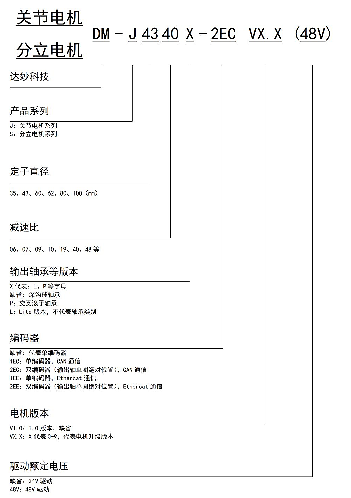

# 01 产品介绍

> DM-J4310-2EC V1.2 减速电机

---

## 免责声明

感谢您购买达妙科技 DAMIAO DM-J4310-2EC V1.2 减速电机（以下简称"电机"）。

在使用本产品之前，请仔细阅读并遵循本文及达妙科技提供的所有安全指引，否则可能会给您和周围的人带来伤害，损坏本产品或其他周围物品。一旦使用本产品，即视为您已经仔细阅读本文档，理解、认可和接受本文档及本产品所有相关文档的全部条款和内容。您承诺仅出于正当目的使用本产品。您承诺对使用本产品以及可能带来的后果负全部责任。达妙科技对于直接或间接使用本产品而造成的损坏、伤害以及任何法律责任不予负责。

DAMIAO 是深圳市达妙科技有限公司的商标。本文出现的产品名称、品牌等，均为其所属公司的商标。本产品及手册为深圳市达妙科技有限公司版权所有。未经许可，不得以任何形式复制翻印。本文档及本产品所有相关的文档最终解释权归深圳市达妙科技有限公司所有。如有更新，恕不另行通知。

---

## 注意事项

### 使用环境
1. **请严格按照规定的工作环境及绕组最大允许温度范围使用电机**，否则会对产品造成永久性不可逆转的损坏。

### 防护措施
2. **避免杂物进入转子内部**，否则会导致转子运行异常。
3. **使用前请检查各零部件是否完好**。如有部件缺失、老化、损坏等，请停止使用。

### 安装要求
4. **确保正确接线，电机安装正确、稳固**。

### 安全警告
5. **使用时勿触摸电子转子部分**，避免意外发生。电机大扭矩输出时，会出现发热的情况，**请注意避免烫伤**。
6. **用户请勿私自拆卸电机**，否则会影响电机的控制精度，甚至会导致电机运行异常。

---

## 电机特色

### 1. 双编码器设计
- **输出轴单圈绝对位置**
- **不惧掉电输出轴绝对位置丢失**

### 2. 一体化设计
- 电机和驱动器一体化设计
- 结构紧凑，集成度高

### 3. 可视化调试
- 支持上位机可视化调试
- 支持固件升级

### 4. 丰富的反馈信息
- 可通过 CAN 总线反馈：
  - 电机速度
  - 位置
  - 转矩
  - 电机温度等信息

### 5. 双温度保护
- 驱动板温度保护
- 电机线圈温度保护

### 6. 梯形加减速
- 位置模式下支持梯形加减速

---

## 命名规则



```
DM - J 43 10 - 2 EC V1.2
│    │  │  │   │  │   │
│    │  │  │   │  │   └─ 版本号
│    │  │  │   │  └───── 编码器类型（EC: 双编码器）
│    │  │  │   └──────── 编码器数量
│    │  │  └──────────── 减速比（10:1）
│    │  └─────────────── 电机外径（43mm系列）
│    └────────────────── 电机系列（J系列）
└─────────────────────── 品牌（DAMIAO）
```

---

**返回** [00_目录.md](00_目录.md)  
**下一章** [02_产品规格.md](02_产品规格.md)
