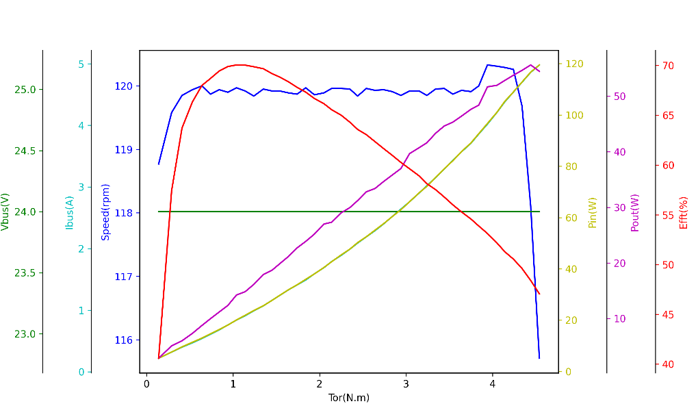

# 02 产品规格

> DM-J4310-2EC V1.2 技术参数

---

## 特征参数

请根据以下参数合理使用电机。

### 电源参数

| 类型 | 特征参数 | DM-J4310-2EC V1.2 (24V) | DM-J4310-2EC V1.2 (48V) |
|------|---------|------------------------|------------------------|
| **电源** | 额定电压 | 24V | 48V |
| | 额定相/电源电流 | 4.9A / 3.1A @ 24V | 4.8A / 1.6A @ 48V |
| | 峰值相/电源电流 | 20A / 16.5A @ 24V | 20A / 12.8A @ 48V |

### 电机参数

| 类型 | 特征参数 | 数值 |
|------|---------|------|
| **性能** | 额定扭矩 | 3.5 N·m |
| | 峰值扭矩 | 12.5 N·m |
| | 额定转速 | 120 rpm |
| | 空载最大转速 (24V) | 200 rpm |
| | 空载最大转速 (48V) | 450 rpm |
| | 减速比 | 10:1 |
| | 极对数 | 14 |
| **电气特性** | 相电感 | 约 320 μH |
| | 相电阻 | 约 580 mΩ |

### 结构与重量

| 类型 | 特征参数 | 数值 |
|------|---------|------|
| **尺寸** | 外径 | 57 mm |
| | 高度 | 46 mm |
| **重量** | 电机重量 | 约 325 g |

### 编码器

| 类型 | 特征参数 | 数值 |
|------|---------|------|
| **编码器** | 编码器位数 | 16 位 |
| | 编码器个数 | 2 |
| | 编码器类型 | 磁编（单圈） |

### 通讯

| 类型 | 特征参数 | 数值 |
|------|---------|------|
| **接口** | 控制接口 | CAN @ 1 Mbps |
| | 调参接口 | UART @ 921600 bps |

### 控制模式

- MIT 模式
- 速度模式
- 位置模式
- 力位混控模式

### 控制与保护

| 保护类型 | 说明 |
|---------|------|
| **驱动过温防护** | 防护温度：120℃，过温电机将退出"使能模式" |
| **电机过温防护** | 根据使用需求设定，建议不超过 100℃，过温电机将退出"使能模式" |
| **电机过压防护** | 根据使用需求设定，建议不超过 32V，过压将退出"使能模式" |
| **通讯丢失防护** | 设定周期内没有收到 CAN 指令将自动退出"使能模式" |
| **电机过流防护** | 根据使用需求设定，建议不超过 9.8A，过流将退出"使能模式" |
| **电机欠压防护** | 若电源电压低于设定值，则退出"使能模式"，建议电源电压不低于 15V |

---

## 工作电压

### 24V 版本
- **工作电压范围**：24V - 28V
- **最低工作电压**：20V
- **最高工作电压**：28V

### 48V 版本
- **工作电压范围**：24V - 48V
- **最低工作电压**：20V
- **最高工作电压**：58V
- **注意**：超过 36V 建议减少热插拔

---

## 最大相电流

### 查询方法
可以通过上电时串口打印信息查询相应驱动器的最大相电流。

### 设置方法
可以通过调试助手进行设置运行的最大相电流百分比来进行限定：
- **默认值**：0.8（即能采样的最大电流的 80%）
- **建议值**：不要超过 98%

---

## 最高转速

最高转速由多种因素限制，包括：
- 电源电压 (V_BUS)
- 磁链值 (ψ_f)
- 减速比 (GR)

### 计算公式

```
V_MAX (rad/s) = 0.57735 × V_BUS / (N_pp × GR × ψ_f)
```

**参数说明**：
- `V_BUS`：电源电压
- `N_pp`：电机极对数
- `ψ_f`：转子磁链
- `GR`：减速比

---

## 扭矩系数

电机的扭矩系数在额定范围内可视为常数，加上减速箱之后可用如下公式进行计算：

### 计算公式

```
K_t = 1.5 × N_pp × ψ_f × GR × GREF
```

**参数说明**：
- `N_pp`：极对数
- `ψ_f`：转子磁链
- `GR`：电机减速比
- `GREF`：减速箱力矩传递系数

---

## TN 曲线

**测试条件**：
- 版本：24V 版本
- 转速：定速 120 rpm
- 环境温度：室温 25℃

**性能曲线图**：



---

**返回** [00_目录.md](00_目录.md)  
**上一章** [01_产品介绍.md](01_产品介绍.md)  
**下一章** [03_硬件说明.md](03_硬件说明.md)
