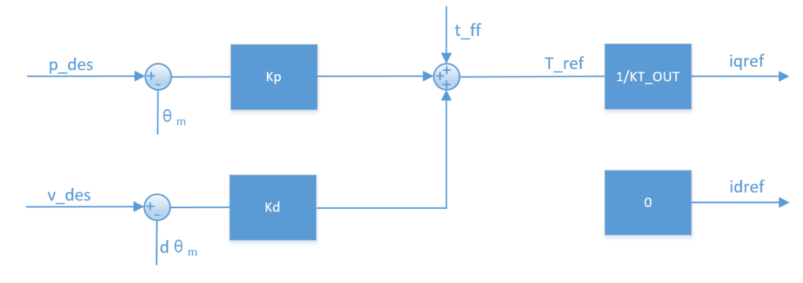
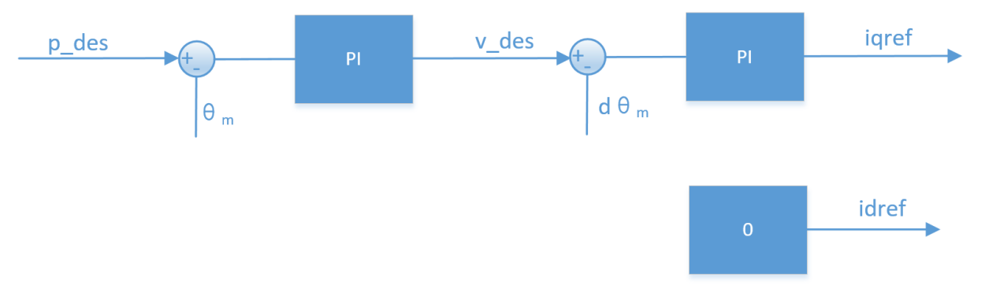
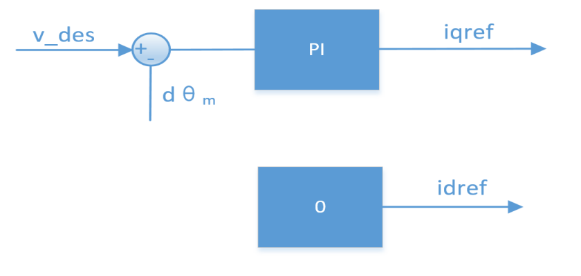

# 04 工作模式

> DM-J4310-2EC V1.2 控制模式说明

---

## 模式概览

电机支持四种工作模式：

| 模式 | 说明 | 适用场景 |
|------|------|---------|
| **MIT 模式** | 位置-速度-力矩混合控制 | 灵活控制，可实现多种控制策略 |
| **位置速度模式** | 三环串级控制（位置环+速度环+电流环） | 精确位置控制 |
| **速度模式** | 双环控制（速度环+电流环） | 恒速运行 |
| **力位混控模式** | 位置和力矩混合控制 | 需要力控的位置控制场景 |

---

## MIT 模式

### 模式说明

MIT 模式是为了兼容原版 MIT 模式所设计，可以在实现无缝切换的同时，能够灵活设定控制范围（P_MAX, V_MAX, T_MAX）。

### 控制原理

电调将接收到的 CAN 数据转化成控制变量进行运算得到扭矩值作为电流环的电流给定，电流环根据其调节规律最终达到给定的扭矩电流。

### 控制框图



```
CAN命令 → [位置/速度/力矩混合] → 扭矩计算 → 电流环 → 电机输出
   ↓
p_des (目标位置)
v_des (目标速度)
kp (位置增益)
kd (速度增益)
t_ff (前馈力矩)
```

### 控制公式

```
T = kp × (p_des - p_actual) + kd × (v_des - v_actual) + t_ff
```

**参数说明**：
- `p_des`：目标位置
- `p_actual`：实际位置
- `v_des`：目标速度
- `v_actual`：实际速度
- `kp`：位置比例增益
- `kd`：速度阻尼增益
- `t_ff`：前馈力矩

### 衍生控制模式

根据 MIT 模式可以衍生出多种控制模式：

#### 1. 速度控制
- **设置**：kp = 0, kd ≠ 0
- **给定**：v_des
- **效果**：实现匀速转动

#### 2. 力矩控制
- **设置**：kp = 0, kd = 0
- **给定**：t_ff
- **效果**：实现给定扭矩输出

#### 3. 位置控制
- **设置**：kp ≠ 0, kd ≠ 0
- **给定**：p_des
- **效果**：实现位置控制

### 重要注意事项

> **警告**：对位置进行控制时，**kd 不能赋 0**，否则会造成电机震荡，甚至失控。

---

## 位置速度模式

### 模式说明

位置串级模式是采用**三环串联控制**的模式：
- **位置环**作为最外环
- 位置环的输出作为**速度环**的给定
- 速度环的输出作为内环**电流环**的给定

### 控制框图



```
目标位置 → 位置环 → 目标速度 → 速度环 → 目标电流 → 电流环 → 电机输出
            (PID)              (PID)              (PID)
              ↑                  ↑                  ↑
           实际位置            实际速度            实际电流
```

### 控制特点

1. **三环串级**：位置环 → 速度环 → 电流环
2. **梯形加减速**：支持梯形速度曲线，平滑启停
3. **精确定位**：适合需要精确位置控制的场景

### 参数设置

| 参数 | 说明 | 调整建议 |
|------|------|---------|
| **位置环 Kp** | 位置比例增益 | 增大可提高响应速度，但过大会震荡 |
| **位置环 Ki** | 位置积分增益 | 消除稳态误差 |
| **速度环 Kp** | 速度比例增益 | 影响速度跟踪性能 |
| **速度环 Ki** | 速度积分增益 | 消除速度稳态误差 |
| **加速度** | 加速度限制 | 单位 Krad/s² |
| **减速度** | 减速度限制 | 单位 Krad/s²（负数） |

---

## 速度模式

### 模式说明

速度模式采用**双环控制**：
- **速度环**作为外环
- 速度环的输出作为**电流环**的给定

### 控制框图



```
目标速度 → 速度环 → 目标电流 → 电流环 → 电机输出
           (PID)              (PID)
             ↑                  ↑
          实际速度            实际电流
```

### 控制特点

1. **双环控制**：速度环 → 电流环
2. **恒速运行**：适合需要恒定转速的场景
3. **速度限制**：可设置最大转速限制

### 参数设置

| 参数 | 说明 | 调整建议 |
|------|------|---------|
| **速度环 Kp** | 速度比例增益 | 影响速度响应 |
| **速度环 Ki** | 速度积分增益 | 消除稳态误差 |
| **限速** | 最大转速限制 | 单位 rad/s（转子速度） |
| **加速度** | 加速度限制 | 单位 Krad/s² |
| **减速度** | 减速度限制 | 单位 Krad/s²（负数） |

---

## 力位混控模式

### 模式说明

力位混控模式（PVT 模式）结合了位置控制和力矩控制的特点，可以在位置控制的同时限制输出力矩。

### 控制框图


```
目标位置 → 位置环 → 目标速度 → 速度环 → 目标电流 → 电流环 → 电机输出
            (PID)              (PID)       ↑      (PID)
              ↑                  ↑          │
           实际位置            实际速度      │
                                           │
                              力矩限制 ─────┘
```

### 控制特点

1. **位置+力矩**：既能控制位置，又能限制力矩
2. **柔顺控制**：适合需要力控的场景
3. **安全保护**：可防止过大力矩损坏机械结构

### 参数设置

| 参数 | 说明 | 调整建议 |
|------|------|---------|
| **位置** | 目标位置 | 单位 rad |
| **速度** | 目标速度 | 单位 rad/s |
| **电流** | 电流限制 | 百分比（0-100%） |

### 应用场景

- 机械臂抓取（需要力控）
- 柔性装配
- 人机协作
- 碰撞检测

---

## 模式修改

### 修改方法

1. 通过调试助手"参数设置"页面
2. 在"控制设置"中选择"控制模式"
3. 选择目标模式（MIT / 位置速度 / 速度 / 力位混控）
4. 点击"写参数"保存设置
5. 驱动器自动软件重启，无需外部重启电源

### 确认当前模式

**方法 1**：串口打印信息
- 上电时串口会打印当前控制模式
- 箭头指向的模式即为当前模式

**方法 2**：调试助手
- 在"参数设置"页面点击"读参数"
- 查看"控制模式"显示的值

---

## 模式选择建议

| 应用场景 | 推荐模式 | 理由 |
|---------|---------|------|
| **精确定位** | 位置速度模式 | 三环控制，定位精度高 |
| **恒速运行** | 速度模式 | 速度稳定，响应快 |
| **灵活控制** | MIT 模式 | 可自由组合位置/速度/力矩控制 |
| **力控场景** | 力位混控模式 | 既能定位又能限制力矩 |
| **快速响应** | MIT 模式 | 控制灵活，响应快 |
| **轨迹跟踪** | 位置速度模式 | 支持梯形加减速 |

---

**返回** [00_目录.md](00_目录.md)  
**上一章** [03_硬件说明.md](03_硬件说明.md)  
**下一章** [05_CAN通信.md](05_CAN通信.md)
