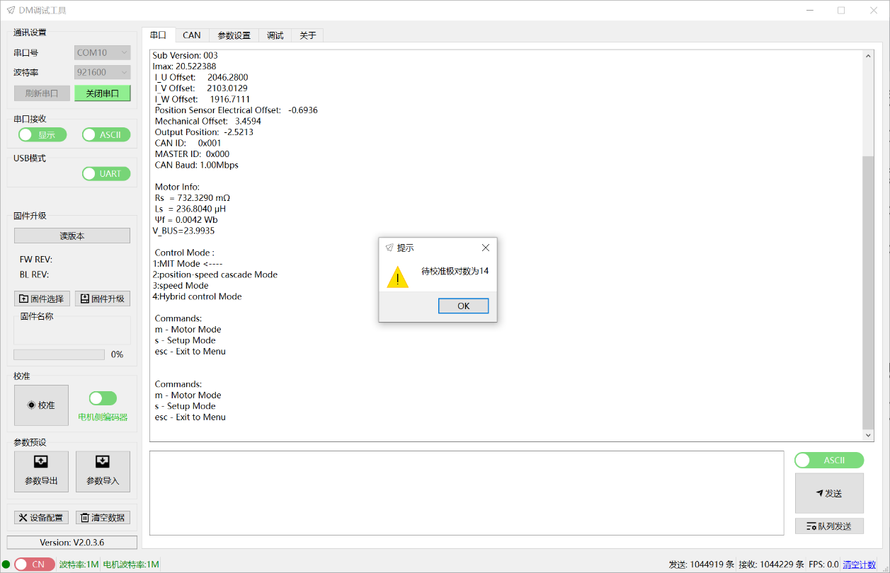
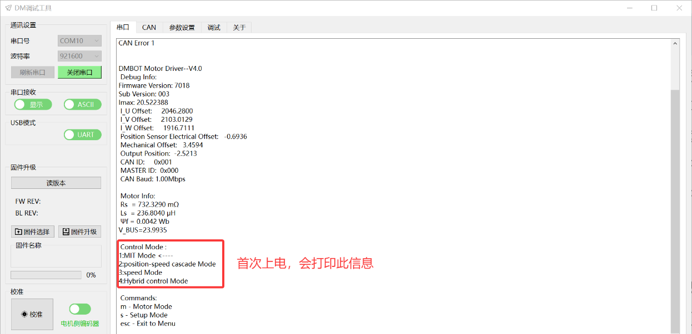
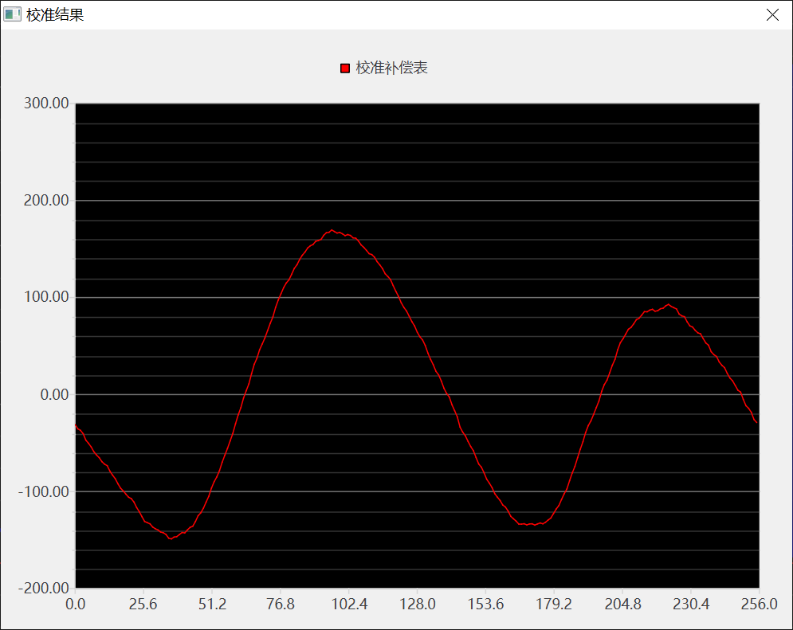
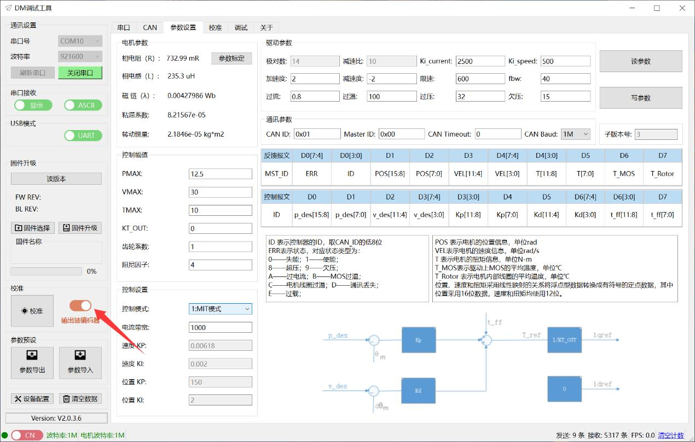
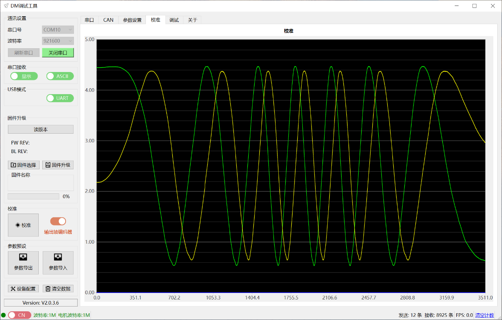

# 06 电机调试流程

> DM-J4310-2EC V1.2 调试与校准

本章节涵盖电机的完整调试流程，包括编码器校准、参数标定、串口读写参数等操作。

---

## 调试前准备

### 软件要求
- 使用 **V2.0.0.0 及以上版本**的上位机调试助手
- 推荐版本：V2.0.3.4

### 硬件连接
1. 连接电机的**串口**（用于参数配置和校准）
2. 连接电机的**CAN口**（用于运动控制调试）
3. 连接**电源接口**

### 连接步骤
1. 打开调试助手软件
2. 选择相应的串口设备并打开串口
3. 给电机供电
4. 串口会打印信息，显示当前的 **Control Mode**（驱动模式）

> **注意**：不同模式采用不同的命令格式，参考 CAN 通信章节

---

## 电机侧编码器校准

### 校准目的
修正传感器的安装误差，消除电机转子位置检测偏差。

### 何时需要校准
- **电机出厂已校准**，正常情况下无需重新校准
- 以下情况需要重新校准：
  - 更换驱动板
  - 电机出现异常震动
  - 其他非正常状态

### 校准前准备
- 保证电机可以**自由转动**
- 最好电机能够**空载运行**
- 校准过程中电机会正向反向转动一个转子周期

### 校准步骤

#### 步骤1：启动校准
点击"校准"按钮，电机会开始转动。

#### 步骤2：自动参数识别
- 电机会自动进行参数识别
- 过程中电机会有旋转运动，**请注意固定好电机**
- 识别完成后，电机会自动进行传感器校准

#### 步骤3：查看传感器波形图
校准完成后会显示传感器波形图：

- **红色曲线**：实际补偿值
- **蓝色曲线**：理想范围

> **注意**：红色曲线的最大值不要明显超过蓝色曲线，否则校准失败，需重新校准。

#### 步骤4：校准数据上传
校准完成后，会自动上传校准值：

包括：
- 极对数
- 补偿数据（Compensation Data）

#### 步骤5：校准数据排查
**特别关注"Compensation Data 补偿"的值**：
- 建议不要超过 **±300**
- 若超过 300，可能原因：
  1. **极对数识别错误**
  2. **电机阻力过大**，导致卡顿
  3. **传感器安装不规范**

---

## 参数标定

### 标定目的
识别电机的相电阻、相电感、磁链等重要参数。

### 何时需要标定
- **电机出厂已标定**，正常情况下无需重新标定
- **电机校准过后也已完成标定**
- 更换驱动板后需要重新标定

### 标定步骤

#### 步骤1：启动标定
1. 点击"参数设置"标签卡
2. 点击"参数标定"按钮
3. 驱动器进入辨识步骤

#### 步骤2：保持空载
- 期间电机会转动
- 应保持**空载状态**
- 固定好电机

#### 步骤3：查看辨识结果
辨识完成后，会自动上传辨识的结果：

- 相电阻
- 相电感
- 磁链
- 粘滞系数（仅作为参考，可多次标定）

> **注意**：除粘滞系数外，其他参数**不能出现负值**。若出现负值，请确认电机状态后再行标定。

---

## 输出轴编码器校准

### 适用范围
**仅双编码器电机需要**进行输出轴编码器校准。

### 校准目的
提升输出轴编码器准确度。

### 何时需要校准
- **电机出厂已校准**，正常情况下无需重新校准
- 以下情况需要重新校准：
  - 更换驱动板
  - 输出位置变化等非正常状态

### 校准前准备
- 保证电机可以**自由转动**
- 确保电机**空载运行**
- 校准过程中电机会正向转动一周

### 校准步骤

#### 步骤1：切换到输出轴编码器模式
点击校准按钮旁边的滑块，切换至显示"**输出轴编码器**"状态。

#### 步骤2：启动校准
点击"校准"按钮，电机开始旋转一周。

#### 步骤3：查看原始数据波形
上传编码器原始数据波形：

#### 步骤4：查看校准值
校准完成后，会自动上传显示校准值：

#### 步骤5：数据校验
- 驱动器会自动进行数据校验
- 如校验数据偏差过大，会报错：
  - **错误类型**：3
  - **红灯闪烁**
- 一般情况下出错是由于**输出轴编码器异常**导致，可联系售后解决

---

## 串口读写参数

### 1. 读参数

#### 操作步骤
1. 在"参数设置"标签卡下
2. 点击"读参数"按钮
3. 驱动器会将存储的参数上传到调试助手

> **注意**：点击读参数成功后，会同步更新调试界面的参数（如 PMAX、ID 等）

#### 读取到的参数包括

##### (1) 驱动参数

| 参数名称 | 说明 | 注意事项 |
|---------|------|---------|
| **极对数** | 电机的极对数 | 通过校准自动得出，**切勿修改** |
| **欠压** | 电源电压下限 | 低于此值驱动器无法控制电机，默认 20V |
| **过压** | 电源电压上限 | 超过此值驱动器报错并退出使能 |
| **加速度/减速度** | 加减速限制 | 非 MIT 模式使用，单位 Krad/s² |
| **减速比** | 电机减速比 | 影响输出转速和位置，**切勿修改** |
| **过温** | 线圈温度保护值 | 建议不超过 100℃ |
| **CAN_ID** | 驱动器 ID 号 | 16进制，建议设置小于 16 |
| **Master ID** | 反馈信息帧 ID | 16进制 |
| **CAN Timeout** | CAN 通讯超时时间 | 32位整数，单位 50us |
| **限速** | 最大运行速度 | 仅速度模式使用，单位 rad/s |
| **过流** | 最大相电流限制 | 百分比数 |
| **CAN波特率** | CAN 通讯速率 | 支持 125Kbps - 5Mbps |
| **Ki_current** | 电流环增强系数 | 不建议修改 |
| **fbw** | 速度环滤波带宽 | 单位 Hz |
| **Ki_speed** | 速度环增强系数 | 建议范围 200-800 |
| **子版本号** | 固件子版本号 | 只读 |

##### (2) 电机参数
此部分参数由驱动器自动辨识得出（更换驱动板需要标定一次）。

##### (3) 控制幅值

| 参数名称 | 说明 |
|---------|------|
| **PMAX** | MIT 模式：命令映射值；其他模式：反馈映射值 |
| **VMAX** | 同 PMAX |
| **TMAX** | 同 PMAX |
| **KT_OUT** | 电机扭矩系数，参数辨识准确时设为 0 |
| **齿轮系数** | 齿轮力矩传动系数，≤ 1.0 |
| **阻尼因子** | 电流环与速度环控制带宽比 |

##### (4) 控制设置

| 参数名称 | 可选值 |
|---------|--------|
| **控制模式** | MIT 模式、位置速度模式、速度模式、力位混控模式 |
| **电流带宽** | 电流环增益系数，默认 1000 |
| **速度 KP/KI** | 速度环参数 |
| **位置 KP/KI** | 位置环参数 |

### 2. 写参数

#### 操作步骤
1. 核对驱动参数、控制幅值、控制设置等参数
2. 对需要修改的参数进行修改
3. 点击"写参数"保存至驱动器

#### 重要注意事项
1. **请勿修改极对数和减速比参数**
2. 点击"写参数"后，驱动器将**自动软件重启**，无需外部重启电源
3. 点击"写参数"时请确保电机处于**"失能"状态**，以防止安全事故
4. "暂存"按钮只针对控制器参数生效，且**掉电后会丢失**

---

## 调试模式

### 调试前准备
- 此功能**仅在连接 CAN 接口**的情况下可操作
- 只可以调试单个电机
- 操作前需连接 CAN 线至驱动器板
- 调试前需确认接线线序以及当前控制模式

### 控制模式的选择与确认

#### 设置控制模式
1. 点击调试助手"参数设置"
2. 在控制设置中点击"控制模式"
3. 可选择以下四种模式：
   - MIT 模式
   - 速度位置模式
   - 速度模式
   - 力位混控模式
4. 点击"写参数"进行控制模式设置
5. 弹出提示窗口："写参数成功！"
6. 因"写参数"功能会自动复位，无需再重新给驱动器上电

#### 确认当前控制模式
方法1：根据上电串口打印数据判断，箭头指向的模式即为当前驱动的控制模式  
方法2：在参数设定页面重新读参数后显示的信息

---

## MIT 模式调试

### 模式确认
1. 参考"控制模式的选择与确认"，选择当前为 MIT 模式
2. 在调试页面中选择对应的"MIT"子标签卡
3. 确保 CAN ID 正确

### MIT 模式的三种控制方法

#### 1. 速度控制

**步骤1：使能电机**
- 电机模式栏点击"使能"按钮
- 驱动器绿色灯亮起，表示电机已使能

**步骤2：给定速度**
- 例如：速度给定 5 rad/s
- KD 给 1 N·s/r
- 其余全部给 0
- 勾选"定时发送"框
- 依次点击"更新"按钮和"发送"按钮
- 可在调试界面查看参数曲线变化图
- **注意固定电机**

**步骤3：退出调试**
- 依次点击"停止"和"失能"按钮
- 驱动器红色灯亮起，表示退出电机模式

#### 2. 位置控制

**步骤1：使能电机**
- 电机模式栏点击"使能"按钮
- 驱动器绿色灯亮起

**步骤2：给定位置**
- 注意电机初始位置
- 给定"位置"参数时，避免与初始位置差距过大，引起电机冲击

#### 3. 力矩控制
（参考速度控制和位置控制的操作流程）

### 调试参数修改
- 根据调试需求修改控制参数
- 在原界面直接对参数进行修改
- 保持勾选"定时发送"
- 点击"更新"按钮即可进行调试

### 实时监控
调试助手界面实时显示：
- 电机温度
- 驱动温度
- 电机运行状态
- 也可通过反馈帧查看（参考"4.1 反馈帧"章节）

---

## 位置速度模式调试

### 模式设置
1. 在参数页面将电机模式切换成**位置速度模式**
2. 点击"写参数"后生效
3. 在调试页面中选择对应的"位置"子标签卡

### 调试步骤

**步骤1：确认 CAN ID**
- 可通过串口打印信息获取
- 或者参数设置页面获取
- 也可以通过调试页面读取、设定按钮设定

**步骤2：使能电机**
- 电机模式栏点击"使能"按钮
- 驱动器绿色灯亮起，表示电机已使能

**步骤3：设定参数**
- 设置参数前，需注意电机的初始位置
- 以此为参考对参数进行设置
- 电机按照设定速度运转到指定位置

---

## 速度模式调试

（操作流程类似位置速度模式，在参数页面切换成速度模式即可）

---

## 力位混控模式调试

### 模式设置
1. 在参数页面将电机模式切换成**PVT 模式**
2. 点击"写参数"后生效
3. 在调试页面中选择对应的"位置"子标签卡

### 调试步骤

**步骤1：确认 CAN ID**
- 可通过串口打印信息或参数设置页面获取
- 也可以通过调试页面读取、设定按钮设定

**步骤2：使能电机**
- 电机模式栏点击"使能"按钮
- 驱动器绿色灯亮起，表示电机已使能

**步骤3：设定参数**
- 设置参数前，需注意电机的初始位置
- 以此为参考对参数进行设置
- 例如：
  - 位置：10 rad
  - 速度：5 rad/s
  - 电流：20%
- 勾选"定时发送"框

---

## 常见问题排查

### 1. 电机侧编码器校准失败
- 检查极对数识别是否正确
- 检查电机阻力是否过大
- 检查传感器安装是否规范
- Compensation Data 补偿值是否超过 ±300

### 2. 参数标定出现负值
- 确认电机状态
- 重新进行标定

### 3. 输出轴编码器校准报错（错误类型3）
- 红灯闪烁
- 一般是输出轴编码器异常
- 联系售后解决

### 4. 写参数后电机异常
- 确认是否在失能状态下写参数
- 检查是否误修改了极对数或减速比
- 检查 CAN ID 是否冲突

---

## 安全注意事项

1. **校准和标定时**：
   - 确保电机空载运行
   - 固定好电机，防止意外转动
   - 保证电机可以自由转动

2. **写参数时**：
   - 必须在失能状态下操作
   - 不要修改极对数和减速比

3. **调试时**：
   - 注意电机初始位置
   - 避免给定值与初始位置差距过大
   - 固定好电机，防止冲击

4. **温度监控**：
   - 实时关注电机温度和驱动温度
   - 过温保护值建议不超过 100℃

---

## 附录：寄存器地址表（部分）

| 地址 | 十进制 | 参数名称 | 读写 | 范围 | 类型 |
|------|--------|---------|------|------|------|
| 0x1A | 26 | KI_ASR (速度环Ki) | RW | [0.0, fmax] | float |
| 0x1B | 27 | KP_APR (位置环Kp) | RW | [0.0, fmax] | float |
| 0x1C | 28 | KI_APR (位置环Ki) | RW | [0.0, fmax] | float |
| 0x1D | 29 | OV_Value (过压保护值) | RW | TBD | float |
| 0x1E | 30 | GREF (齿轮力矩效率) | RW | (0.0, 1.0] | float |
| 0x1F | 31 | Deta (速度环阻尼系数) | RW | [1.0, 30.0] | float |
| 0x20 | 32 | V_BW (速度环滤波带宽) | RW | (0.0, 500.0) | float |
| 0x21 | 33 | IQ_c1 (电流环增强系数) | RW | [100.0, 1.0e4] | float |
| 0x22 | 34 | VL_c1 (速度环增强系数) | RW | (0.0, 1.0e4] | float |
| 0x23 | 35 | can_br (CAN波特率代码) | RW | [0, 4] | uint32 |
| 0x3B | 59 | Imax (驱动板最大电流) | RO | / | float |
| 0x3C | 60 | VBus (电源电压) | RO | / | float |
| 0x3D | 61 | Tpcb (驱动板温度) | RO | / | float |
| 0x3E | 62 | Tmtr (电机温度) | RO | / | float |
| 0x50 | 80 | p_m (电机当前位置) | RO | / | float |
| 0x51 | 81 | xout (输出轴位置) | RO | / | float |

> 注：  
> - RW：可读写  
> - RO：只读  
> - 电机输出轴位置：使用转子折算到输出轴的位置，单位 rad  
> - 输出轴位置：采用电机输出轴编码器计算得出的位置，单位 rad

---

**返回** [00_目录.md](00_目录.md)  
**上一章** [05_CAN通信.md](05_CAN通信.md)  
**下一章** [07_调试操作.md](07_调试操作.md)
