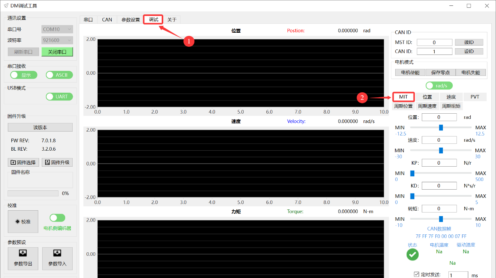
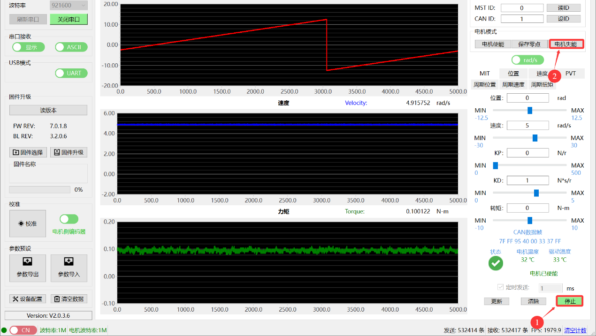
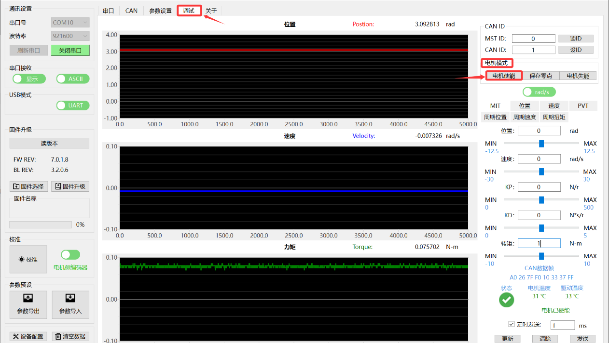
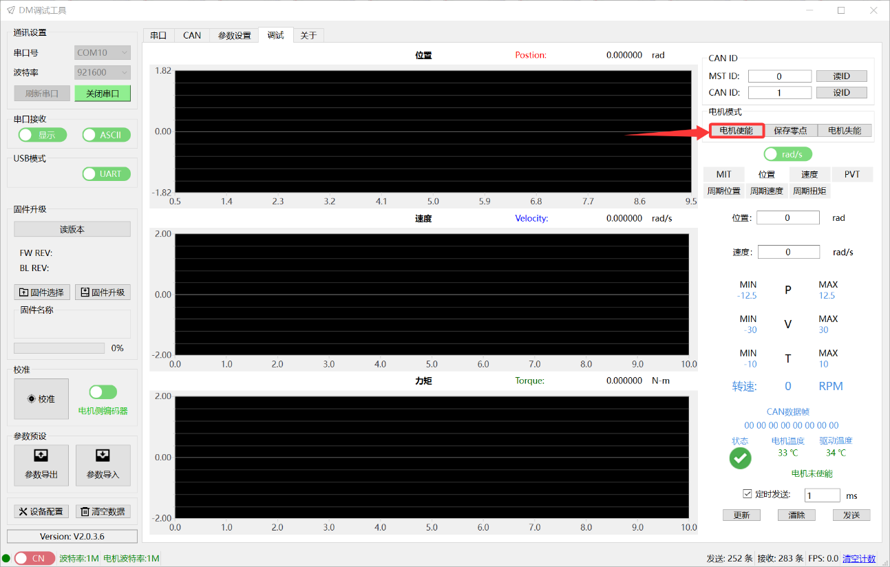
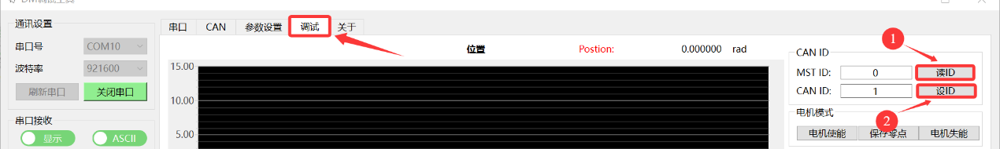
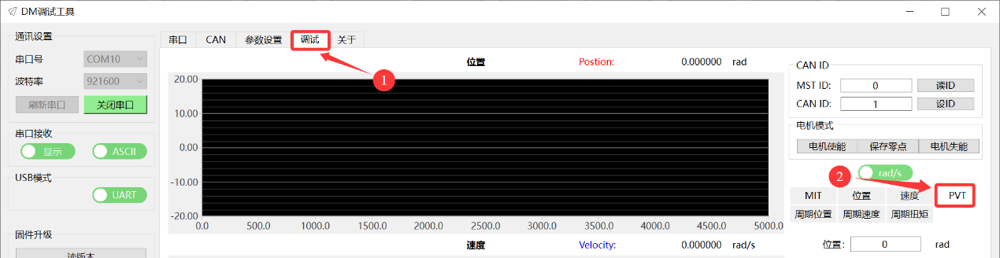

# 07 调试操作

> DM-J4310-2EC V1.2 各模式调试方法

本章节详细介绍各种工作模式下的调试操作步骤。

---

## 调试前准备

### 必要条件
- 此功能**仅在连接 CAN 接口**的情况下可操作
- 只可以调试单个电机
- 操作前需连接 CAN 线至驱动器板

### 确认事项
- 确认接线线序正确
- 确认当前控制模式
- 根据不同模式选择调试页面中的子标签卡

---

## MIT 模式调试

### 前置步骤

#### 1. 确认控制模式
参考"控制模式的选择与确认"，选择当前为 MIT 模式。

#### 2. 选择调试页面
在调试页面中选择对应的"MIT"子标签卡。

#### 3. 确认 CAN ID
可通过以下方式获取：
- 串口打印信息
- 参数设置页面
- 调试页面读取、设定按钮

---

### MIT 速度控制

#### 步骤 1：使能电机
- 电机模式栏点击"使能"按钮
- 驱动器**绿色灯亮起**，表示电机已使能

#### 步骤 2：给定速度

**参数设置示例**：

- 速度给定：5 rad/s
- KD：1 N·s/r
- 其余全部给 0
- 勾选"定时发送"框
- 依次点击"更新"按钮和"发送"按钮
- 可在调试界面查看参数曲线变化图

> **注意**：固定电机，防止意外转动

#### 步骤 3：退出调试
- 依次点击"停止"和"失能"按钮
- 驱动器**红色灯亮起**，表示退出电机模式

---

### MIT 位置控制

#### 步骤 1：使能电机
- 电机模式栏点击"使能"按钮
- 驱动器**绿色灯亮起**

#### 步骤 2：给定位置

**注意事项**：
- 注意电机初始位置
- 给定"位置"参数时，避免与初始位置差距过大，引起电机冲击

**保存零点**：
- 可通过控制命令栏点击"保存零点"
- 将电机当前位置设置为零点
- 方便"位置"参数设置

**参数设置示例**：

- 位置给定：3.14 rad
- KP：2 N/r
- KD：1 N·s/r
- 其余全部给 0
- 勾选"定时发送"框
- 依次点击"更新"按钮和"发送"按钮
- 可在调试界面查看参数曲线变化图

> **注意**：固定电机

#### 步骤 3：退出调试
- 先将电机停止下来
- 再依次点击"停止"和"失能"按钮
- 驱动器**红色灯亮起**

---

### MIT 力矩控制

#### 步骤 1：使能电机
- 电机模式栏点击"使能"按钮
- 驱动器**绿色灯亮起**

#### 步骤 2：给定力矩

> **警告**：空载情况下，即使给定很小的力矩，电机也会加速到最大转速旋转。

**参数设置示例**：

- 转矩设定：1 N·m
- 其余全部给 0
- 勾选"定时发送"框
- 依次点击"更新"按钮和"发送"按钮
- 可在调试界面查看参数曲线变化图

> **注意**：固定电机

---

### MIT 调试参数修改

根据调试需求，需要修改控制参数查看调试变化：
1. 在原界面直接对参数进行修改
2. 保持勾选"定时发送"
3. 点击"更新"按钮即可进行调试

### 实时监控

调试助手界面实时显示：
- 当前电机温度
- 驱动温度
- 电机运行状态

也可通过反馈帧查看，反馈帧格式以及状态类型请查看"反馈帧"章节。

---

## 位置速度模式调试

### 前置步骤

#### 1. 切换控制模式
- 在参数页面将电机模式切换成**位置速度模式**
- 点击"写参数"后生效
- 在调试页面中选择对应的"位置"子标签卡

#### 2. 确认 CAN ID
可通过以下方式获取：
- 串口打印信息
- 参数设置页面
- 调试页面读取、设定按钮

---

### 调试步骤

#### 步骤 1：使能电机
- 电机模式栏点击"使能"按钮
- 驱动器**绿色灯亮起**，表示电机已使能

#### 步骤 2：设定参数

**注意事项**：
- 设置参数前，需注意电机的初始位置
- 以此为参考对参数进行设置
- 电机按照设定速度运转到指定位置

**参数设置示例**：

- 位置：10 rad
- 速度：5 rad/s
- 勾选"定时发送"框
- 依次点击"更新"按钮和"发送"按钮
- 可在调试界面查看参数曲线变化图

> **注意**：固定电机

#### 步骤 3：调试参数修改

根据调试需求修改控制参数：
1. 在原界面直接对参数进行修改
2. 保持勾选"定时发送"
3. 点击"更新"按钮即可进行调试

#### 步骤 4：退出调试
- 依次点击"停止"和"失能"按钮
- 驱动器**红色灯亮起**

---

## 速度模式调试

### 前置步骤

#### 1. 切换控制模式
- 在参数页面将电机模式切换成**速度模式**
- 点击"写参数"后生效
- 在调试页面中选择对应的"速度"子标签卡

#### 2. 确认 CAN ID
可通过以下方式获取：
- 串口打印信息
- 参数设置页面
- 调试页面读取、设定按钮

---

### 调试步骤

#### 步骤 1：使能电机
- 电机模式栏点击"使能"按钮
- 驱动器**绿色灯亮起**

#### 步骤 2：设定速度

**参数设置示例**：

- 速度：5 rad/s
- 勾选"定时发送"框
- 依次点击"更新"按钮和"发送"按钮
- 可在调试界面查看参数曲线变化图

> **注意**：固定电机

#### 步骤 3：调试参数修改

根据调试需求修改控制参数：
1. 在原界面直接对参数进行修改
2. 保持勾选"定时发送"
3. 点击"更新"按钮即可进行调试

#### 步骤 4：退出调试
- 依次点击"停止"和"失能"按钮
- 驱动器**红色灯亮起**

---

## 力位混控模式调试

### 前置步骤

#### 1. 切换控制模式
- 在参数页面将电机模式切换成**PVT 模式**
- 点击"写参数"后生效
- 在调试页面中选择对应的"位置"子标签卡

#### 2. 确认 CAN ID
可通过以下方式获取：
- 串口打印信息
- 参数设置页面
- 调试页面读取、设定按钮

---

### 调试步骤

#### 步骤 1：使能电机
- 电机模式栏点击"使能"按钮
- 驱动器**绿色灯亮起**

#### 步骤 2：设定参数

**注意事项**：
- 设置参数前，需注意电机的初始位置
- 以此为参考对参数进行设置

**参数设置示例**：

- 位置：10 rad
- 速度：5 rad/s
- 电流：20%
- 勾选"定时发送"框
- 依次点击"更新"按钮和"发送"按钮
- 可在调试界面查看参数曲线变化图

> **注意**：固定电机

#### 步骤 3：调试参数修改

根据调试需求修改控制参数：
1. 在原界面直接对参数进行修改
2. 保持勾选"定时发送"
3. 点击"更新"按钮即可进行调试

#### 步骤 4：退出调试
- 依次点击"停止"和"失能"按钮
- 驱动器**红色灯亮起**

---

## 调试注意事项

### 安全事项
1. **固定电机**：调试时务必固定好电机，防止意外转动造成伤害
2. **初始位置**：给定位置参数时，注意与初始位置的差距，避免冲击
3. **空载力矩控制**：空载情况下，即使很小的力矩也会使电机加速到最大转速

### 操作规范
1. **定时发送**：修改参数后，保持勾选"定时发送"，点击"更新"按钮
2. **退出顺序**：先点击"停止"，再点击"失能"
3. **温度监控**：实时关注电机温度和驱动温度

### 参数调整
1. **小步调整**：参数调整时，建议小步调整，观察效果
2. **记录参数**：记录好的参数组合，方便后续使用
3. **保存参数**：调试完成后，记得保存参数到驱动器

---

## 调试技巧

### MIT 模式
- **速度控制**：适合测试电机基本运行状态
- **位置控制**：KD 不能为 0，否则会震荡
- **力矩控制**：空载时注意安全，建议带负载测试

### 位置速度模式
- 利用梯形加减速，实现平滑运动
- 调整加减速度参数，优化运动曲线
- 注意初始位置，避免大幅度跳变

### 速度模式
- 调整阻尼因子（2.0-10.0），优化速度响应
- 推荐阻尼因子：4.0
- 过小会震荡，过大响应慢

### 力位混控模式
- 电流限制可防止过大力矩
- 适合需要力控的应用场景
- 注意电流百分比设置

---

## 常见问题

### 1. 电机不响应
- 检查是否已使能（绿灯亮）
- 检查 CAN ID 是否正确
- 检查 CAN 线是否连接正常

### 2. 电机震荡
- MIT 位置控制：检查 KD 是否为 0
- 速度模式：调整阻尼因子
- 位置速度模式：调整 PID 参数

### 3. 电机冲击
- 检查初始位置与目标位置差距
- 降低速度给定值
- 增大加减速度时间

### 4. 温度过高
- 检查负载是否过大
- 检查电流限制是否合理
- 增加散热措施

---

**返回** [00_目录.md](00_目录.md)  
**上一章** [06_电机调试流程.md](06_电机调试流程.md)  
**下一章** [08_固件升级.md](08_固件升级.md)
