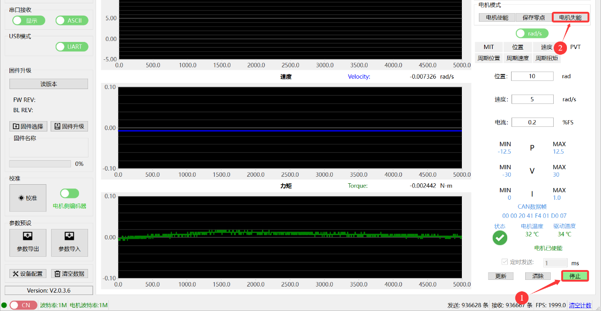
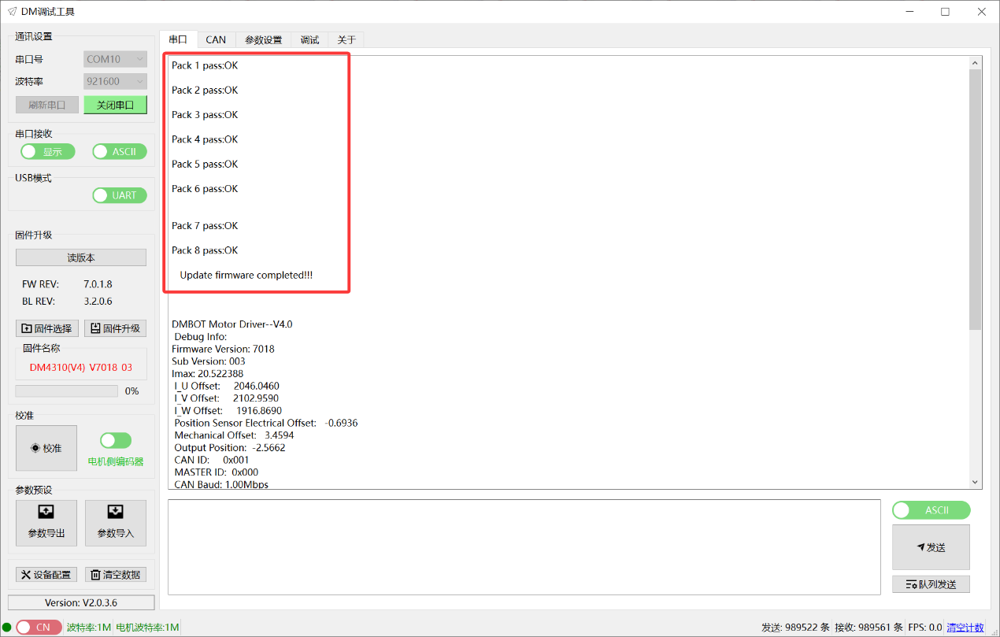
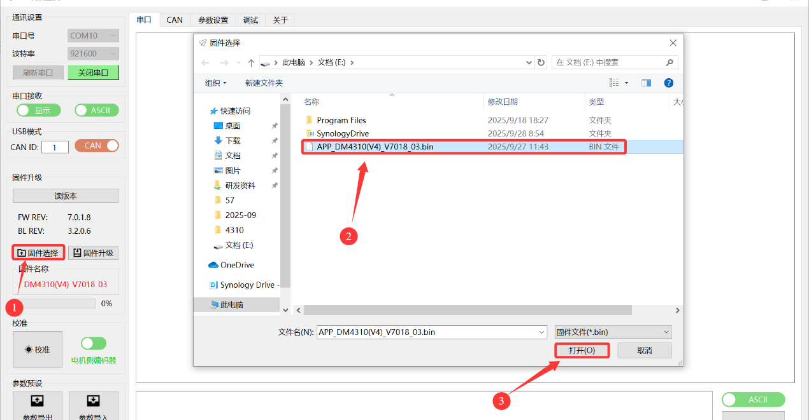

# 08 固件升级

> DM-J4310-2EC V1.2 固件版本查看与升级

---

## 版本查看

### 查看方法

可通过以下方式查看固件版本：

#### 方法 1：串口打印信息
- 电机上电时，串口会打印固件版本信息

#### 方法 2：调试助手

- 打开调试助手
- 连接串口
- 点击"读版本"按钮
- 在参数设置页面查看版本信息

#### 方法 3：读取寄存器
- 软件版本号：寄存器 0x0E（地址 14）
- 子版本号：寄存器 0x24（地址 36）
- Boot 版本号：寄存器 0x25（地址 37）

---

## 串口固件升级

### 升级前准备

1. **获取固件文件**
   - 从达妙科技官网或售后获取最新固件
   - 确认固件文件适用于 DM-J4310-2EC V1.2

2. **硬件连接**
   - 连接串口线（GH1.25-3pin）
   - 连接电源

3. **软件准备**
   - 打开达妙科技调试助手
   - 确认串口连接正常

### 升级步骤

#### 步骤 1：进入升级模式
1. 打开调试助手
2. 选择正确的串口
3. 点击"固件升级"或"串口升级"按钮

#### 步骤 2：选择固件文件
1. 点击"选择文件"按钮
2. 浏览并选择固件文件（通常为 .bin 或 .hex 格式）
3. 确认文件路径正确

#### 步骤 3：开始升级
1. 点击"开始升级"按钮
2. 调试助手会显示升级进度
3. **升级过程中请勿断电或断开连接**

#### 步骤 4：升级完成

1. 升级完成后，调试助手会提示"升级成功"
2. 串口界面会有相应的提示
3. 电机会自动重启
4. 重新连接串口，确认新版本号

### 升级注意事项

1. **升级过程中请勿断电**，否则可能导致固件损坏
2. **升级过程中请勿断开串口连接**
3. 升级时间通常为 **30 秒 - 2 分钟**，请耐心等待
4. 升级失败后，可重新尝试升级
5. 如多次升级失败，请联系售后技术支持

---

## CAN 固件升级

### 升级前准备

1. **获取固件文件**
   - 从达妙科技官网或售后获取最新固件
   - 确认固件文件适用于 DM-J4310-2EC V1.2

2. **硬件连接**
   - 连接 CAN 线
   - 连接电源
   - 确保 CAN 总线上只有一个电机（或确认目标电机的 CAN ID）

3. **软件准备**
   - 打开达妙科技调试助手
   - 确认 CAN 连接正常

### 升级步骤

#### 步骤 1：进入升级模式
1. 打开调试助手
2. 选择 CAN 接口
3. 点击"CAN 升级"按钮

#### 步骤 2：选择目标电机

1. 将 UART 切换成 CAN
2. 输入目标电机的 CAN ID
3. 确认 CAN ID 正确
4. 若连接成功，则无提示；若总线不存在，会有相应提示

#### 步骤 3：选择固件文件
1. 点击"选择文件"按钮
2. 浏览并选择固件文件
3. 确认文件路径正确

#### 步骤 4：开始升级
1. 点击"开始升级"按钮
2. 调试助手会显示升级进度
3. **升级过程中请勿断电或断开连接**

#### 步骤 5：升级完成
1. 升级完成后，调试助手会提示"升级成功"
2. 电机会自动重启
3. 通过 CAN 读取寄存器，确认新版本号

### CAN 升级注意事项

1. **确保 CAN 总线上只有一个电机**，或确认目标电机的 CAN ID 唯一
2. **升级过程中请勿断电**
3. **升级过程中请勿断开 CAN 连接**
4. CAN 升级速度较串口升级慢，请耐心等待
5. 升级失败后，可重新尝试升级
6. 如多次升级失败，建议使用串口升级

---

## 升级失败处理

### 常见失败原因

1. **升级过程中断电**
   - 现象：电机无法启动，或启动后异常
   - 解决：重新连接，再次升级

2. **固件文件错误**
   - 现象：升级失败，提示文件错误
   - 解决：确认固件文件是否适用于该型号电机

3. **通信中断**
   - 现象：升级过程中进度停止
   - 解决：检查连接，重新升级

4. **CAN ID 冲突**（CAN 升级）
   - 现象：升级失败，或升级了错误的电机
   - 解决：确保总线上只有一个电机，或确认 CAN ID 唯一

### 恢复方法

#### 方法 1：重新升级
1. 重新连接串口或 CAN
2. 再次执行升级步骤
3. 确保升级过程不被中断

#### 方法 2：Boot 模式恢复
如果电机无法正常启动：
1. 联系达妙科技售后技术支持
2. 获取 Boot 模式进入方法
3. 在 Boot 模式下重新刷写固件

---

## 版本兼容性

### 固件版本说明

固件版本号格式：`主版本.次版本.修订版本`

例如：`V2.0.3.4`
- 主版本：2
- 次版本：0
- 修订版本：3
- 子版本：4

### 升级建议

1. **稳定版本**：建议使用官方推荐的稳定版本
2. **测试版本**：测试版本可能包含新功能，但稳定性待验证
3. **向下兼容**：新版本固件通常向下兼容旧版本的参数设置
4. **重大更新**：主版本更新时，建议重新进行校准和标定

### 升级后操作

升级固件后，建议进行以下操作：

1. **读取参数**：确认参数是否保留
2. **重新校准**（可选）：如果固件有重大更新，建议重新校准
3. **功能测试**：测试各种工作模式是否正常
4. **保存参数**：确认参数无误后，保存到驱动器

---

## 固件更新日志

### 查看更新日志

1. 访问达妙科技官网
2. 进入产品支持页面
3. 查看固件更新日志

### 常见更新内容

- **性能优化**：提升控制精度、响应速度
- **功能增强**：新增控制模式、参数调整
- **Bug 修复**：修复已知问题
- **兼容性改进**：提升与上位机的兼容性

---

## 技术支持

### 联系方式

如遇到固件升级问题，请联系达妙科技技术支持：

- **官网**：www.damiao-tech.com（示例）
- **邮箱**：support@damiao-tech.com（示例）
- **电话**：请查看产品包装或官网

### 提供信息

联系技术支持时，请提供以下信息：

1. 电机型号：DM-J4310-2EC V1.2
2. 当前固件版本
3. 目标固件版本
4. 升级方式（串口/CAN）
5. 错误信息或现象描述
6. 调试助手版本

---

**返回** [00_目录.md](00_目录.md)  
**上一章** [07_调试操作.md](07_调试操作.md)  
**下一章** [09_调试助手使用.md](09_调试助手使用.md)
