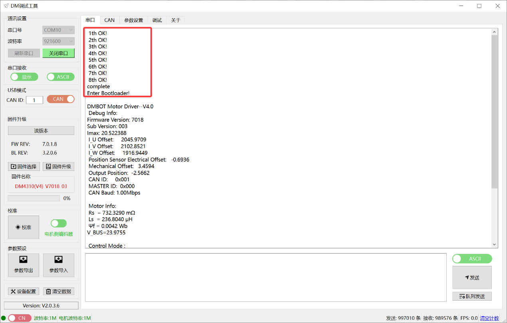

# 09 调试助手使用

> 达妙科技调试助手软件使用说明

---

## 调试助手简介

达妙科技调试助手是专为达妙电机设计的上位机软件，用于：
- 电机参数配置
- 电机校准和标定
- 实时调试和监控
- 固件升级

---

## 硬件连接

### 连接方式

使用达妙科技 USB 转 CAN 调试工具，连接电脑和电机：

1. **串口连接**
   - 电机调试串口通过 GH1.25 连接线-3pin 连接 PC
   - 用于参数设置、校准、固件升级

2. **CAN 连接**
   - 电机电源接口中 CAN 通信端子通过 XT30(2+2)-F 插头连接线连接 USB 转 CAN 调试工具
   - 用于实时控制和调试

3. **电源连接**
   - 连接电源接口，为电机供电

### 连接步骤



1. 连接电机的串口、CAN 口以及电源接口
2. 电脑端打开达妙科技调试助手
3. 选择相应的串口设备并打开串口
4. 给电机供电
5. 串口会打印信息，**Control Mode** 指示当前驱动模式

---

## 软件界面

### 主要功能区

调试助手主要包含以下功能区：

1. **连接设置**
   - 串口选择
   - CAN 接口选择
   - 波特率设置

2. **参数设置**
   - 读取参数
   - 写入参数
   - 参数标定
   - 编码器校准

3. **调试界面**
   - MIT 模式调试
   - 位置速度模式调试
   - 速度模式调试
   - 力位混控模式调试

4. **固件升级**
   - 串口固件升级
   - CAN 固件升级
   - 版本查看

5. **监控显示**
   - 实时参数曲线
   - 温度监控
   - 状态显示

---

## 基本操作

### 1. 连接电机

#### 串口连接
1. 选择正确的串口号
2. 点击"打开串口"按钮
3. 观察串口打印信息，确认连接成功

#### CAN 连接
1. 选择 CAN 接口
2. 设置正确的波特率（默认 1 Mbps）
3. 确认 CAN ID 设置正确

### 2. 读取参数

1. 确保串口已连接
2. 点击"参数设置"标签卡
3. 点击"读参数"按钮
4. 等待参数上传完成
5. 核对参数是否正确

### 3. 修改参数

1. 先读取当前参数
2. 在界面上修改需要更改的参数
3. 确认修改无误
4. 点击"写参数"按钮
5. 等待写入完成
6. 电机会自动复位

> **注意**：写参数时请确保电机处于失能状态

### 4. 校准电机

#### 电机侧编码器校准
1. 点击"参数设置"标签卡
2. 确保电机空载且可自由转动
3. 点击"校准"按钮
4. 等待校准完成
5. 查看校准结果

#### 输出轴编码器校准
1. 点击校准按钮旁边的滑块
2. 切换至"输出轴编码器"状态
3. 点击"校准"按钮
4. 等待校准完成
5. 查看校准结果

### 5. 参数标定

1. 点击"参数设置"标签卡
2. 点击"参数标定"按钮
3. 电机会转动，保持空载状态
4. 等待标定完成
5. 查看标定结果

### 6. 调试电机

1. 确保 CAN 已连接
2. 选择对应的控制模式标签卡
3. 点击"使能"按钮
4. 设置控制参数
5. 勾选"定时发送"
6. 点击"更新"和"发送"按钮
7. 观察电机运行状态和参数曲线

### 7. 固件升级

#### 串口升级
1. 连接串口
2. 点击"固件选择"按钮
3. 选择固件文件
4. 确认固件名称正确
5. 点击"固件升级"按钮
6. 等待升级完成

#### CAN 升级
1. 连接 CAN
2. 将 UART 切换成 CAN
3. 填入要升级的电机 ID
4. 点击"固件选择"按钮
5. 选择固件文件
6. 点击"固件升级"按钮
7. 等待升级完成

---

## 详细使用说明

### 官方文档

详细调试过程请参考：**调试助手使用说明书（达妙驱动控制协议）V1.4.pdf**

### 下载链接

```
https://gitee.com/kit-miao/damiao-document/blob/master/
调试助手使用说明书（达妙驱动控制协议）V1.4.pdf
```

或访问达妙科技官网获取最新版本文档。

---

## 常见问题

### 1. 无法连接串口
- 检查串口线是否连接正常
- 检查串口号是否选择正确
- 检查是否有其他程序占用串口
- 尝试重新插拔 USB 线

### 2. 无法连接 CAN
- 检查 CAN 线是否连接正常
- 检查波特率是否设置正确
- 检查 CAN ID 是否正确
- 检查 CAN 终端电阻是否连接

### 3. 参数读取失败
- 确认串口连接正常
- 确认电机已上电
- 重新打开串口
- 重启调试助手

### 4. 参数写入失败
- 确认电机处于失能状态
- 确认参数值在有效范围内
- 重新读取参数后再写入

### 5. 校准失败
- 确认电机空载且可自由转动
- 检查电机是否有异常震动
- 重新进行校准
- 如多次失败，联系售后

### 6. 固件升级失败
- 确认固件文件正确
- 确认连接稳定
- 升级过程中不要断电
- 重新尝试升级

---

## 软件更新

### 获取最新版本

1. 访问达妙科技官网
2. 进入下载中心
3. 下载最新版本调试助手
4. 安装并使用

### 版本兼容性

- 建议使用 **V2.0.0.0 及以上版本**
- 推荐版本：**V2.0.3.4**
- 不同版本可能功能有所差异

---

## 技术支持

如遇到调试助手使用问题，请：

1. 查阅官方文档
2. 访问达妙科技官网技术支持页面
3. 联系售后技术支持

---

**返回** [00_目录.md](00_目录.md)  
**上一章** [08_固件升级.md](08_固件升级.md)

---

**文档整理完成**  
**整理日期**：2026-04-27  
**原始文档**：DM-J4310-2EC V1.2 减速电机使用说明书 V1.2
