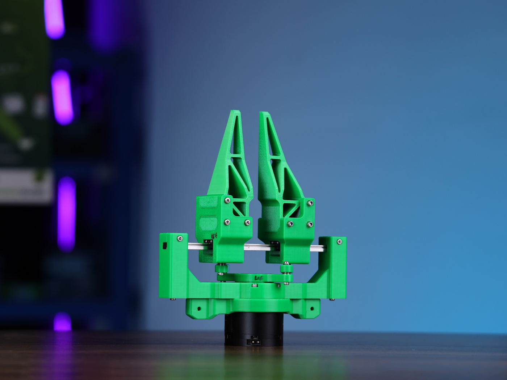
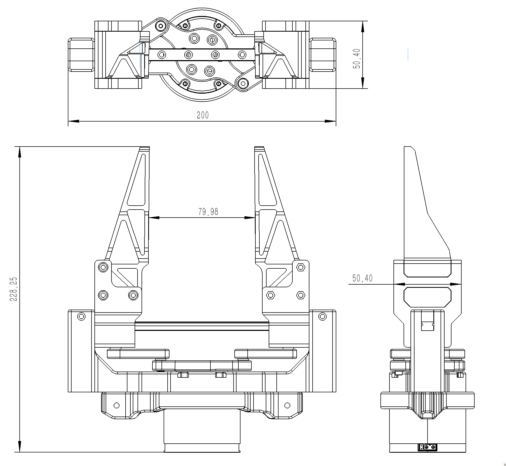

# DM_Gripper - Assembly Guide with Demo

> 发布时间: 2025-09-17T00:00:00.000Z
> 原文链接: https://wiki.seeedstudio.com/dm_gripper/

---
On this page

The **DM\_Gripper** is an open-source, **3D-printed robotic gripper** designed around the **DM-4310-2EC motor**. Its modular design emphasizes ease of assembly and disassembly, enabling both hobbyists and robotics developers to **rapidly prototype, customize, and scale** their projects.

Fully compatible with **DAMIAO actuators**, the DM\_Gripper also provides flexibility for integration with other actuator brands. Its unique **swappable claw system** allows users to quickly exchange claws of different shapes, supporting diverse robotic tasks and use cases.

All gripper parts are **fully 3D-printable** with minimal support requirements, making it accessible for makers, researchers, and engineers alike.

This wiki includes:

-   Mechanism design overview
-   Full bill of materials (BOM)
-   3D printing guide and setup
-   Step-by-step assembly instructions
-   Demo and practical use cases

[**Get One Now 🖱️**](https://www.seeedstudio.com/Seeed-Gripper-01-p-6561.html)

## Dimensions/Operating Range[​](#dimensionsoperating-range "Direct link to Dimensions/Operating Range")

The dimensions and operating range are shown below in millimeters, with variable height depending on the claws used.

## Drive Mechanisms[​](#drive-mechanisms "Direct link to Drive Mechanisms")

This gripper features a classical Dual Crank & Slider mechanism, translating rotational to axial motion.

-   **Crank & Slider Showcase:**

-   **Motion Simulation Showcase**

## BOM[​](#bom "Direct link to BOM")

#### 🔩 Fasteners[​](#-fasteners "Direct link to 🔩 Fasteners")

| Name | Quantity |
|------|----------|
| Phillips Pan Head Screw PM3×8 | 8 |
| Hex Socket Cap Screw M3×20 | 4 |
| Hex Socket Cap Screw M3×25 | 6 |
| Hex Socket Cap Screw M3×50 | 8 |
| Hex Socket Cap Screw M3×16 | 12 |
| 304 Nylon Locking Hex Self-Locking Nut M3 (Thickness-3.9mm × Width-5.5mm) | 18 |
| Spring Washer – M3 | 4 |
| Flat Washer – M3×7mm (OD) × 0.5mm (Thickness) | 8 |

#### ⚙️ Bearing[​](#️-bearing "Direct link to ⚙️ Bearing")

| Name | Quantity |
|------|----------|
| F3-8M Miniature Thrust Bearing (ID-3mm × OD-8mm × Thickness-3.5mm) | 4 |

#### 🛠️ Linear Motion[​](#️-linear-motion "Direct link to 🛠️ Linear Motion")

| Name | Quantity |
|------|----------|
| Stainless Steel Linear Rail MGN9, 200 mm | 1 |
| Linear Rail Carriage MGN9C (Standard) | 2 |

#### 🔌 Actuator[​](#-actuator "Direct link to 🔌 Actuator")

| Name | Quantity |
|------|----------|
| DM4310-2EC Motor | 1 |

#### 🧩 Custom Printables[​](#-custom-printables "Direct link to 🧩 Custom Printables")

| Name | Quantity |
|------|----------|
| **3D Printed Parts** | 1 set |

## Assembly Guide[​](#assembly-guide "Direct link to Assembly Guide")

### 3D-Printing Guide[​](#3d-printing-guide "Direct link to 3D-Printing Guide")

-   If you have dedicated support material or PETG+PLA in your [**AMS**](https://wiki.bambulab.com/en/ams/manual/ams-function-introduction) and want the best surface finish on supported faces, please refer to [**This Wiki**](https://wiki.bambulab.com/en/filament-acc/filament/h2d-pla-and-petg-mutual-support).
    _Note: your print job may take longer._

-   If you only have one filament to print, make sure you print with the correct orientations and decide whether you need the following steps (Turn On **ADVANCED** in Bambu Studio).

    > **Warning**
    >
    > Do not change the Top Z distance if you are using PETG or ABS. Keep them as default. Only change this if you use PLA.

    -   Step 1: Print layout with minimal supports required

        

    -   Step 2: Scarf Settings provide a better surface finish as marked in Green Rectangles.

        

    -   Step 3: My Print Settings: 0.2mm layer height, 25% infill density, Style – 3D Honeycomb.

        
        
        
        

### Step By Step Assembly Walkthrough[​](#step-by-step-assembly-walkthrough "Direct link to Step By Step Assembly Walkthrough")

-   Step 1: Fix the Claw Holders to the MGN9C sliders with eight M3×8 mushroom-headed screws

-   Step 2: Stack the bearings, rotors, and linkages ("hamburger" style)

-   Step 3: Place eight M7 washers above and below the slots

-   Step 4: Place four nuts above and below the washers

-   Step 5: Screw four pairs of M3×20 screws and spring washers to the nuts (use pliers if necessary)

-   Step 6: Place the Base and Actuator in position; the patterns on the rotor plate and actuator should align

-   Step 7: Screw six M3×16 screws to secure the rotor plate to the actuator

-   Step 8: Push the claw base to the maximum range for the next steps

-   Step 9: Attach the cam holder to the bottom

-   Step 10: Fix the cam holder with four pairs of M3×25 screws and nuts

-   Step 11: Fix the base with six M3×16 screws (Pull out the rail for this stage and slide it back in afterwards)

-   Step 12: Use two pairs of M3×50 screws and nuts to lock the rail on the base

-   Step 13: Slide the rail presser in and secure with two pairs of M3×25 screws and nuts

-   Step 14: Place the claws on the claw holders, and secure them with six pairs of M3×50 screws and nuts

## Demos and CAD Files[​](#demos-and-cad-files "Direct link to Demos and CAD Files")

-   Follow the [**Damiao Actuators Wiki**](https://wiki.seeedstudio.com/damiao_series/) to get everything set up if you haven't done so.
-   Follow the [**Torque Controller Demo**](https://github.com/tianrking/DM_Gripper/tree/main) (**many thanks to tianrking**) to get the gripper moving with a cool GUI.

-   The CAD resources: editable STEP files and STLs are available [**here**](https://github.com/YlsonDdb/DM_Gripper).
