# 达妙系列电机

> 发布时间: 2025-06-01T00:00:00.000Z
> 原文链接: https://wiki.seeedstudio.com/cn/damiao_series/

---
On this page

本文将介绍如何开始使用达妙 43 系列电机，以及如何在 reComputer Mini Jetson Orin 上使用 C++ 和 Python 进行操作。

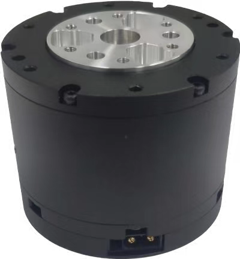

[**立即购买 🖱️**](https://www.seeedstudio.com/Seeed-Gripper-01-p-6561.html)

## 规格参数[​](#规格参数 "Direct link to 规格参数")

以下是所有电机型号的完整参数表：

### 表1：基础规格

| 电机型号 | 额定扭矩 (Nm) | 峰值扭矩 (Nm) | 空载转速 (rpm) | 额定转速 (rpm) | 减速比 | 尺寸 直径\*高度 (mm) | 重量 (g) |
|---|---|---|---|---|---|---|---|
| J4310-2EC V1.1 | 3 | 7 | 200 | 120 | 10 | 57 \* 46 | ~300 |
| J4310-2EC V1.1(48V) | 3 | 7 | 400 | 120 | 10 | 57 \* 46 | ~300 |
| J4340-2EC | 9 | 27 | 52.5 | 36 | 40 | 57 \* 53.3 | ~362 |
| J4340-2EC(48V) | 9 | 27 | 100 | 36 | 40 | 57 \* 53.3 | ~362 |
| J4340P-2EC | 9 | 27 | 52.5 | 36 | 40 | 57 \* 56.5 | ~375 |
| J4340P-2EC(48V) | 9 | 27 | 100 | 36 | 40 | 57 \* 56.5 | ~375 |

### 表2：电气参数

| 电机型号 | 供电电压 (V) | 推荐电压范围 (V) | 额定相电流 (A) | 峰值相电流 (A) | 额定功率 (W) | 极对数 | 通信方式 | 编码器类型 | 安装方式 |
|---|---|---|---|---|---|---|---|---|---|
| J4310-2EC V1.1 | 24 | 15-32 | 3.7 | 7.2 | 37.699112 | 14 | CAN, CANFD | 磁性，双编码器 | 内置 |
| J4310-2EC V1.1(48V) | 48 | 15-52 | 3.7 | 7.2 | 37.699112 | 14 | CAN, CANFD | 磁性，双编码器 | 内置 |
| J4340-2EC | 24 | 15-32 | 3 | 8 | 33.929201 | 14 | CAN, CANFD | 磁性，双编码器 | 内置 |
| J4340-2EC(48V) | 48 | 15-52 | 2.5 | 9 | 33.929201 | 14 | CAN, CANFD | 磁性，双编码器 | 内置 |
| J4340P-2EC | 24 | 15-32 | 3 | 8 | 33.929201 | 14 | CAN, CANFD | 磁性，双编码器 | 内置 |
| J4340P-2EC(48V) | 48 | 15-52 | 2.5 | 9 | 33.929201 | 14 | CAN, CANFD | 磁性，双编码器 | 内置 |

### 表3：控制参数

| 电机型号 | 相电阻 (Ω) | 相电感 (uH) | 磁链 (Wb) | 转动惯量 (Kg\*m²) | 扭矩常数 (Nm/A) | 驱动最大电流 (A) | 速度环 KP | 默认 PMAX (rad) | 默认 VMAX (rad/s) | 默认 TMAX (Nm) | 速度常数 |
|---|---|---|---|---|---|---|---|---|---|---|---|
| J4310-2EC V1.1 | 0.85 | 345 | 0.0045 | 1.80E-05 | 0.945 | 10.261194 | 3.72E-04 | 12.5 | 30 | 10 | 87.512523 |
| J4310-2EC V1.1(48V) | 0.85 | 345 | 0.0045 | 1.80E-05 | 0.945 | 10.261194 | 3.72E-04 | 12.5 | 30 | 10 | 87.512523 |
| J4340-2EC | 0.88 | 360 | 0.00485 | 2.00E-05 | 4.074 | 10.261194 | 9.59E-05 | 12.5 | 8 | 28 | 81.197186 |
| J4340-2EC(48V) | 0.88 | 360 | 0.00485 | 2.00E-05 | 4.074 | 10.261194 | 9.59E-05 | 12.5 | 8 | 28 | 81.197186 |
| J4340P-2EC | 0.88 | 360 | 0.00485 | 2.00E-05 | 4.074 | 10.261194 | 9.59E-05 | 12.5 | 8 | 28 | 81.197186 |
| J4340P-2EC(48V) | 0.88 | 360 | 0.00485 | 2.00E-05 | 4.074 | 10.261194 | 9.59E-05 | 12.5 | 8 | 28 | 81.197186 |

## 主要特性[​](#主要特性 "Direct link to 主要特性")

1.  **CAN BUS & CANFD**
2.  **双编码器**
3.  **高扭矩密度**
4.  **高精度**
5.  **中空设计**

## 入门指南[​](#入门指南 "Direct link to 入门指南")

### 使用前的环境准备[​](#使用前的环境准备 "Direct link to 使用前的环境准备")

**PC 上的 Windows 系统**

-   下载 [达妙调试工具](https://files.seeedstudio.com/wiki/robotics/Actuator/damiao/Debugging_Tools_v.1.6.8.8.exe)。
-   下载 [USB2CAN 工具](https://files.seeedstudio.com/wiki/robotics/Actuator/damiao/USB2CAN_2.0.0.3.exe)

### 将电路连接到 PC[​](#将电路连接到-pc "Direct link to 将电路连接到 PC")

我们使用 CAN 通信方式，这需要额外的 USB-CAN 接口来通过 Windows 上位机进行调试。


在这里，您需要为电机提供单独的 24V 电源，并将 USB 连接到您的计算机。

### 使用 `Debugging_Tools_v.1.6.8.8.exe` 测试电机[​](#使用-debugging_tools_v1688exe-测试电机 "Direct link to 使用-debugging_tools_v1688exe-测试电机")

您可以在应用程序底部切换中英文。

**配置串口连接参数**

**连接电机**

**读取参数**

**设置 CAN ID**

**写入参数**

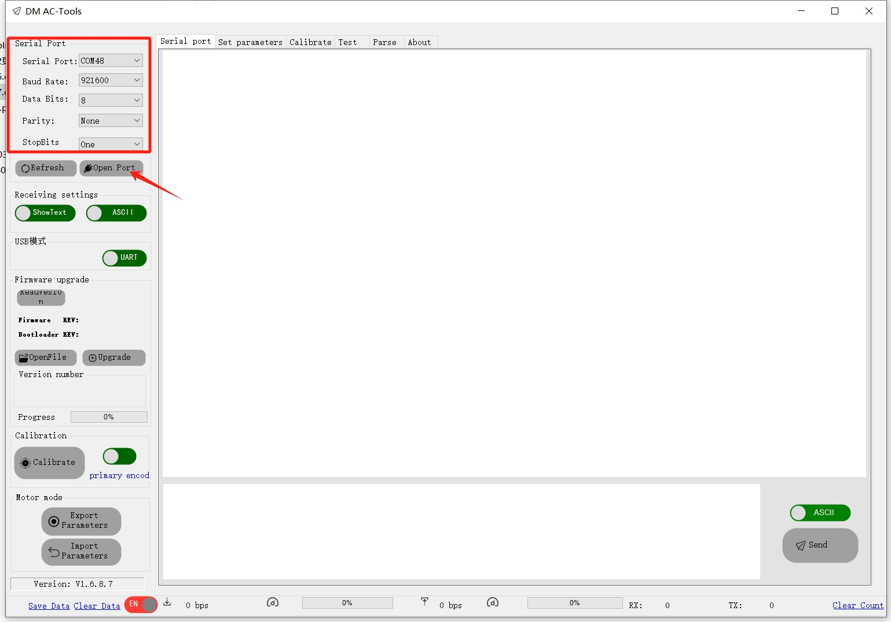

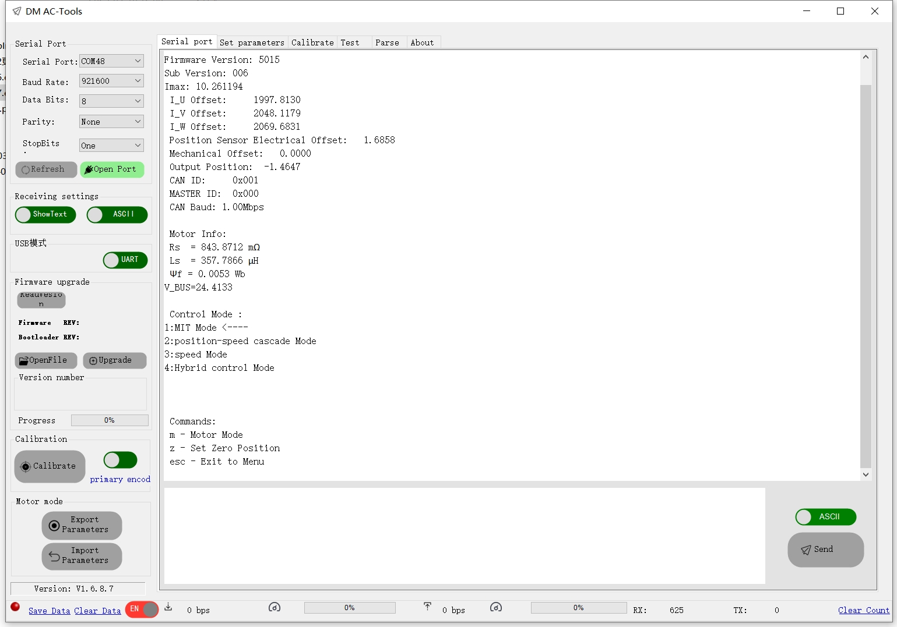

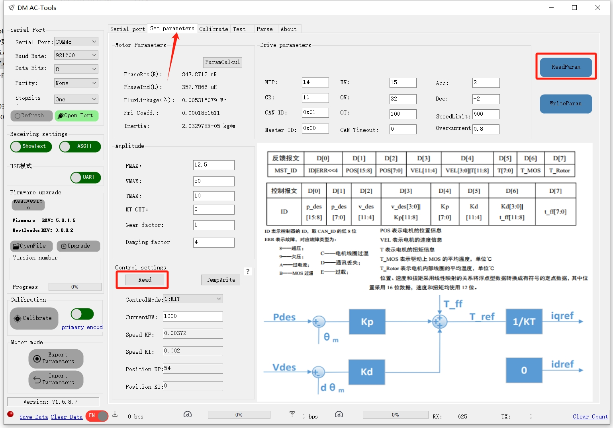

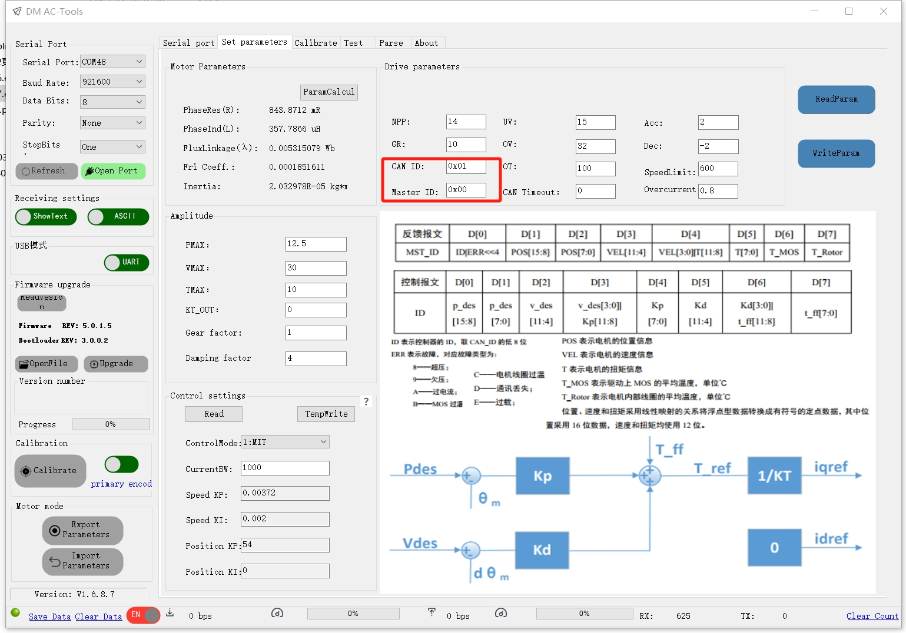

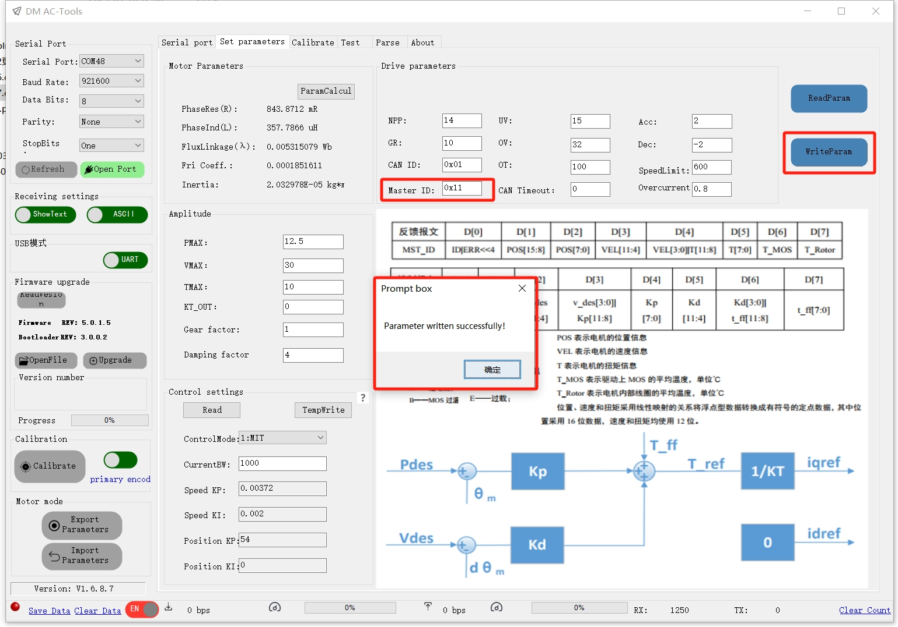

对于串口，使用计算机自动识别的端口，其他设置保持默认。

点击 "Open Port" 按钮后，将自动连接到上位机。如果这是首次连接，电机信息将在对话框中打印出来

在 "Set Parameters" 部分，点击 "Read Param" 将显示电机当前的详细信息和运动模式。

在这里，请首先配置 CAN ID。

配置完成后，点击 "Write Param" 更新参数。

tip

**​CAN\_ID**：驱动器用于接收 CAN 命令的帧 ID（十六进制）。

**​Master ID**：驱动器用于发送反馈的帧 ID（十六进制）。

​Master ID 是主机 ID。建议为每个电机设置​唯一的 Master ID。

一个好的做法是将​ Master ID 设置为比​ CAN\_ID 高 ​0x10（例如，如果 CAN\_ID = 0x01，Master ID = 0x11）。

​示例：

​电机 1：CAN\_ID = 0x01，Master ID = 0x11

​电机 2：CAN\_ID = 0x02，Master ID = 0x12

​不要将 Master ID 设置为 0x00！！！

#### **(1) 基本参数**[​](#1-基本参数 "Direct link to 1-基本参数")

-   **NPP**：电机极对数，通过校准自动确定。
-   **UV**：如果供电电压低于阈值（最低 **15V**），驱动器将停止工作。
-   **OV**：设置电压上限。驱动器在上电时检查供电电压，如果超过则禁用操作（仅在启动时检查一次）。
-   **Acc/Dec**：在 **非 MIT 模式** 中用于限制速度变化率。
-   **GR(Gear Ratio)**：影响输出速度/位置，间接影响扭矩反馈。支持浮点值。
-   **OT**：线圈温度阈值（推荐 ≤ **100°C**）。超过此值将触发故障模式（禁用电机并报告错误）。
-   **CAN\_ID**：接收 CAN 命令的帧 ID（十六进制）。
-   **Master ID**：驱动器反馈的帧 ID（十六进制）。最佳实践：设置 `MasterID = CAN_ID + 0x10`（例如，`0x01` → `0x11`）。**绝不设置为 `0x00`。**
-   **CAN Timeout**：定义超时周期的 32 位整数（单位：50µs 周期）。如果在此间隔内未检测到 CAN 命令，电机进入保护模式。
-   **Speed Limit**（_仅速度模式_）：减速前的最大速度（单位：**rad/s**）。
-   **Overcurrent**：最大相电流限制（百分比）。

#### **(2) 电机参数**[​](#2-电机参数 "Direct link to 2-电机参数")

-   由驱动器自动识别。**更换驱动板时需要重新校准**。持久存储在驱动器中。

#### **(3) 命令缩放（幅度设置）**[​](#3-命令缩放幅度设置 "Direct link to 3-命令缩放幅度设置")

-   **PMAX**：在 **MIT 模式** 中缩放命令输入；在其他模式中缩放反馈输出。参考 CAN 协议了解映射规则。
-   **VMAX**：与 PMAX 相同。
-   **TMAX**：与 PMAX 相同。
-   **KT\_OUT**：电机扭矩常数。如果电机参数识别准确，设置为 **0**。
-   **Gear Ratio Coefficient**：齿轮的扭矩传递比。

> **注意**：驱动器使用 **MIT 通信协议格式**。

#### **(4) 控制设置**[​](#4-控制设置 "Direct link to 4-控制设置")

-   **控制模式**：
    -   **MIT 模式**
    -   **位置-速度模式**（梯形加减速）
    -   **速度模式**
-   **Current Bandwidth**：电流环增益（默认：`1000`）。
-   **Speed KP/KI, Position KP/KI**：速度环和位置环的 PID 参数。

### MIT 控制模式[​](#mit-控制模式 "Direct link to MIT 控制模式")

**1\. MIT 扭矩控制模式：**

1.  在 Set Parameters 部分，点击 ​Read Param 显示当前电机参数。
2.  将 ​Control Mode 设置为 MIT Mode。
3.  验证配置的 ​CAN ID。
4.  点击 ​Write Param 保存所有设置。

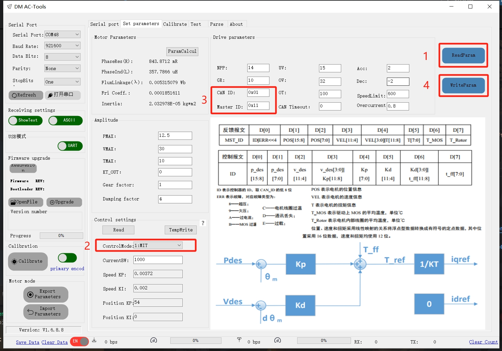

5.  在 ​Test 选项卡中，点击 ​\*\*"Enable Motor"\*\* 按钮（Ente）。
6.  在 ​MIT Control 部分：
    -   将 ​Torque (Nm) 设置为 ​1。
    -   点击 ​Update → ​Send。

电机将开始旋转。

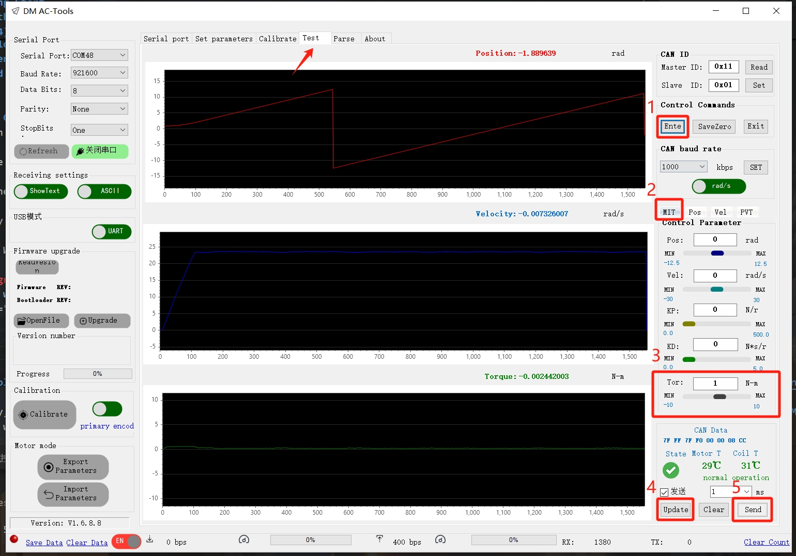

您也可以复制 CAN 数据（十六进制格式）并使用串口调试工具来驱动电机。

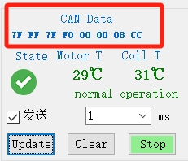

**2\. MIT 速度控制模式：**

1.  在 ​Test 选项卡中，点击 ​\*\*"Enable Motor"\*\* 按钮（Ente）。
2.  在 ​MIT Control 部分：
    -   将 Vel (rad/s) 设置为 ​5。
    -   将 KD (N\*s/r) 设置为 ​1。
    -   点击 ​Update → ​Send。

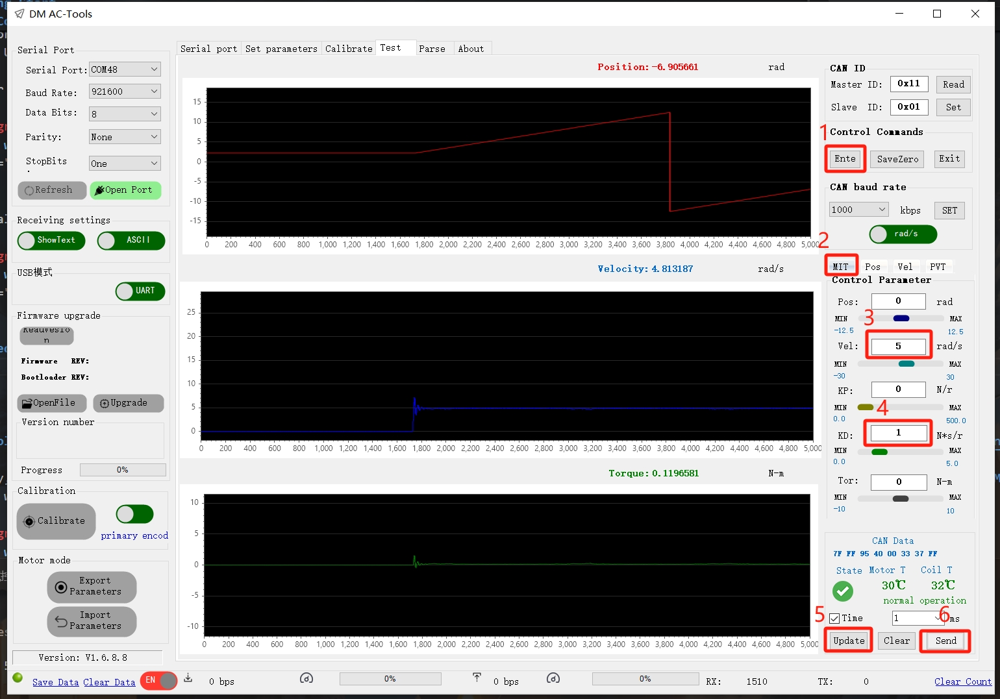

电机将开始旋转。您也可以复制 CAN 数据（十六进制格式）并使用串口调试工具来驱动电机。

**3\. MIT 位置控制模式：**

1.  在 ​Test 选项卡中，点击 ​\*\*"Enable Motor"\*\* 按钮（Ente）。
2.  您可以使用 ​\*\*"SaveZero"\*\* 将当前位置设置为零点。
3.  在 ​MIT Control 部分：
    -   将 Pos (rad) 设置为 3.14。
    -   将 KP (N/r) 设置为 ​2。
    -   将 KD (N\*s/r) 设置为 ​1。
    -   点击 ​Update → ​Send。

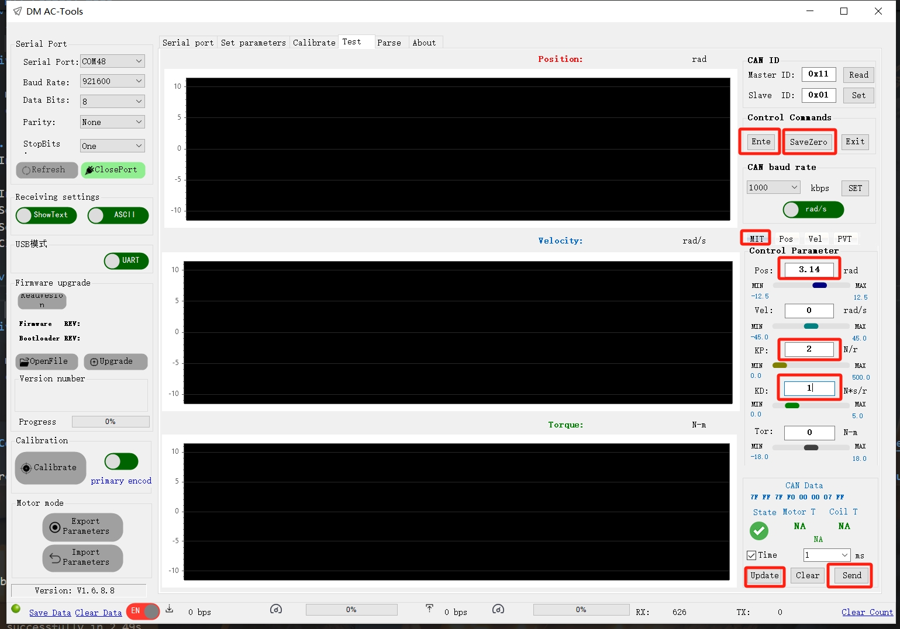

电机将开始旋转。您也可以复制 CAN 数据（十六进制格式）并使用串口调试工具来驱动电机。

### 速度控制模式[​](#速度控制模式 "Direct link to 速度控制模式")

1.  在 Set Parameters 部分，点击 ​Read Param 显示当前电机参数。
2.  将 ​Control Mode 设置为 Vel Mode。
3.  验证配置的 ​CAN ID。
4.  点击 ​Write Param 保存所有设置。

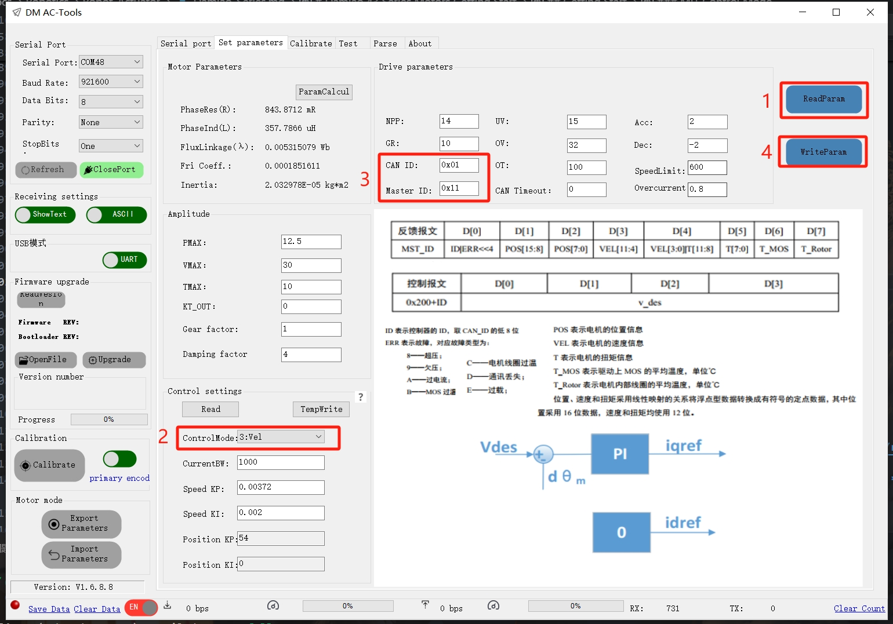

5.  在 ​Test 选项卡中，点击 ​\*\*"Enable Motor"\*\* 按钮（Ente）。
6.  在 Vel Control 部分：
    -   将 Vel (rad/s) 设置为 5。
    -   点击 ​Update → ​Send。

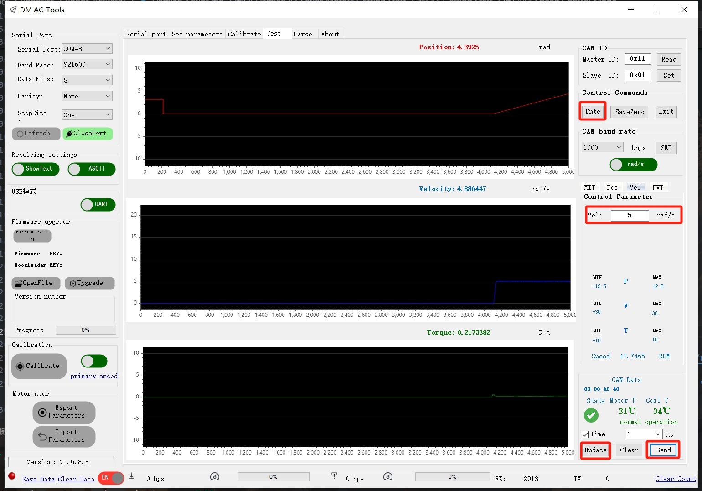

电机将���始旋转。您也可以复制 CAN 数据（十六进制格式）并使用串口调试工具来驱动电机。

### 位置控制模式[​](#位置控制模式 "Direct link to 位置控制模式")

1.  在 Set Parameters 部分，点击 ​Read Param 显示当前电机参数。
2.  将 ​Control Mode 设置为 Pos Mode。
3.  验证配置的 ​CAN ID。
4.  点击 ​Write Param 保存所有设置。

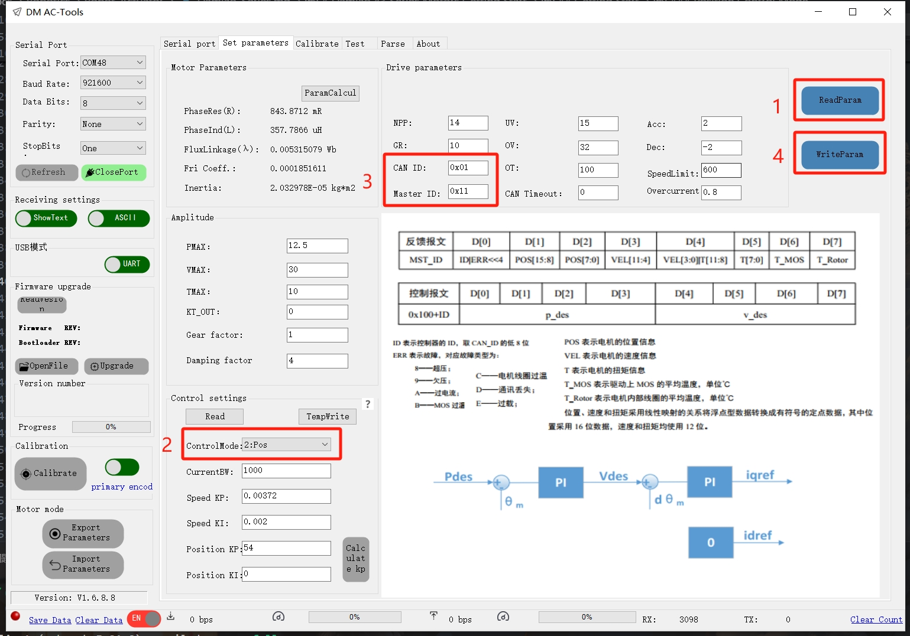

5.  在 ​Test 选项卡中，点击 ​\*\*"Enable Motor"\*\* 按钮（Ente）。
6.  在 Pos Control 部分：
    -   将 Pos 设置为 3.14。
    -   将 Vel (rad/s) 设置为 5。
    -   点击 ​Update → ​Send。

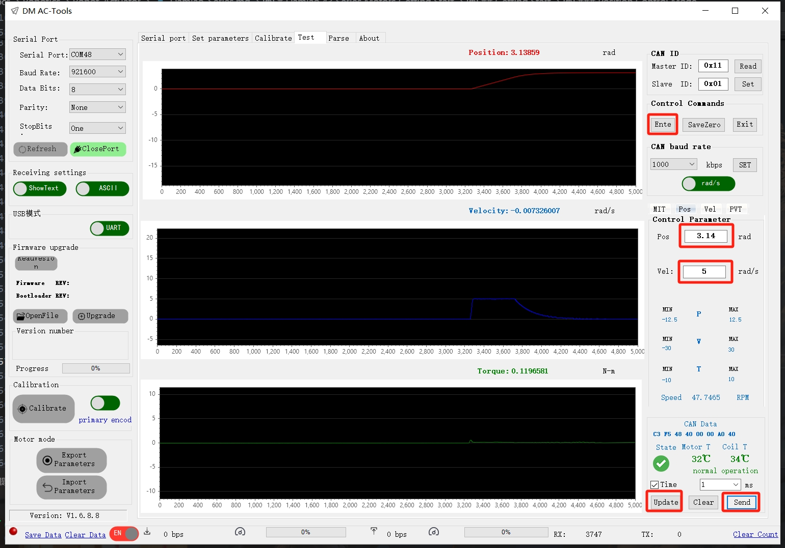

电机将开始旋转。您也可以复制 CAN 数据（十六进制格式）并使用串口调试工具来驱动电机。

## 使用 [​reComputer Mini Jetson Orin](/cn/recomputer_jetson_mini_getting_started/) 控制电机[​](#使用-recomputer-mini-jetson-orin-��制电机 "Direct link to 使用-recomputer-mini-jetson-orin-控制电机")

目前，市场上电机最常见的 CAN 通信接口使用 **XT30 (2+2)** 和 **JST 连接器**。我们的 **reComputer Mini Jetson Orin** 和 **reComputer Robotics** 设备配备了 **双 XT30 (2+2) 端口** 和 **基于 JST 的 CAN 接口**，提供无缝兼容性。

**reComputer Mini：**


**reComputer Robotics**

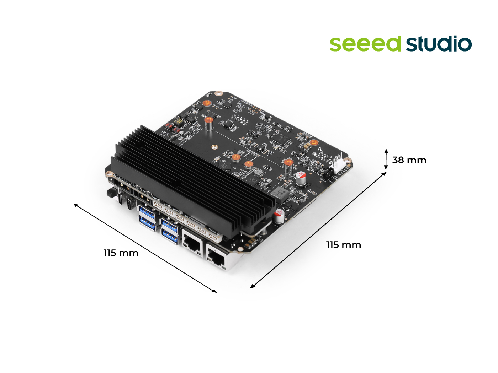

有关 CAN 使用的更多详细信息，您可以参考此 [wiki](https://wiki.seeedstudio.com/cn/recomputer_jetson_mini_hardware_interfaces_usage/#can)。

### 启用 CAN 接口[​](#启用-can-接口 "Direct link to 启用 CAN 接口")

**步骤 1：** 在使用 CAN0 和 CAN1 之前，请拆下底盖并将两个 120Ω 终端电阻都设置为 ​ON 位置。

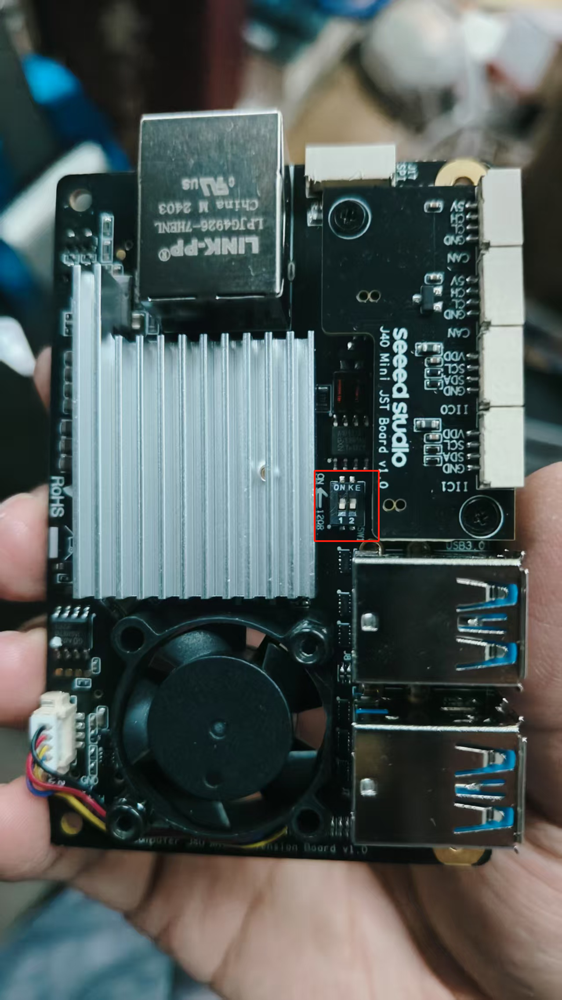

**步骤 2：** 通过 XT30 (2+2) 接口将电机直接连接到 reComputer Mini CAN0。

tip

对于 reComputer Mini 的 CAN 接口，H/L 引脚与电机的 H/L 相比是反向的。因此，您需要在 XT30 2+2 线束中反转 H/L 连接。

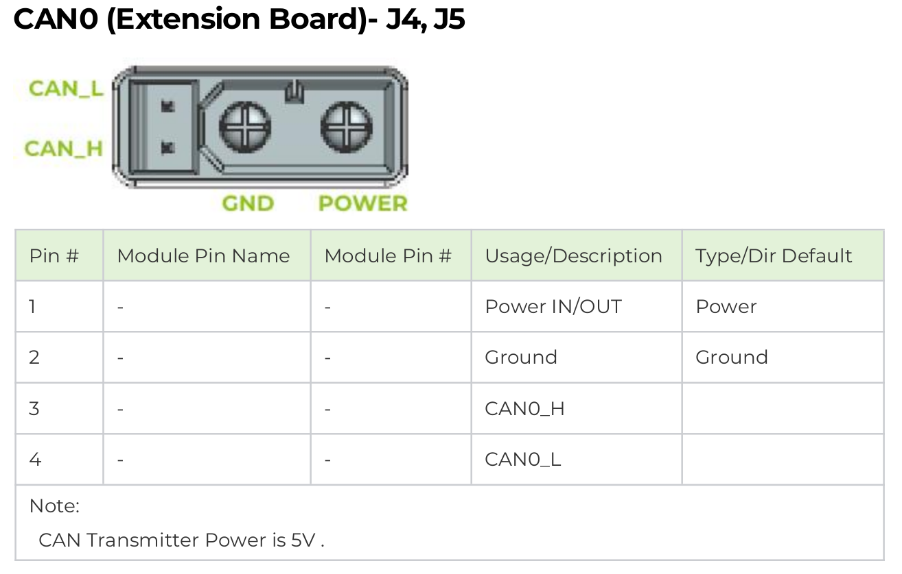

danger

此电源仅用于单电机学习和测试。对于多个电机，请设计单独的电源板，并将 Jetson 的电源与电机电源隔离，以避免高电流直接通过 Jetson, 烧毁Jetson需要自行承担风险。

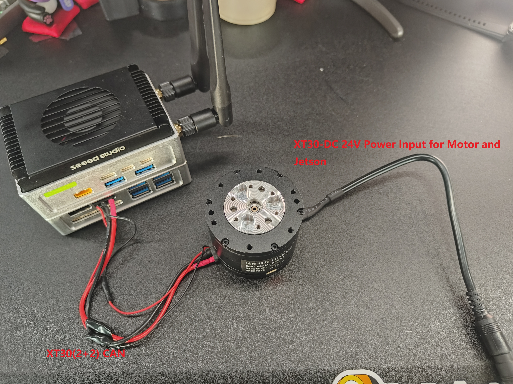

danger

此电源仅用于单电机学习和测试。对于多个电机，请设计单独的电源板并将 Jetson 的电源与电机电源隔离，以避免大电流直接通过 Jetson。

#### 启用 Jetson CAN 通信[​](#启用-jetson-can-通信 "Direct link to 启用 Jetson CAN 通信")

打开终端并输入以下命令将 GPIO 引脚拉高并激活 CAN0：

```
gpioset --mode=wait 0 43=0
```

如果您��用 JST 接口 CAN1，请将引脚 106 拉高。

```
gpioset --mode=wait 0 106=0
```

保持此终端打开，启动新终端，并配置 CAN0。

```
sudo modprobe mttcan
sudo ip link set can0 type can bitrate 1000000
sudo ip link set can0 up
```

### C++ 示例[​](#c-示例 "Direct link to C++ 示例")

#### 安装和编译[​](#安装和编译 "Direct link to 安装和编译")

-   **安装 CMake**

```
sudo apt update
sudo apt install cmake
```

-   **安装 CAN 工具**

```
sudo apt install can-utils
```

-   **下载并编译程序**

1.  创建工作空间并克隆仓库：

```
mkdir -p ~/orin_ws/src
cd ~/orin_ws/src
git clone https://gitee.com/xauter/orin-control.git
```

2.  编译：

```
cd ~/orin_ws/src/orin-control/dm_hw
mkdir build
cd build
cmake ..
make
```

#### 使用方法[​](#使用方法 "Direct link to 使用方法")

1.  **检查 CAN 设备**

打开终端并运行：

```
ip -brief link | grep can
```

2.  **运行程序**

在 `build` 文件夹中，执行：

```
cd ~/orin_ws/src/orin-control/dm_hw/build
./dm_main
```

电机将亮起**绿色**并以**正弦速度**旋转。

### 使用 Python 控制[​](#使用-python-控制 "Direct link to 使用 Python 控制")

-   **安装 Python 环境**

```
pip install python-can numpy
```

-   **在目录 `~/damiao/scripts` 下创建名为 scripts 的文件夹来存储 Python 脚本。**

```
mkdir -p ~/damiao/scripts
```

-   **创建 damiao\_motor.py 文件**

```
cd ~/damiao/scripts
touch damiao_motor.py
```

将以下代码复制到 damiao\_motor.py

damiao\_motor.py

```python
import can
from time import sleep, time
import numpy as np
from enum import IntEnum
from struct import unpack
from struct import pack


class Motor:
    def __init__(self, MotorType, SlaveID, MasterID):
        """
        define Motor object 定义电机对象
        :param MotorType: Motor type 电机类型
        :param SlaveID: CANID 电机ID
        :param MasterID: MasterID 主机ID 建议不要设为0
        """
        self.Pd = float(0)
        self.Vd = float(0)
        self.goal_position = float(0)
        self.goal_tau = float(0)
        self.state_q = float(0)
        self.state_dq = float(0)
        self.state_tau = float(0)
        self.state_tmos = int(0)
        self.state_trotor = int(0)
        self.SlaveID = SlaveID
        self.MasterID = MasterID
        self.MotorType = MotorType
        self.isEnable = False
        self.NowControlMode = Control_Type.MIT
        self.temp_param_dict = {}

    def recv_data(self, q: float, dq: float, tau: float, tmos: int, trotor: int):
        self.state_q = q
        self.state_dq = dq
        self.state_tau = tau
        self.state_tmos = tmos
        self.state_trotor = trotor

    def getPosition(self):
        """
        get the position of the motor 获取电机位置
        :return: the position of the motor 电机位置
        """
        return self.state_q

    def getVelocity(self):
        """
        get the velocity of the motor 获取电机速度
        :return: the velocity of the motor 电机速度
        """
        return self.state_dq

    def getTorque(self):
        """
        get the torque of the motor 获取电机力矩
        :return: the torque of the motor 电机力矩
        """
        return self.state_tau

    def getParam(self, RID):
        """
        get the parameter of the motor 获取电机内部的参数，需要提前读取
        :param RID: DM_variable 电机参数
        :return: the parameter of the motor 电机参数
        """
        if RID in self.temp_param_dict:
            return self.temp_param_dict[RID]
        else:
            return None


class MotorControl:

    Limit_Param = [[12.5, 30, 10], [12.5, 50, 10], [12.5, 8, 28], [12.5, 10, 28],
                   [12.5, 45, 20], [12.5, 45, 40], [12.5, 45, 54], [12.5, 25, 200], [12.5, 20, 200],
                   [12.5, 280, 1], [12.5, 45, 10], [12.5, 45, 10]]

    def __init__(self, channel: str, bitrate: int = 1000000):
        """
        define MotorControl object 定义电机控制对象
        :param serial_device: serial object 串口对象
        """
        self.motors_map = dict()
        self.data_save = bytes()
        self.canbus = can.interface.Bus(channel=channel, interface='socketcan', bitrate=bitrate)

    def controlMIT(self, DM_Motor, kp: float, kd: float, q: float, dq: float, tau: float):
        """
        MIT Control Mode Function 达妙电机MIT控制模式函数
        :param DM_Motor: Motor object 电机对象
        :param kp: kp
        :param kd:  kd
        :param q:  position  期望位置
        :param dq:  velocity  期望速度
        :param tau: torque  期望力矩
        :return: None
        """
        if DM_Motor.SlaveID not in self.motors_map:
            print("controlMIT ERROR : Motor ID not found")
            return
        kp_uint = float_to_uint(kp, 0, 500, 12)
        kd_uint = float_to_uint(kd, 0, 5, 12)
        MotorType = DM_Motor.MotorType
        Q_MAX = self.Limit_Param[MotorType][0]
        DQ_MAX = self.Limit_Param[MotorType][1]
        TAU_MAX = self.Limit_Param[MotorType][2]
        q_uint = float_to_uint(q, -Q_MAX, Q_MAX, 16)
        dq_uint = float_to_uint(dq, -DQ_MAX, DQ_MAX, 12)
        tau_uint = float_to_uint(tau, -TAU_MAX, TAU_MAX, 12)
        data_buf = np.array([0x00, 0x00, 0x00, 0x00, 0x00, 0x00, 0x00, 0x00], np.uint8)
        data_buf[0] = (q_uint >> 8) & 0xff
        data_buf[1] = q_uint & 0xff
        data_buf[2] = dq_uint >> 4
        data_buf[3] = ((dq_uint & 0xf) << 4) | ((kp_uint >> 8) & 0xf)
        data_buf[4] = kp_uint & 0xff
        data_buf[5] = kd_uint >> 4
        data_buf[6] = ((kd_uint & 0xf) << 4) | ((tau_uint >> 8) & 0xf)
        data_buf[7] = tau_uint & 0xff
        self.__send_data(DM_Motor.SlaveID, data_buf)
        self.recv()

    def control_delay(self, DM_Motor, kp: float, kd: float, q: float, dq: float, tau: float, delay: float):
        """
        MIT Control Mode Function with delay 达妙电机MIT控制模式函数带延迟
        :param DM_Motor: Motor object 电机对象
        :param kp: kp
        :param kd: kd
        :param q:  position  期望位置
        :param dq:  velocity  期望速度
        :param tau: torque  期望力矩
        :param delay: delay time 延迟时间 单位秒
        """
        self.controlMIT(DM_Motor, kp, kd, q, dq, tau)
        sleep(delay)

    def control_Pos_Vel(self, Motor, P_desired: float, V_desired: float):
        """
        control the motor in position and velocity control mode 电机位置速度控制模式
        :param Motor: Motor object 电机对象
        :param P_desired: desired position 期望位置
        :param V_desired: desired velocity 期望速度
        :return: None
        """
        if Motor.SlaveID not in self.motors_map:
            print("Control Pos_Vel Error : Motor ID not found")
            return
        motorid = 0x100 + Motor.SlaveID
        data_buf = np.array([0x00, 0x00, 0x00, 0x00, 0x00, 0x00, 0x00, 0x00], np.uint8)
        P_desired_uint8s = float_to_uint8s(P_desired)
        V_desired_uint8s = float_to_uint8s(V_desired)
        data_buf[0:4] = P_desired_uint8s
        data_buf[4:8] = V_desired_uint8s
        self.__send_data(motorid, data_buf)
        self.recv()

    def control_Vel(self, Motor, Vel_desired):
        """
        control the motor in velocity control mode 电机速度控制模式
        :param Motor: Motor object 电机对象
        :param Vel_desired: desired velocity 期望速度
        """
        if Motor.SlaveID not in self.motors_map:
            print("control_VEL ERROR : Motor ID not found")
            return
        motorid = 0x200 + Motor.SlaveID
        data_buf = np.array([0x00, 0x00, 0x00, 0x00, 0x00, 0x00, 0x00, 0x00], np.uint8)
        Vel_desired_uint8s = float_to_uint8s(Vel_desired)
        data_buf[0:4] = Vel_desired_uint8s
        self.__send_data(motorid, data_buf)
        self.recv()

    def control_pos_force(self, Motor, Pos_des: float, Vel_des, i_des):
        """
        control the motor in EMIT control mode 电机力位混合模式
        :param Pos_des: desired position rad  期望位置 单位为rad
        :param Vel_des: desired velocity rad/s  期望速度 为放大100倍
        :param i_des: desired current rang 0-10000 期望电流标幺值放大10000倍
        电流标幺值：实际电流值除以最大电流值，最大电流见上电打印
        """
        if Motor.SlaveID not in self.motors_map:
            print("control_pos_vel ERROR : Motor ID not found")
            return
        motorid = 0x300 + Motor.SlaveID
        data_buf = np.array([0x00, 0x00, 0x00, 0x00, 0x00, 0x00, 0x00, 0x00], np.uint8)
        Pos_desired_uint8s = float_to_uint8s(Pos_des)
        data_buf[0:4] = Pos_desired_uint8s
        Vel_uint = np.uint16(Vel_des)
        ides_uint = np.uint16(i_des)
        data_buf[4] = Vel_uint & 0xff
        data_buf[5] = Vel_uint >> 8
        data_buf[6] = ides_uint & 0xff
        data_buf[7] = ides_uint >> 8
        self.__send_data(motorid, data_buf)
        self.recv()

    def enable(self, Motor):
        """
        enable motor 使能电机
        最好在上电后几秒后再使能电机
        :param Motor: Motor object 电机对象
        """
        self.__control_cmd(Motor, np.uint8(0xFC))
        sleep(0.1)
        self.recv()

    def enable_old(self, Motor, ControlMode):
        """
        enable motor old firmware 使能电机旧版本固件，这个是为了旧版本电机固件的兼容性
        可恶的旧版本固件使能需要加上偏移量
        最好在上电后几秒后再使能电机
        :param Motor: Motor object 电机对象
        """
        data_buf = np.array([0xff, 0xff, 0xff, 0xff, 0xff, 0xff, 0xff, 0xfc], np.uint8)
        enable_id = ((int(ControlMode) - 1) << 2) + Motor.SlaveID
        self.__send_data(enable_id, data_buf)
        sleep(0.1)
        self.recv()

    def disable(self, Motor):
        """
        disable motor 失能电机
        :param Motor: Motor object 电机对象
        """
        self.__control_cmd(Motor, np.uint8(0xFD))
        sleep(0.1)
        self.recv()

    def set_zero_position(self, Motor):
        """
        set the zero position of the motor 设置电机0位
        :param Motor: Motor object 电机对象
        """
        self.__control_cmd(Motor, np.uint8(0xFE))
        sleep(0.1)
        self.recv()

    def recv(self):
        data_recv = self.canbus.recv(0.1)
        if data_recv is not None:
            CANID = data_recv.data[0]
            CMD = 0x11
            self.__process_packet(data_recv.data, CANID, CMD)

    def recv_set_param_data(self):
        data_recv = self.canbus.recv(0.1)
        if data_recv is not None:
            data = data_recv.data
            CANID = data_recv.arbitration_id
            CMD = 0x11
            self.__process_packet(data, CANID, CMD)
            print(hex(CANID), hex(CMD))
            print(hex(data_recv.data[0]), hex(data_recv.data[1]), hex(data_recv.data[2]), hex(data_recv.data[3]),
                  hex(data_recv.data[4]), hex(data_recv.data[5]), hex(data_recv.data[6]), hex(data_recv.data[7]))

    def __process_packet(self, data, CANID, CMD):
        if CMD == 0x11:
            if CANID != 0x00:
                if CANID in self.motors_map:
                    q_uint = np.uint16((np.uint16(data[1]) << 8) | data[2])
                    dq_uint = np.uint16((np.uint16(data[3]) << 4) | (data[4] >> 4))
                    tau_uint = np.uint16(((data[4] & 0xf) << 8) | data[5])
                    t_mos = data[6]
                    t_rotor = data[7]
                    MotorType_recv = self.motors_map[CANID].MotorType
                    Q_MAX = self.Limit_Param[MotorType_recv][0]
                    DQ_MAX = self.Limit_Param[MotorType_recv][1]
                    TAU_MAX = self.Limit_Param[MotorType_recv][2]
                    recv_q = uint_to_float(q_uint, -Q_MAX, Q_MAX, 16)
                    recv_dq = uint_to_float(dq_uint, -DQ_MAX, DQ_MAX, 12)
                    recv_tau = uint_to_float(tau_uint, -TAU_MAX, TAU_MAX, 12)
                    self.motors_map[CANID].recv_data(recv_q, recv_dq, recv_tau, t_mos, t_rotor)
            else:
                MasterID = data[0] & 0x0f
                if MasterID in self.motors_map:
                    q_uint = np.uint16((np.uint16(data[1]) << 8) | data[2])
                    dq_uint = np.uint16((np.uint16(data[3]) << 4) | (data[4] >> 4))
                    tau_uint = np.uint16(((data[4] & 0xf) << 8) | data[5])
                    t_mos = data[6]
                    t_rotor = data[7]
                    MotorType_recv = self.motors_map[MasterID].MotorType
                    Q_MAX = self.Limit_Param[MotorType_recv][0]
                    DQ_MAX = self.Limit_Param[MotorType_recv][1]
                    TAU_MAX = self.Limit_Param[MotorType_recv][2]
                    recv_q = uint_to_float(q_uint, -Q_MAX, Q_MAX, 16)
                    recv_dq = uint_to_float(dq_uint, -DQ_MAX, DQ_MAX, 12)
                    recv_tau = uint_to_float(tau_uint, -TAU_MAX, TAU_MAX, 12)
                    self.motors_map[MasterID].recv_data(recv_q, recv_dq, recv_tau, t_mos, t_rotor)

    def __process_set_param_packet(self, data, CANID, CMD):
        if CMD == 0x11 and (data[2] == 0x33 or data[2] == 0x55):
            masterid = CANID
            slaveId = ((data[1] << 8) | data[0])
            if CANID == 0x00:
                masterid = slaveId
            if masterid not in self.motors_map:
                if slaveId not in self.motors_map:
                    return
                else:
                    masterid = slaveId
            RID = data[3]
            if is_in_ranges(RID):
                num = uint8s_to_uint32(data[4], data[5], data[6], data[7])
                self.motors_map[masterid].temp_param_dict[RID] = num
            else:
                num = uint8s_to_float(data[4], data[5], data[6], data[7])
                self.motors_map[masterid].temp_param_dict[RID] = num

    def addMotor(self, Motor):
        """
        add motor to the motor control object 添加电机到电机控制对象
        :param Motor: Motor object 电机对象
        """
        self.motors_map[Motor.SlaveID] = Motor
        if Motor.MasterID != 0:
            self.motors_map[Motor.MasterID] = Motor
        return True

    def __control_cmd(self, Motor, cmd: np.uint8):
        data_buf = np.array([0xff, 0xff, 0xff, 0xff, 0xff, 0xff, 0xff, cmd], np.uint8)
        self.__send_data(Motor.SlaveID, data_buf)

    def __send_data(self, motor_id, data):
        """
        send data to the motor 发送数据到电机
        :param motor_id:
        :param data:
        :return:
        """
        msg = can.Message(is_extended_id=False, arbitration_id=motor_id, data=data, is_remote_frame=False)
        self.canbus.send(msg)

    def __read_RID_param(self, Motor, RID):
        can_id_l = Motor.SlaveID & 0xff
        can_id_h = (Motor.SlaveID >> 8) & 0xff
        data_buf = np.array([np.uint8(can_id_l), np.uint8(can_id_h), 0x33, np.uint8(RID), 0x00, 0x00, 0x00, 0x00],
                            np.uint8)
        self.__send_data(0x7FF, data_buf)

    def __write_motor_param(self, Motor, RID, data):
        can_id_l = Motor.SlaveID & 0xff
        can_id_h = (Motor.SlaveID >> 8) & 0xff
        data_buf = np.array([np.uint8(can_id_l), np.uint8(can_id_h), 0x55, np.uint8(RID), 0x00, 0x00, 0x00, 0x00],
                            np.uint8)
        if not is_in_ranges(RID):
            data_buf[4:8] = float_to_uint8s(data)
        else:
            data_buf[4:8] = data_to_uint8s(int(data))
        self.__send_data(0x7FF, data_buf)

    def switchControlMode(self, Motor, ControlMode):
        """
        switch the control mode of the motor 切换电机控制模式
        :param Motor: Motor object 电机对象
        :param ControlMode: Control_Type 电机控制模式 example:MIT:Control_Type.MIT MIT模式
        """
        max_retries = 20
        retry_interval = 0.1
        RID = 10
        self.__write_motor_param(Motor, RID, np.uint8(ControlMode))
        for _ in range(max_retries):
            sleep(retry_interval)
            self.recv_set_param_data()
            if Motor.SlaveID in self.motors_map:
                if RID in self.motors_map[Motor.SlaveID].temp_param_dict:
                    if abs(self.motors_map[Motor.SlaveID].temp_param_dict[RID] - ControlMode) < 0.1:
                        return True
                    else:
                        return False
        return False

    def save_motor_param(self, Motor):
        """
        save the all parameter  to flash 保存所有电机参数
        :param Motor: Motor object 电机对象
        :return:
        """
        can_id_l = Motor.SlaveID & 0xff
        can_id_h = (Motor.SlaveID >> 8) & 0xff
        data_buf = np.array([np.uint8(can_id_l), np.uint8(can_id_h), 0xAA, 0x00, 0x00, 0x00, 0x00, 0x00], np.uint8)
        self.disable(Motor)
        self.__send_data(0x7FF, data_buf)
        sleep(0.001)

    def change_limit_param(self, Motor_Type, PMAX, VMAX, TMAX):
        """
        change the PMAX VMAX TMAX of the motor 改变电机的PMAX VMAX TMAX
        :param Motor_Type:
        :param PMAX: 电机的PMAX
        :param VMAX: 电机的VMAX
        :param TMAX: 电机的TMAX
        :return:
        """
        self.Limit_Param[Motor_Type][0] = PMAX
        self.Limit_Param[Motor_Type][1] = VMAX
        self.Limit_Param[Motor_Type][2] = TMAX

    def refresh_motor_status(self, Motor):
        """
        get the motor status 获得电机状态
        """
        can_id_l = Motor.SlaveID & 0xff
        can_id_h = (Motor.SlaveID >> 8) & 0xff
        data_buf = np.array([np.uint8(can_id_l), np.uint8(can_id_h), 0xCC, 0x00, 0x00, 0x00, 0x00, 0x00], np.uint8)
        self.__send_data(0x7FF, data_buf)
        self.recv()

    def change_motor_param(self, Motor, RID, data):
        """
        change the RID of the motor 改变电机的参数
        :param Motor: Motor object 电机对象
        :param RID: DM_variable 电机参数
        :param data: 电机参数的值
        :return: True or False ,True means success, False means fail
        """
        max_retries = 20
        retry_interval = 0.05
        self.__write_motor_param(Motor, RID, data)
        for _ in range(max_retries):
            self.recv_set_param_data()
            if Motor.SlaveID in self.motors_map and RID in self.motors_map[Motor.SlaveID].temp_param_dict:
                if abs(self.motors_map[Motor.SlaveID].temp_param_dict[RID] - data) < 0.1:
                    return True
                else:
                    return False
            sleep(retry_interval)
        return False

    def read_motor_param(self, Motor, RID):
        """
        read only the RID of the motor 读取电机的内部信息例如 版本号等
        :param Motor: Motor object 电机对象
        :param RID: DM_variable 电机参数
        :return: 电机参数的值
        """
        max_retries = 5
        retry_interval = 0.05
        self.__read_RID_param(Motor, RID)
        for _ in range(max_retries):
            sleep(retry_interval)
            self.recv_set_param_data()
            if Motor.SlaveID in self.motors_map:
                if RID in self.motors_map[Motor.SlaveID].temp_param_dict:
                    return self.motors_map[Motor.SlaveID].temp_param_dict[RID]
        return None

    def __extract_packets(self, data):
        frames = []
        header = 0xAA
        tail = 0x55
        frame_length = 16
        i = 0
        remainder_pos = 0
        while i <= len(data) - frame_length:
            if data[i] == header and data[i + frame_length - 1] == tail:
                frame = data[i:i + frame_length]
                frames.append(frame)
                i += frame_length
                remainder_pos = i
            else:
                i += 1
        self.data_save = data[remainder_pos:]
        return frames


def LIMIT_MIN_MAX(x, min_val, max_val):
    return max(min_val, min(x, max_val))


def float_to_uint(x: float, x_min: float, x_max: float, bits):
    x = LIMIT_MIN_MAX(x, x_min, x_max)
    span = x_max - x_min
    data_norm = (x - x_min) / span
    return np.uint16(data_norm * ((1 << bits) - 1))


def uint_to_float(x: np.uint16, min: float, max: float, bits):
    span = max - min
    data_norm = float(x) / ((1 << bits) - 1)
    temp = data_norm * span + min
    return np.float32(temp)


def float_to_uint8s(value):
    packed = pack('f', value)
    return unpack('4B', packed)


def data_to_uint8s(value):
    if isinstance(value, int) and (0 <= value <= 0xFFFFFFFF):
        packed = pack('I', value)
    else:
        raise ValueError("Value must be an integer within the range of uint32")
    return unpack('4B', packed)


def is_in_ranges(number):
    """
    check if the number is in the range of uint32
    :param number:
    :return:
    """
    if (7 <= number <= 10) or (13 <= number <= 16) or (35 <= number <= 36):
        return True
    return False


def uint8s_to_uint32(byte1, byte2, byte3, byte4):
    packed = pack('<4B', byte1, byte2, byte3, byte4)
    return unpack('<I', packed)[0]


def uint8s_to_float(byte1, byte2, byte3, byte4):
    packed = pack('<4B', byte1, byte2, byte3, byte4)
    return unpack('<f', packed)[0]


def print_hex(data):
    hex_values = [f'{byte:02X}' for byte in data]
    print(' '.join(hex_values))


def get_enum_by_index(index, enum_class):
    try:
        return enum_class(index)
    except ValueError:
        return None


class DM_Motor_Type(IntEnum):
    DM4310 = 0
    DM4310_48V = 1
    DM4340 = 2
    DM4340_48V = 3
    DM6006 = 4
    DM8006 = 5
    DM8009 = 6
    DM10010L = 7
    DM10010 = 8
    DMH3510 = 9
    DMH6215 = 10
    DMG6220 = 11


class DM_variable(IntEnum):
    UV_Value = 0
    KT_Value = 1
    OT_Value = 2
    OC_Value = 3
    ACC = 4
    DEC = 5
    MAX_SPD = 6
    MST_ID = 7
    ESC_ID = 8
    TIMEOUT = 9
    CTRL_MODE = 10
    Damp = 11
    Inertia = 12
    hw_ver = 13
    sw_ver = 14
    SN = 15
    NPP = 16
    Rs = 17
    LS = 18
    Flux = 19
    Gr = 20
    PMAX = 21
    VMAX = 22
    TMAX = 23
    I_BW = 24
    KP_ASR = 25
    KI_ASR = 26
    KP_APR = 27
    KI_APR = 28
    OV_Value = 29
    GREF = 30
    Deta = 31
    V_BW = 32
    IQ_c1 = 33
    VL_c1 = 34
    can_br = 35
    sub_ver = 36
    u_off = 50
    v_off = 51
    k1 = 52
    k2 = 53
    m_off = 54
    dir = 55
    p_m = 80
    xout = 81


class Control_Type(IntEnum):
    MIT = 1
    POS_VEL = 2
    VEL = 3
    Torque_Pos = 4


class DamiaoPort:
    def __init__(self, device, types, can_ids, master_ids, motor_with_torque, control_mode=Control_Type.MIT):
        self.device = device
        self.types = types
        self.can_ids = can_ids
        self.master_ids = master_ids
        self.control = MotorControl(self.device, bitrate=4000000)
        self.motors = [Motor(type, can_id, master_id) for type, can_id, master_id in zip(types, can_ids, master_ids)]
        self.stat_data = []
        self.stat_time = []
        for motor in self.motors:
            self.control.addMotor(motor)
            self.control.enable(motor)

    def get_present_status(self):
        self.stat_time.append(time())
        stat = [[
            motor.goal_position,
            motor.goal_tau,
            motor.getPosition(),
            motor.getVelocity(),
            motor.getTorque(),
            motor.state_tmos,
            motor.state_trotor,
        ] for motor in self.motors]
        self.stat_data.append(stat)
        return stat

    def save_status(self, filename):
        np.savez(filename, np.array(self.stat_time), np.array(self.stat_data))

    def disable(self):
        for motor in self.motors:
            self.control.disable(motor)

    def shutdown(self):
        for motor in self.motors:
            self.control.controlMIT(motor, 0, 0, 0, 0, 0)
        self.control.canbus.shutdown()

    def set_zero_position(self):
        for motor in self.motors:
            self.control.disable(motor)
        sleep(1)
        for motor in self.motors:
            self.control.set_zero_position(motor)
        sleep(1)
        for motor in self.motors:
            self.control.enable(motor)
        return 0

    async def move_towards(self, goal_positions, kps, kds):
        for motor, goal_position, kp, kd in zip(self.motors, goal_positions, kps, kds):
            delta = goal_position - motor.getPosition()
            v = motor.getVelocity()
            tau = kp * delta - kd * v
            motor.goal_position = goal_position
            motor.goal_tau = tau
            self.control.controlMIT(motor, 0, 0, 0, 0, tau)
            await asyncio.sleep(0.00003)

    def move_regressor_sync(self, regs, search_range, search_step, goal_positions, kps, kds):
        TORQUE_SCALER = 30
        if len(self.stat_data) == 0:
            return self.move_towards_sync(goal_positions, kps, kds)
        for motor, reg, goal_position, kp, kd, stat in zip(
                self.motors, regs, goal_positions, kps, kds, self.stat_data[-1]):
            pos = motor.getPosition()
            vel = motor.getVelocity()
            delta = goal_position - pos
            goal_tau = kp * delta - kd * vel
            _goal_pos, _goal_tau, _pos, _vel, _tau = stat
            x = np.array([[_pos, _vel, _tau, _goal_pos, _goal_tau],
                          [pos, vel, motor.getTorque(), goal_position, goal_tau]])
            x /= np.array([[np.pi, 10, TORQUE_SCALER, np.pi, TORQUE_SCALER]])
            xs = []
            for tau in np.linspace(goal_tau / TORQUE_SCALER - search_range,
                                   goal_tau / TORQUE_SCALER + search_range,
                                   num=search_step):
                x_ = x.copy()
                x_[0, 4] = tau
                xs.append(x_.flatten())
            h = reg.predict(xs)
            diff = h - goal_position
            tau = TORQUE_SCALER * xs[np.argmin(diff ** 2)][4]
            goal_tau = tau
            motor.goal_position = goal_position
            motor.goal_tau = goal_tau
            self.control.controlMIT(motor, 0, 0, 0, 0, goal_tau)
            sleep(0.00003)

    def move_towards_sync(self, goal_positions, kps, kds):
        for motor, goal_position, kp, kd in zip(self.motors, goal_positions, kps, kds):
            delta = goal_position - motor.getPosition()
            v = motor.getVelocity()
            tau = kp * delta - kd * v
            motor.goal_position = goal_position
            motor.goal_tau = tau
            self.control.controlMIT(motor, 0, 0, 0, 0, tau)

    def set_goal_torque_sync(self, goal_taus):
        for motor, goal_tau in zip(self.motors, goal_taus):
            motor.goal_position = 0
            motor.goal_tau = goal_tau
            self.control.controlMIT(motor, 0, 0, 0, 0, motor.goal_tau)
            sleep(0.00003)

    def move_torque_sync(self, taus):
        for motor, tau in zip(self.motors, taus):
            motor.goal_position = 0
            motor.goal_tau = tau
            self.control.controlMIT(motor, 0, 0, 0, 0, motor.goal_tau)
            sleep(0.00003)

    def keep_torque_sync(self):
        for motor in self.motors:
            self.control.controlMIT(motor, 0, 0, 0, 0, motor.goal_tau)
            sleep(0.00003)

    async def set_goal_positions(self, goal_positions, kps):
        for motor, goal_position, kp in zip(self.motors, goal_positions, kps):
            motor.goal_position = goal_position
            motor.goal_tau = 0
            self.control.controlMIT(motor, kp, 1.2, goal_position, 0, 0)
            await asyncio.sleep(0.00003)

    def set_goal_positions_sync(self, goal_positions, kps, kds):
        for motor, goal_position, kp, kd in zip(self.motors, goal_positions, kps, kds):
            motor.goal_position = goal_position
            motor.goal_tau = 0
            self.control.controlMIT(motor, kp, kd, goal_position, 0, 0)
            sleep(0.00003)

    def set_goal_posvel(self, goal_positions):
        for motor, goal_position in zip(self.motors, goal_positions):
            motor.goal_position = goal_position
            motor.goal_tau = 0
            self.control.control_pos_force(motor, goal_position, 1, 1)

    def controlMIT(self, motor, kp, kd, q, dq, tau):
        self.control.controlMIT(self.motors[motor], kp, kd, q, dq, tau)
```

-   **创建 damiao\_test.py 文件**

将以下代码复制到 damiao\_test.py

damiao\_test.py

```python
import time
import math
import numpy as np
from damiao_motor import Motor, MotorControl, DM_Motor_Type, Control_Type

NUM_MOTORS = 1
CAN_INTERFACE = "can0"
CAN_BITRATE = 1000000
MOTOR_TYPE = DM_Motor_Type.DM4310
FREQUENCY = 0.1
AMPLITUDE = 6
DURATION = 60.0


def main():
    control = MotorControl(CAN_INTERFACE, bitrate=CAN_BITRATE)

    motors = []
    for i in range(NUM_MOTORS):
        motor = Motor(MOTOR_TYPE, i + 1, i + 0X10)
        control.addMotor(motor)
        motors.append(motor)
        control.enable(motor)
        print(f"Motor {i + 1} enabled")

    try:
        start_time = time.time()
        while time.time() - start_time < DURATION:
            current_time = time.time() - start_time

            position = AMPLITUDE * math.sin(2 * math.pi * FREQUENCY * current_time)

            for motor in motors:
                control.controlMIT(
                    motor,
                    kp=10.0,
                    kd=1.0,
                    q=position,
                    dq=0.0,
                    tau=0.0
                )

            time.sleep(0.001)

    except KeyboardInterrupt:
        print("\nProgram interrupted by user")
    finally:
        for motor in motors:
            control.disable(motor)
            print(f"Motor {motor.SlaveID} disabled")


if __name__ == "__main__":
    main()
```

-   **运行 damiao\_test.py**

```
python damiao_test.py
```

电机将亮起**绿色**并以**正弦速度**旋转。

## 技术支持与产品讨论[​](#技术支持与产品讨论 "Direct link to 技术支持与产品讨论")

感谢您选择我们的产品！我们在这里为您提供不同的支持，以确保您使用我们产品的体验尽可能顺畅。我们提供多种沟通渠道，以满足不同的偏好和需求。

[](https://forum.seeedstudio.com/)[](https://www.seeedstudio.com/contacts)

[](https://discord.gg/eWkprNDMU7)[](https://github.com/Seeed-Studio/wiki-documents/discussions/69)
