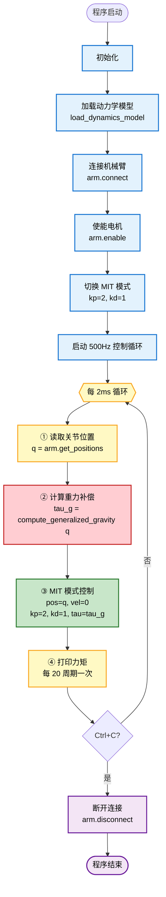

# 重力补偿控制循环流程图

展示 500Hz 控制循环的完整执行流程。



## 步骤详解

### 步骤 1：读取关节位置
```python
q = arm.get_positions()  # shape=(6,), 单位：弧度
```
从 CAN 总线读取 6 个电机的当前位置。

### 步骤 2：计算重力补偿 ⭐ **核心步骤**
```python
tau_g = compute_generalized_gravity(q=q)  # shape=(6,), 单位：N·m
```
使用 Pinocchio 的 RNEA 算法计算当前姿态下的重力补偿力矩。

### 步骤 3：MIT 模式控制
```python
arm.mit(
    pos=q,                              # 位置目标 = 当前位置
    vel=np.zeros(6),                    # 速度目标 = 0
    kp=np.full(6, 2.0),                 # 位置刚度 = 2（很弱）
    kd=np.full(6, 1.0),                 # 速度阻尼 = 1
    tau=tau_g,                          # 前馈力矩 = 重力补偿
)
```
MIT 模式控制律：

$$\tau_{motor} = k_p \cdot (q_{target} - q) + k_d \cdot (v_{target} - v) + \tau_{feedforward}$$

由于 $q_{target} = q$，实际输出：

$$\tau_{motor} = -k_d \cdot \dot{q} + \tau_g$$

- 第一项 $-k_d \cdot \dot{q}$ → 速度阻尼（防晃动）
- 第二项 $\tau_g$ → 重力补偿（抵消重力，让机械臂"漂浮"）

### 步骤 4：打印力矩
每 20 个周期（40ms）打印一次 `tau_g`，用于监控和调试。

### 步骤 5：循环判断
检查 Ctrl+C 信号：
- **否** → 回到步骤 1，继续循环
- **是** → 断开连接，程序结束

## 控制频率

| 参数 | 值 | 说明 |
|------|------|------|
| **控制频率** | 500 Hz | 每 2ms 执行一次 |
| **实时性要求** | 高 | 必须在 2ms 内完成所有计算 |
| **Pinocchio 性能** | ~0.1ms | RNEA 算法 O(n)，6 轴机械臂 |
| **kp（位置刚度）** | 2.0 | 很弱，允许手推 |
| **kd（速度阻尼）** | 1.0 | 防止震荡 |

## 图例颜色说明

- 🔵 **蓝色** → 初始化阶段（只执行一次）
- 🟡 **黄色** → 循环体内的数据读取/输出
- 🔴 **红色** → 核心计算（重力补偿）
- 🟢 **绿色** → 控制指令发送
- 🟣 **紫色** → 退出阶段
