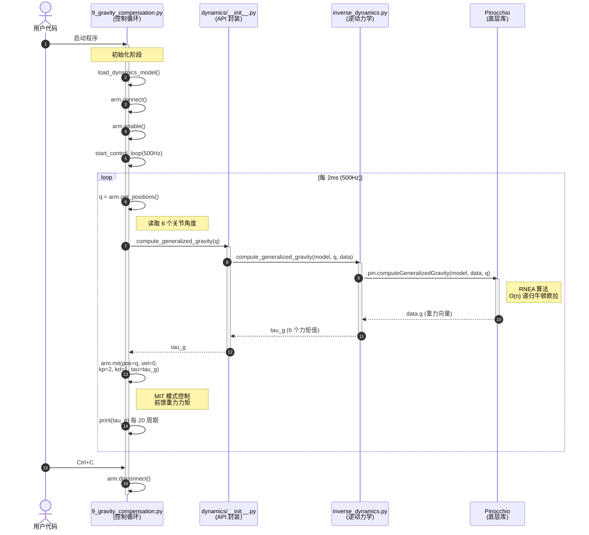
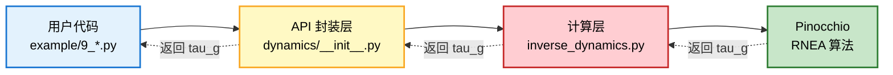

# 重力补偿函数调用序列图

展示从用户代码到 Pinocchio 底层的完整函数调用链。

## 关键调用链

1. **用户代码** → 启动 `9_gravity_compensation.py`
2. **控制循环** (500Hz) → 每 2ms 执行一次
3. **读取关节位置** → `arm.get_positions()` 获取 q
4. **计算重力补偿** → `compute_generalized_gravity(q)`
   - 经过 `dynamics/__init__.py` 封装层
   - 调用 `inverse_dynamics.py` 计算层
   - 最终调用 Pinocchio 的 `pin.computeGeneralizedGravity()`
5. **MIT 控制** → 前馈重力力矩 `tau_g`
6. **循环** → 直到用户按 Ctrl+C

## 性能特点

- **RNEA 算法**：O(n) 时间复杂度，n=6（关节数）
- **500Hz 控制频率**：每 2ms 执行一次，实时性强
- **零拷贝优化**：`data.g.copy()` 避免数据竞争

## 调用层次图（简化）

> 提示：mermaid 图在 VS Code（已安装 `bierner.markdown-mermaid` 插件）、GitHub、Typora 中都能直接渲染，无需额外配置。
