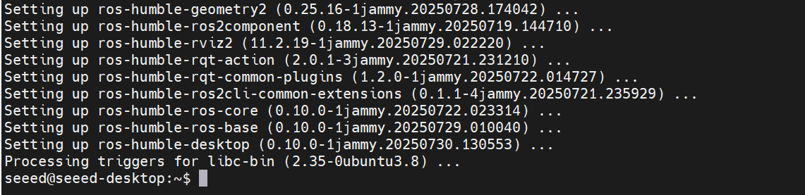
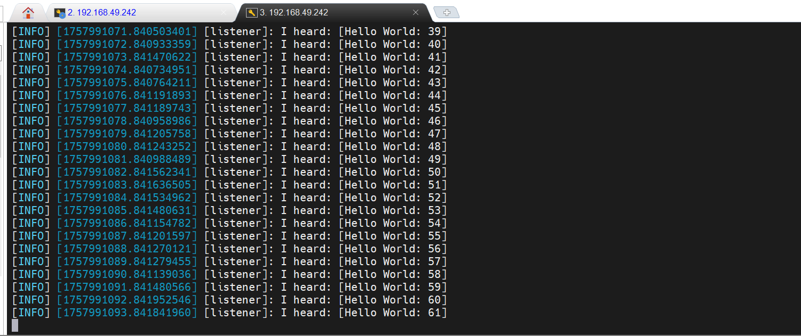

# Install the ROS2 Humble

> 发布时间: 2025-05-28T00:00:00.000Z
> 原文链接: https://wiki.seeedstudio.com/install_ros2_humble/

---
On this page

ROS 2 is a next-generation open-source robotics middleware designed for building real-time, reliable, and scalable robotic systems. This wiki will demonstrate the detailed installation process of ROS 2 using Jetson as an example.

-   JP5.1.2
-   JP6.2

## Set Locale[​](#set-locale "Direct link to Set Locale")

```
locale  sudo apt update && sudo apt install localessudo locale-gen en_US en_US.UTF-8sudo update-locale LC_ALL=en_US.UTF-8 LANG=en_US.UTF-8export LANG=en_US.UTF-8locale
```

## Install Dependencies[​](#install-dependencies "Direct link to Install Dependencies")

```
sudo apt update && sudo apt install gnupg wgetsudo apt install software-properties-commonsudo add-apt-repository universe
```

## Initialize Sources (Choose One Region)[​](#initialize-sources-choose-one-region "Direct link to Initialize Sources (Choose One Region)")

```
echo 'deb https://isaac.download.nvidia.com/isaac-ros/ubuntu/main focal main' | sudo tee -a /etc/apt/sources.listecho 'deb https://isaac.download.nvidia.cn/isaac-ros/ubuntu/main focal main' | sudo tee -a /etc/apt/sources.list
```

## Add ROS 2 APT Repository[​](#add-ros-2-apt-repository "Direct link to Add ROS 2 APT Repository")

```
sudo apt update && sudo apt install curl -y \&& sudo curl -sSL https://raw.githubusercontent.com/ros/rosdistro/master/ros.key -o /usr/share/keyrings/ros-archive-keyring.gpgecho "deb [arch=$(dpkg --print-architecture) signed-by=/usr/share/keyrings/ros-archive-keyring.gpg] http://packages.ros.org/ros2/ubuntu focal main" | sudo tee /etc/apt/sources.list.d/ros2.list > /dev/null
```

## Install ROS2[​](#install-ros2 "Direct link to Install ROS2")

```
sudo apt updatesudo apt install ros-humble-desktop-full
```

## Install Additional Build Tools[​](#install-additional-build-tools "Direct link to Install Additional Build Tools")

```
sudo apt install ros-dev-tools
```

## Initialize ROS Environment[​](#initialize-ros-environment "Direct link to Initialize ROS Environment")

```
sudo rosdep initrosdep update
```

## Set Up ROS Environment Variables[​](#set-up-ros-environment-variables "Direct link to Set Up ROS Environment Variables")

```
echo "source /opt/ros/humble/setup.bash" >> ~/.bashrcsource ~/.bashrc
```

On the Jetson device, open a terminal and enter the following command:

```
sudo apt install software-properties-common -ysudo add-apt-repository universesudo apt updatesudo apt install curl -ysudo curl -sSL https://raw.githubusercontent.com/ros/rosdistro/master/ros.key -o /usr/share/keyrings/ros-archive-keyring.gpgecho "deb [arch=$(dpkg --print-architecture) signed-by=/usr/share/keyrings/ros-archive-keyring.gpg] http://packages.ros.org/ros2/ubuntu $(. /etc/os-release && echo $UBUNTU_CODENAME) main" | sudo tee /etc/apt/sources.list.d/ros2.list > /dev/nullsudo apt updatesudo apt install ros-humble-desktop -y
```



To verify whether ROS2 has been successfully installed, we can create two new terminals in the device and run the following commands respectively.

```
ros2 run demo_nodes_cpp talkerros2 run demo_nodes_py listener
```



If both terminals print out the messages, it means ROS 2 Humble has been successfully installed! 🎉

## Tech Support & Product Discussion[​](#tech-support--product-discussion "Direct link to Tech Support & Product Discussion")

Thank you for choosing our products! We are here to provide you with different support to ensure that your experience with our products is as smooth as possible. We offer several communication channels to cater to different preferences and needs.

[](https://forum.seeedstudio.com/)[](https://www.seeedstudio.com/contacts)

[](https://discord.gg/eWkprNDMU7)[](https://github.com/Seeed-Studio/wiki-documents/discussions/69)