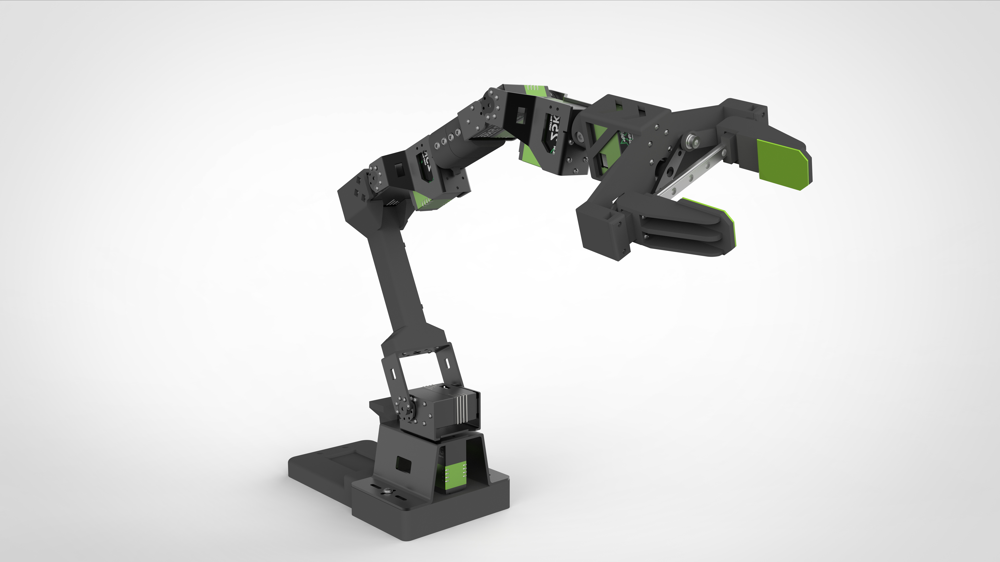
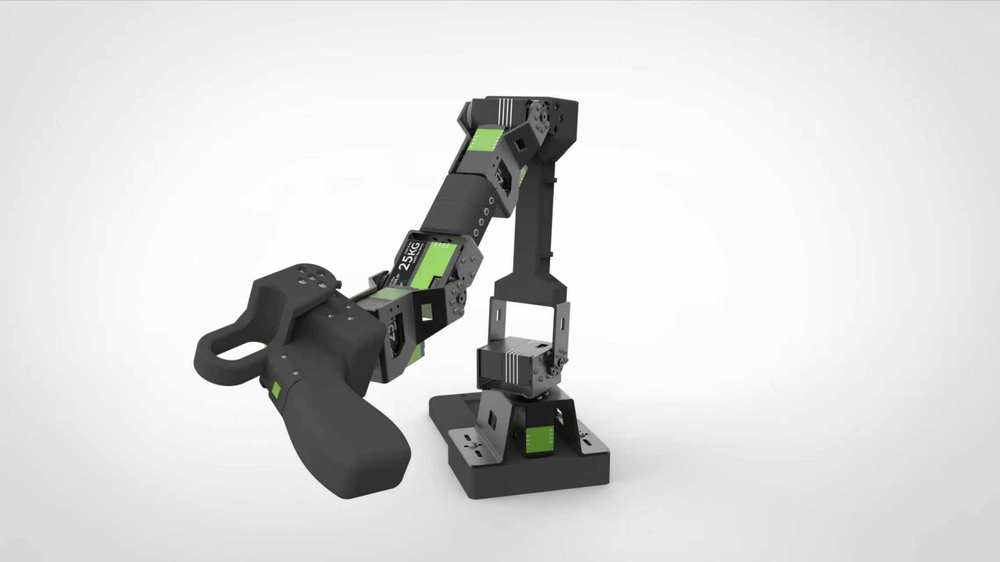
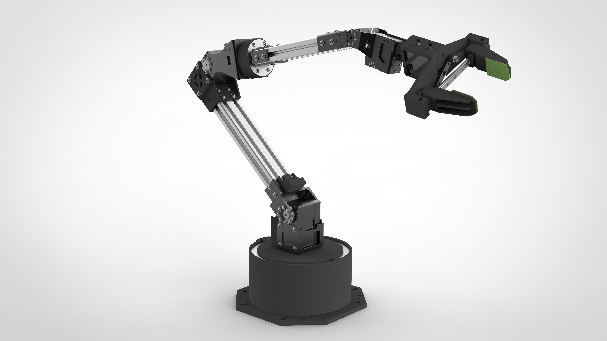

# Starai Arm in ROS2 MoveIt

> 发布时间: 2025-08-01T00:00:00.000Z
> 原文链接: https://wiki.seeedstudio.com/starai_arm_ros_moveit/

---
On this page

**Follower Viola**

**Leader Violin**

**Follower Cello**







[**Get One Now!!! 🖱️**](https://www.seeedstudio.com/Fashionstar-Star-Arm-Viola-Violin-p-6497.html)

## Product Introduction[​](#product-introduction "Direct link to Product Introduction")

1.  **Open-Source & Easy for Secondary Development** This series of servo motors, provided by [Fashion Star Robotics](https://fashionrobo.com/), offers an open-source, easily customizable 6+1 degrees of freedom robotic arm solution.

2.  **Dual-Arm Systems with Various Payloads** The Violin serves as the leader robotic arm. When at 70% of its arm span, the follower arm Viola has an operating payload of 300g, while the follower arm Cello has an operating payload of 750g.

3.  **Supported ROS2, Moveit2 and Isaac Sim** It supports ROS2 for publishing and subscribing to robotic arm data topics and controlling the robotic arm, and also supports MoveIt2 for inverse kinematics calculation, as well as simulation in Isaac Sim.

4.  **LeRobot Platform Integration Support** It's specifically designed for integration with the [LeRobot platform](https://github.com/huggingface/lerobot). This platform provides PyTorch models, datasets, and tools for imitation learning in real-world robotics tasks, including data collection, simulation, training, and deployment.

5.  **Open-Source SDK** Supports Python and C++ SDK Development

6.  **Button Hover** Simulates gravity compensation, allowing the robotic arm to hover at any position via a button.

7.  **Modular End Effector** Enables quick DIY replacement.

8.  **Abundant Learning Resources** We offer comprehensive open-source learning resources, including environment setup, installation and debugging guides, and custom grasping task examples to help users quickly get started and develop robotic applications.

9.  **Nvidia Platform Compatibility** Deployment is supported via the Nvidia Jetson platform.


## Specifications[​](#specifications "Direct link to Specifications")

| Item | Follower Arm \| Viola | Leader Arm \| Violin | Follower Arm \| Cello |
| --- | --- | --- | --- |
| Degrees of Freedom | 6+1 | 6+1 | 6+1 |
| Reach | 470mm | 470mm | 670mm |
| Span | 940mm | 940mm | 1340mm |
| Repeatability | 2mm | \- | 1mm |
| Working Payload | 300g (with 70% Reach) | \- | 750g (with 70% Reach) |
| Servos | RX8-U50H-M x2, RA8-U25H-M x4, RA8-U26H-M x1 | RX8-U50H-M x2, RA8-U25H-M x4, RA8-U26H-M x1 | RX18-U100H-M x3, RX8-U50H-M x3, RX8-U51H-M x1 |
| Parallel Gripper Kit | ✅ | \- | ✅ |
| Wrist Rotate | Yes | Yes | Yes |
| Hold at any Position | Yes | Yes (with handle button) | Yes |
| Wrist Camera Mount | Provides reference 3D printing files | Provides reference 3D printing files | |
| Works with LeRobot | ✅ | ✅ | ✅ |
| Works with ROS 2 | ✅ | ✅ | ✅ |
| Works with MoveIt2 | ✅ | ✅ | ✅ |
| Works with Gazebo | ✅ | ✅ | ✅ |
| Communication Hub | UC-01 | UC-01 | UC-01 |
| Power Supply | 12V10A/120w XT30 | 12V10A/120w XT30 | 12V25A/300w XT60 |

For more information about servo motors, please visit the following link.

[RA8-U25H-M](https://fashionrobo.com/actuator-u25/23396/)

[RX18-U100H-M](https://fashionrobo.com/actuator-u100/22853/)

[RX8-U50H-M](https://fashionrobo.com/actuator-u50/136/)

## Dependent Environment[​](#dependent-environment "Direct link to Dependent Environment")

```
No LSB modules are available.
Distributor ID: Ubuntu
Description: Ubuntu 22.04.5 LTS
Release: 22.04
Codename: Jammy
```

ROS2: Humble

### Install ROS2 Humble[​](#install-ros2-humble "Direct link to Install ROS2 Humble")

[ROS2 Humble Installation](https://wiki.seeedstudio.com/install_ros2_humble/)

### Install Moveit2[​](#install-moveit2 "Direct link to Install Moveit2")

```bash
sudo apt install ros-humble-moveit*
```

### Install Servo Motor's SDK[​](#install-servo-motors-sdk "Direct link to Install Servo Motor's SDK")

```bash
sudo pip install pyserial
sudo pip install fashionstar-uart-sdk
```

### Create a workspace and Initialization[​](#create-a-workspace-and-initialization "Direct link to Create a workspace and Initialization")

```bash
mkdir -p ~/starai_ws/src
cd ~/starai_ws
colcon build
```

### Clone `starai-arm-moveit2` Ros2's Package[​](#clone-starai-arm-moveit2-ros2s-package "Direct link to clone-starai-arm-moveit2-ros2s-package")

```bash
cd ~/starai_ws/src
git clone https://github.com/Seeed-Projects/fashionstar-starai-arm-ros2.git
cd ~/starai_ws
colcon build
echo "source ~/starai_ws/install/setup.bash" >> ~/.bashrc
source ~/.bashrc
```

## Viola[​](#viola "Direct link to Viola")

### Starai Arm MoveIt2 Simulation Script (Optional)[​](#starai-arm-moveit2-simulation-script-optional "Direct link to Starai Arm MoveIt2 Simulation Script (Optional)")

```bash
ros2 launch viola_moveit_config demo.launch.py
```

### Using a Real Robotic Arm[​](#using-a-real-robotic-arm "Direct link to Using a Real Robotic Arm")

### Step 1: Start the Arm Control Node[​](#step-1-start-the-arm-control-node "Direct link to Step 1: Start the Arm Control Node")

Start the arm hardware driver, the Arm Will Move to The Zero Position.

```bash
ros2 launch viola_moveit_config driver.launch.py
```

### Step2: Starthe Moveit2[​](#step2-starthe-moveit2 "Direct link to Step2: Starthe Moveit2")

```bash
ros2 launch viola_moveit_config moveit_write_read.launch.py
```

### End-effector pose read/write demo[​](#end-effector-pose-readwrite-demo "Direct link to End-effector pose read/write demo")

```bash
ros2 run arm_moveit_write topic_publisher
```

## Cello[​](#cello "Direct link to Cello")

### Starai Arm MoveIt2 Simulation Script (Optional)[​](#starai-arm-moveit2-simulation-script-optional-1 "Direct link to Starai Arm MoveIt2 Simulation Script (Optional)")

```bash
ros2 launch cello_moveit_config demo.launch.py
```

### Using a Real Robotic Arm[​](#using-a-real-robotic-arm-1 "Direct link to Using a Real Robotic Arm")

### Step 1: Start the Arm Control Node[​](#step-1-start-the-arm-control-node-1 "Direct link to Step 1: Start the Arm Control Node")

Start the arm hardware driver, the Arm Will Move to The Zero Position.

```bash
ros2 launch cello_moveit_config driver.launch.py
```

### Step2: Starthe Moveit2[​](#step2-starthe-moveit2-1 "Direct link to Step2: Starthe Moveit2")

```bash
ros2 launch cello_moveit_config actual_robot_demo.launch.py
```

### End-effector pose read/write demo[​](#end-effector-pose-readwrite-demo-1 "Direct link to End-effector pose read/write demo")

```bash
ros2 launch cello_moveit_config moveit_write_read.launch.py
```

## Position and orientation topic sending node demo[​](#position-and-orientation-topic-sending-node-demo "Direct link to Position and orientation topic sending node demo")

update here `src/arm_moveit_write/src/topic_publisher.cpp`

```cpp
    // // viola
    // dataset1_ = {
    //   {0.003, -0.204, 0.274},       // position
    //   {0.014, 0.717, 0.017, 0.696}, // orientation
    //   "open"                         // gripper_state
    // };
    // dataset2_ = {
    //   {-0.00, -0.34, 0.177},        // position
    //   {0.0, 0.7071, 0.0, 0.7071},   // orientation
    //   "close"                        // gripper_state
    // };

    // cello
    dataset1_ = {
      {-0.278, 0.000, 0.438},       // position
      {0.707, 0.000, -0.707, 0.000}, // orientation
      "open"                         // gripper_state
    };
    dataset2_ = {
      {-0.479, -0.000, 0.369},        // position
      {0.707, -0.000, -0.707, 0.000},   // orientation
      "close"                        // gripper_state
    }
```

```bash
colcon build
source install/setup.sh
ros2 run arm_moveit_write topic_publisher
```

## FAQ[​](#faq "Direct link to FAQ")

-   If you experience flickering in the RViz2 interface, try the following commands:

    ```bash
    export QT_AUTO_SCREEN_SCALE_FACTOR=0
    ```
