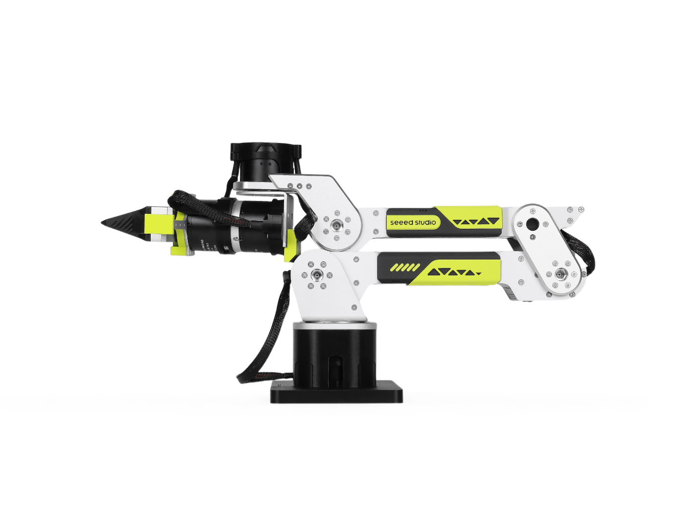
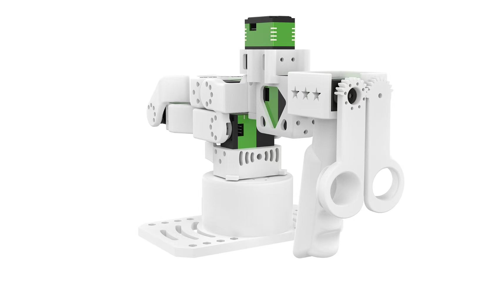
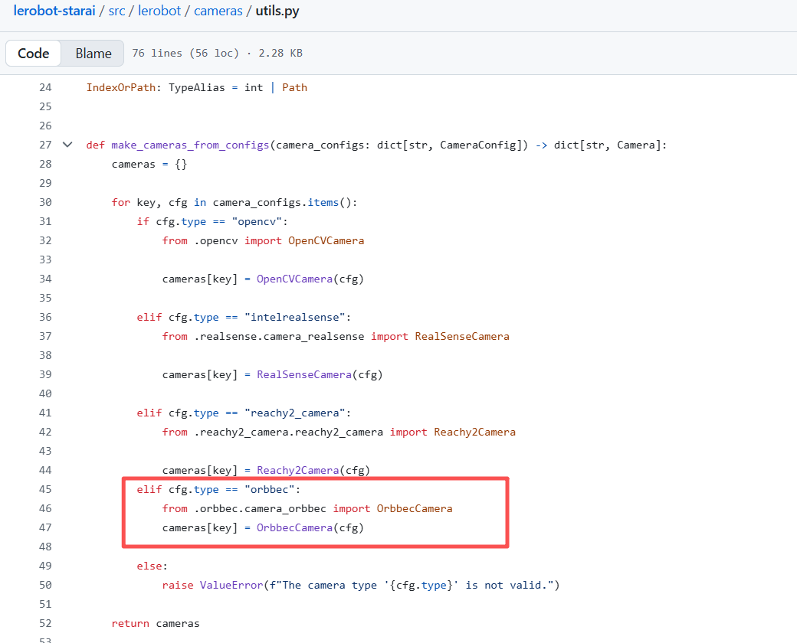
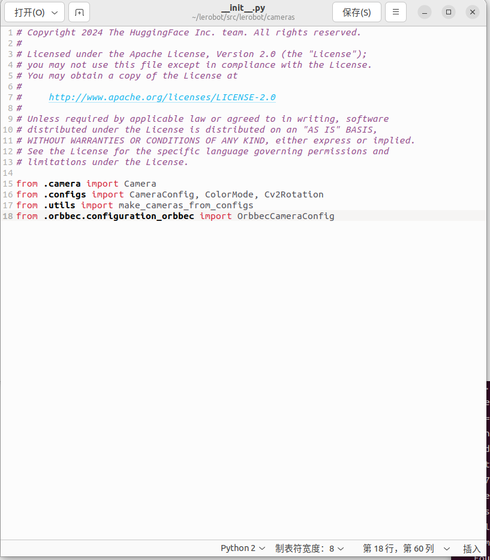
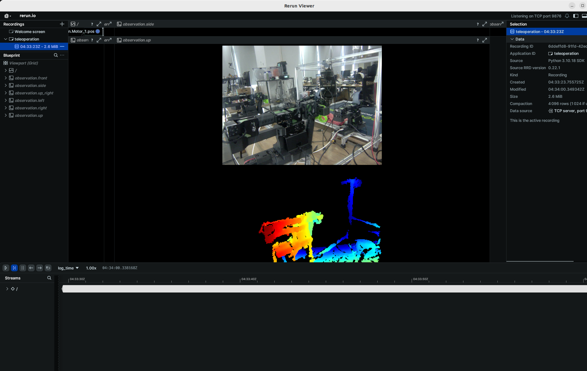

# reBot Arm B601-DM入门Lerobot

> 发布时间: 2026-04-15T00:00:00.000Z
> 原文链接: https://wiki.seeedstudio.com/cn/rebot_arm_b601_dm_lerobot/

---
On this page

[](./LICENSE)

**6-DOF Robotic Arm · Multi-Motor Support · Kinematics Solver · Trajectory Planning · Fully Open Source**

[reBot Arm B601-DM](https://wiki.seeedstudio.com/cn/rebot_b601_dm_getting_started/)是由Seeed开源的是一个致力于降低具身智能学习门槛的机械臂项目。我们毫无保留地开源了所有结构设计和代码，一起让机器人技术触手可及。

[LeRobot](https://github.com/huggingface/lerobot/tree/main) 致力于为真实世界的机器人提供 PyTorch 中的模型、数据集和工具。其目标是降低机器人学的入门门槛，使每个人都能通过共享数据集和预训练模型进行贡献和受益。LeRobot 集成了经过验证的前沿方法，专注于模仿学习和强化学习。它提供了一套预训练模型、包含人类收集的示范数据集和仿真环境，使用户无需进行机器人组装即可开始使用。

### 📖 项目简介 (Introduction)[​](#-项目简介-introduction "Direct link to 📖 项目简介 (Introduction)")

**reBot-DevArm (reBot Arm B601 DM 和reBot Arm B601 RS)** 是一个致力于降低具身智能学习门槛的机械臂项目。我们主打 **"真·开源"** —— 不仅仅是代码，我们无保留地开源了所有的：

-   🦾 **两个版本电机的开源机械臂**：我们会提供Robostride和Damiao两个版本的同样外观的机械臂所有开源文件。
-   🛠️ **硬件图纸**：钣金件、3D打印件源文件。
-   🔩 **BOM 清单**：详细到每一个螺丝的规格和购买链接。
-   💻 **软件及算法**：Python SDK、ROS1/2、Isaac Sim、Lerobot等

## 搭建属于你的 reBot 机械臂[​](#搭建属于你的-rebot-机械臂 "Direct link to 搭建属于你的 reBot 机械臂")

-   我们提供五种套件方案：
    -   **机械臂本体电机套件**：仅包含机械臂所需的电机与线束。
    -   **机械臂本体结构件套件**：仅包含机械结构零部件。
    -   **夹持器完整套件**：包含夹持器的电机、线束及结构件。
    -   **整机完整套件**：包含机械臂本体与夹持器全套组件。
    -   **成品组装机械臂**：已完成组装的成品机械臂。

reBot-DevArm 和 reComputer Jetson AI 智能机器人套件无缝结合了高精度的机器人手臂控制与强大的 AI 计算平台，提供了全面的机器人开发解决方案。该套件基于 Jetson Orin 或 AGX Orin 平台，结合 reBot-DevArm 和 LeRobot AI 框架，为用户提供适用于教育、科研和工业自动化等多种场景的智能机器人系统。

本维基提供了 reBot-DevArm 调试教程，并在 Lerobot 框架内实现数据收集和训练。

caution

Seeed Studio 教程严格按官方文档更新，如遇无法解决的软件或环境问题，请先查阅文末FAQ，或者联系客服加入SeeedStudio Lerobot交流群询问，也可以在这里询问：[LeRobot GitHub](https://github.com/huggingface/lerobot) 或 [Discord频道](https://discord.gg/8TnwDdjFGU)。

## 🔧 reBot B601-DM 系列特点：[​](#-rebot-b601-dm-系列特点 "Direct link to 🔧 reBot B601-DM 系列特点：")

1.  **开源 & 低成本**
    reBot Arm 是由 Seeed Studio 提供的开源机器人臂解决方案，致力于降低具身智能学习门槛。

2.  **支持 LeRobot 平台集成**
    专为与 [LeRobot 平台](https://github.com/huggingface/lerobot) 集成而设计。该平台提供 PyTorch 模型、数据集与工具，面向现实机器人任务的模仿学习（包括数据采集、仿真、训练与部署）。

3.  **丰富的学习资源**
    提供全面的开源学习资源，包括组装与校准指南、测试与数据采集教程、训练与部署文档，帮助用户快速上手并开发机器人应用。

4.  **兼容 Nvidia 平台**
    支持通过 reComputer Mini J4012 Orin NX 16GB 平台进行部署。


## 初始系统环境[​](#初始系统环境 "Direct link to 初始系统环境")

**For Ubuntu X86:**

-   Ubuntu 22.04
-   CUDA 12+
-   Python 3.10
-   Torch 2.6

**For Jetson Orin:**

-   Jetson Jetpack 6.0 和 6.1，暂不支持6.2
-   Python 3.10
-   Torch 2.3+

## 安装LeRobot[​](#安装lerobot "Direct link to 安装LeRobot")

需要根据你的 CUDA 版本安装 pytorch 和 torchvision 等环境。

### 1\. 安装 Miniforge[​](#1-安装-miniforge "Direct link to 1. 安装 Miniforge")

```
cd ~wget "https://github.com/conda-forge/miniforge/releases/latest/download/Miniforge3-$(uname)-$(uname -m).sh"bash Miniforge3-$(uname)-$(uname -m).sh~/miniforge3/bin/conda init bashsource ~/.bashrc
```

### 2\. 克隆 Lerobot 仓库[​](#2-克隆-lerobot-仓库 "Direct link to 2. 克隆 Lerobot 仓库")

```
mkdir ~/rebot_lerobotcd ~/rebot_lerobotgit clone https://github.com/Seeed-Projects/lerobot.git
```

### 3\. 克隆功能包[​](#3-克隆功能包 "Direct link to 3. 克隆功能包")

克隆两个依赖功能包到 rebot\_lerobot 目录下：

tip

关于功能包的详细功能，请参考：

-   [lerobot-teleoperator-rebot-arm-102](https://github.com/Seeed-Projects/lerobot-teleoperator-rebot-arm-102)
-   [lerobot-robot-seeed-b601](https://github.com/Seeed-Projects/lerobot-robot-seeed-b601)

```
cd ~/rebot_lerobotgit clone https://github.com/Seeed-Projects/lerobot-teleoperator-rebot-arm-102.gitgit clone https://github.com/Seeed-Projects/lerobot-robot-seeed-b601.git
```

### 4\. 创建 Conda 环境并安装 LeRobot[​](#4-创建-conda-环境并安装-lerobot "Direct link to 4. 创建 Conda 环境并安装 LeRobot")

lerobot 仓库已有 pyproject.toml，创建 conda 环境并安装所有依赖包。

```
cd ~/rebot_lerobotconda create -y -n lerobot python=3.12conda activate lerobotpip install -e ./lerobotpip install -e ./lerobot-teleoperator-rebot-arm-102pip install -e ./lerobot-robot-seeed-b601pip install motorbridge
```

### 5\. 安装 ffmpeg[​](#5-安装-ffmpeg "Direct link to 5. 安装 ffmpeg")

ffmpeg 是视频解码依赖，通过 conda 安装：

```
conda install ffmpeg -c conda-forge
```

tip

**版本说明**：

-   默认会安装 ffmpeg 7.X（支持 libsvtav1 编码器）
-   如果遇到版本兼容问题，可以指定安装 ffmpeg 7.1.1：

    ```
    conda install ffmpeg=7.1.1 -c conda-forge
    ```

-   可通过 `ffmpeg -encoders | grep svtav1` 检查是否支持 libsvtav1 编码器

### 6\. Jetson Jetpack 6.0+ 设备特殊配置[​](#6-jetson-jetpack-60-设备特殊配置 "Direct link to 6. Jetson Jetpack 6.0+ 设备特殊配置")

(电脑端可跳过这一步) 对于 Jetson Jetpack 6.0+ 设备（请确保在执行此步骤前按照 [此链接教程](https://github.com/Seeed-Projects/reComputer-Jetson-for-Beginners/tree/main/3-Basic-Tools-and-Getting-Started/3.5-Pytorch) 的第 5 步安装了 Pytorch-gpu 和 Torchvision）：

```
pip install opencv-python==4.10.0.84  pip install numpy==1.26.0
```

### 7\. 检查 Pytorch 和 Torchvision[​](#7-检查-pytorch-和-torchvision "Direct link to 7. 检查 Pytorch 和 Torchvision")

tip

如果你使用的是 Jetson 设备，请根据 [此教程](https://github.com/Seeed-Projects/reComputer-Jetson-for-Beginners/blob/main/3-Basic-Tools-and-Getting-Started/3.3-Pytorch-and-Tensorflow/README.md#installing-pytorch-on-recomputer-nvidia-jetson) 安装 Pytorch 和 Torchvision。

由于通过 pip 安装 lerobot 环境时会卸载原有的 Pytorch 和 Torchvision 并安装 CPU 版本，因此需要在 Python 中进行检查。

```
python3import torchprint(torch.cuda.is_available())
```

如果输出为 True ，您可以输入 exit()来退出python，继续进行下列步骤
如果输出结果为 False，需要根据 [官网教程](https://pytorch.org/index.html) 重新安装 Pytorch 和 Torchvision。

## 校准机械臂[​](#校准机械臂 "Direct link to 校准机械臂")

接下来，你需要对你的 reBot B601-DM 机器人接上电源和数据线进行校准，以确保在相同的物理位置时，Leader 臂和 Follower 臂的位置信息一致。
这个校准过程至关重要，因为它可以让在一个 reBot B601-DM 机器人上训练的神经网络在另一个机器人上也能正常工作。如果需要重新校准机械臂，请完全删除`~/.cache/huggingface/lerobot/calibration/robots`或者`~/.cache/huggingface/lerobot/calibration/teleoperators`下的文件并重新校准机械臂，否者会出现报错提示，校准的机械臂信息会存储该目录下的json文件中。

首先，您需要授予接口权限，运行以下命令：

```
sudo chmod 666 /dev/ttyUSB*  sudo chmod 666 /dev/ttyACM*
```

### 校准follower臂[​](#校准follower臂 "Direct link to 校准follower臂")

B601-DM每次执行本wiki中lerobot相关的程序，都会自动进行一次校准。
你需要做的确保是在启动前，将B601-DM放置到如图所示的位置（夹爪要完全闭合）。



### 校准leader臂[​](#校准leader臂 "Direct link to 校准leader臂")

校准的步骤至关重要，会直接影响机械臂是否正常运行，请严格按照流程执行。

rebot 102 leader

tip

**reBot 102 leader 校准说明**：

-   启动校准时，reBot Arm 102 的每个舵机当前位置会被**重设为零点**
-   `joint_ranges`（关节限位）取自配置文件 `config_rebot_arm_102_leader.py`，而非校准数据
-   如果某个关节看起来总是卡在某个限位附近，优先检查 `joint_ranges` 配置
-   关节方向定义在配置文件中，若方向不一致需修改配置而非重新校准
-   reBot 102 leader 使用 USB 转 UART 模块，通常映射为 `/dev/ttyUSB*`
-   使用 `ls /dev/ttyUSB*` 查看实际端口号

如果是初次连接，可能会报找不到串口/dev/ttyACM0,此时因为brltty在占用该串口，请执行如下步骤

```
sudo dmesg | grep ttyUSB sudo apt remove brltty
```



按照提示，将leader机械臂移动到上图所示的零点，

```
sudo chmod 666 /dev/ttyUSB0lerobot-calibrate \    --teleop.type=rebot_arm_102_leader \    --teleop.port=/dev/ttyUSB0 \    --teleop.id=rebot_arm_102_leader
```

保持静止，然后按下enter，直到提示校准完成。
校准完成后，输入以下命令来测试leader机械臂。

```
python ./lerobot-teleoperator-rebot-arm-102/examples/read_raw_angles.py \      --port /dev/ttyUSB0
```

## 遥操作[​](#遥操作 "Direct link to 遥操作")

先对串口给予权限：

```
sudo chmod 666 /dev/ttyUSB*  sudo chmod 666 /dev/ttyACM*
```

运行遥操作：

```
lerobot-teleoperate \    --robot.type=seeed_b601_dm_follower \    --robot.port=/dev/ttyACM0 \    --robot.id=follower1 \    --robot.can_adapter=damiao \    --teleop.type=rebot_arm_102_leader \    --teleop.port=/dev/ttyUSB0 \    --teleop.id=rebot_arm_102_leader \    --teleop.joint_directions='{"shoulder_pan":-1,"shoulder_lift":-1,"elbow_flex":1,"wrist_flex":1,"wrist_yaw":1,"wrist_roll":-1,"gripper":-4}'
```

## 添加摄像头[​](#添加摄像头 "Direct link to 添加摄像头")

如果是Orbbec Gemini2深度相机

-   🚀 步骤 1：安装 Orbbec SDK 依赖环境

1.  拉取 `pyorbbec` 仓库

    ```
    cd ~/git clone https://github.com/orbbec/pyorbbecsdk.git
    ```

2.  下载并安装 SDK 对应的 **.whl 文件**
    前往 [pyorbbecsdk Releases](https://github.com/orbbec/pyorbbecsdk/releases)，
    根据 Python 版本选择并安装，例如：

    ```
    pip install pyorbbecsdk-x.x.x-cp310-cp310-linux_x86_64.whl
    ```

3.  在 `pyorbbec` 目录下安装依赖

    ```
    cd ~/pyorbbecsdkpip install -r requirements.txt
    ```


强制降低`numpy`版本到`1.26.0`

```
pip install numpy==1.26.0
```

可以忽略红色报错。

4.将orbbec sdk克隆到`~/lerobot/src/cameras`目录下

```
cd ~/rebot_lerobot/src/camerasgit clone https://github.com/ZhuYaoHui1998/orbbec.git
```

5.修改utils.py和\_\_init\_\_.py

-   在`~/lerobot/src/lerobot/cameras`目录下找到`utils.py`，在`40`行处添加如下代码：

```
elif cfg.type == "orbbec":            from .orbbec.camera_orbbec import OrbbecCamera            cameras[key] = OrbbecCamera(cfg)
```



-   在`~/lerobot/src/lerobot/cameras`目录下找到`__init__.py`，在`18`行处添加如下代码：

```
from .orbbec.configuration_orbbec import OrbbecCameraConfig
```



-   🚀 步骤 2：函数调用与示例

我们加入了focus\_area超参数，因为过远的深度数据对于机械臂没有意义（抓取不到），因此小于或者大于focus\_area的深度数据将会变为黑色,默认的focus\_area是(20,600) 目前支持的分辨率只限于 width: 640, height: 880

```
lerobot-teleoperate \    --robot.type=seeed_b601_dm_follower \    --robot.port=/dev/ttyACM0 \    --robot.id=follower1 \    --robot.can_adapter=damiao \    --robot.cameras="{ up: {type: orbbec, width: 640, height: 880, fps: 30, focus_area:[60,300]}}" \    --teleop.type=rebot_arm_102_leader \    --teleop.port=/dev/ttyUSB0 \    --teleop.id=rebot_arm_102_leader \    --display_data=true
```



后续采集数据、训练及评估任务与常规RGB命令一样，只需要把:

```
  --robot.cameras="{ up: {type: orbbec, width: 640, height: 880, fps: 30, focus_area:[60,300]}}" \
```

替换到常规rgb命令中即可，你也可以再后面添加额外的单目RGB相机。

**💡 作者与贡献**

-   作者: 张家铨，王文钊 - 华南师范大学

为了实例化摄像头，您需要一个摄像头标识符。这个标识符可能会在您重启电脑或重新插拔摄像头时发生变化，这主要取决于您的操作系统。

要查找连接到您系统的摄像头的**摄像头索引**，请运行以下脚本：

```
lerobot-find-cameras opencv
```

终端会打印相关摄像头信息。

```
--- Detected Cameras ---Camera #0:  Name: OpenCV Camera @ 0  Type: OpenCV  Id: 0  Backend api: AVFOUNDATION  Default stream profile:    Format: 16.0    Width: 1920    Height: 1080    Fps: 15.0--------------------(more cameras ...)
```

您可以在 `~/lerobot/outputs/captured_images` 目录中找到每台摄像头拍摄的图片。

warning

在 **macOS** 中使用 Intel RealSense 摄像头时，您可能会遇到 **“Error finding RealSense cameras: failed to set power state”** 的错误。这可以通过使用 `sudo` 权限运行相同的命令来解决。请注意，在 **macOS** 中使用 RealSense 摄像头是不稳定的。

之后，您就可以在遥控操作时在电脑上显示摄像头画面了，只需运行以下代码即可。这对于在录制第一个数据集之前准备您的设置非常有用。

```
lerobot-teleoperate \    --robot.type=seeed_b601_dm_follower \    --robot.port=/dev/ttyACM0 \    --robot.id=follower1 \    --robot.can_adapter=damiao \    --robot.cameras="{ front: {type: opencv, index_or_path: 0, width: 640, height: 480, fps: 30, fourcc: "MJPG"}}" \    --teleop.type=rebot_arm_102_leader \    --teleop.port=/dev/ttyUSB0 \    --teleop.id=rebot_arm_102_leader \    --display_data=true
```

tip

`fourcc: "MJPG"`格式图像是经过压缩后的图像，你可以尝试更高分辨率，当然你可以尝试`YUYV`格式图像，但是这会导致图像的分辨率和FPS降低导致机械臂运行卡顿。目前`MJPG`格式下可支持`3`个摄像头`1920*1080`分辨率并且保持`30FPS`, 但是依然不推荐2个摄像头通过同一个USB HUB接入电脑

如果您有更多摄像头，可以通过更改 `--robot.cameras` 参数来添加。您应该注意`index_or_path` 的格式，它由 `python -m lerobot.find_cameras opencv` 命令输出的摄像头 ID 的最后一位数字决定。

例如，如果你想添加摄像头：

```
lerobot-teleoperate \    --robot.type=seeed_b601_dm_follower \    --robot.port=/dev/ttyACM0 \    --robot.id=follower1 \    --robot.can_adapter=damiao \    --robot.cameras="{ front: {type: opencv, index_or_path: 0, width: 640, height: 480, fps: 30, fourcc: "MJPG"}, side: {type: opencv, index_or_path: 2, width: 640, height: 480, fps: 30, fourcc: "MJPG"}}" \    --teleop.type=rebot_arm_102_leader \    --teleop.port=/dev/ttyUSB0 \    --teleop.id=rebot_arm_102_leader \    --display_data=true
```

## 数据集制作采集[​](#数据集制作采集 "Direct link to 数据集制作采集")

如果你想数据集保存在本地

```
lerobot-record \    --robot.type=seeed_b601_dm_follower \    --robot.port=/dev/ttyACM0 \    --robot.id=follower1 \    --robot.can_adapter=damiao \    --robot.cameras="{ front: {type: opencv, index_or_path: 0, width: 640, height: 480, fps: 30, fourcc: "MJPG"}, side: {type: opencv, index_or_path: 2, width: 640, height: 480, fps: 30, fourcc: "MJPG"}}" \    --teleop.type=rebot_arm_102_leader \    --teleop.port=/dev/ttyUSB0 \    --teleop.id=rebot_arm_102_leader \    --display_data=true \    --dataset.repo_id=seeed_rebot_b601_dm/test \    --dataset.num_episodes=5 \    --dataset.single_task="Grab the black cube" \    --dataset.push_to_hub=false \    --dataset.episode_time_s=30 \    --dataset.reset_time_s=30
```

其中`repo_id`可以自定义修改，`push_to_hub=false`，最后数据集会保存在主目录的`~/.cache/huggingface/lerobot`下会创建上述`seeed_rebot_b601_dm/test`文件夹

如果您想使用 Hugging Face Hub 的功能来上传您的数据集

-   如果您想使用 Hugging Face Hub 的功能来上传您的数据集，并且您之前尚未这样做，请确保您已使用具有写入权限的令牌登录，该令牌可以从 [Hugging Face 设置](https://huggingface.co/settings/tokens) 中生成：

```
huggingface-cli login --token ${HUGGINGFACE_TOKEN} --add-to-git-credential
```

将您的 Hugging Face 仓库名称存储在一个变量中，以运行以下命令：

```
HF_USER=$(huggingface-cli whoami | head -n 1)echo $HF_USER
```

记录 5 个回合并将您的数据集上传到 Hub：

```
lerobot-record \    --robot.type=seeed_b601_dm_follower \    --robot.port=/dev/ttyACM0 \    --robot.id=follower1 \    --robot.can_adapter=damiao \    --robot.cameras="{ front: {type: opencv, index_or_path: 0, width: 640, height: 480, fps: 30, fourcc: "MJPG"}, side: {type: opencv, index_or_path: 2, width: 640, height: 480, fps: 30, fourcc: "MJPG"}}" \    --teleop.type=rebot_arm_102_leader \    --teleop.port=/dev/ttyUSB0 \    --teleop.id=rebot_arm_102_leader \    --display_data=true \    --dataset.repo_id=${HF_USER}/record-test \    --dataset.num_episodes=5 \    --dataset.single_task="Grab the black cube" \    --dataset.push_to_hub=true \    --dataset.episode_time_s=30 \    --dataset.reset_time_s=30
```

你会看到类似如下数据:

```
INFO 2024-08-10 15:02:58 ol_robot.py:219 dt:33.34 (30.0hz) dtRlead: 5.06 (197.5hz) dtWfoll: 0.25 (3963.7hz) dtRfoll: 6.22 (160.7hz) dtRlaptop: 32.57 (30.7hz) dtRphone: 33.84 (29.5hz)
```

**记录功能**

**record**功能提供了一套工具，用于在机器人运行期间捕获和管理数据。

**1\. 数据存储**

-   数据以 `LeRobotDataset` 格式存储，并在记录过程中保存到磁盘中。
-   默认情况下，数据集在记录完成后会推送到你的 Hugging Face 页面。
-   若要禁用上传，请使用：`--dataset.push_to_hub=False`。

**2\. 检查点与恢复**

-   在记录过程中会自动创建检查点。
-   如果记录过程中断，可以通过重新运行相同的命令并添加 `--resume=true` 来恢复记录。

⚠️ **重要提示**：在恢复时，需将 `--dataset.num_episodes` 设置为要额外记录的剧集数量（而不是数据集中目标的总剧集数量）。

-   若要从头开始记录，请**手动删除**数据集目录。

**3\. 记录参数**

通过命令行参数设置数据记录的流程：

参数

描述

默认值

\--dataset.episode\_time\_s

每个数据剧集的持续时间（秒）

60

\--dataset.reset\_time\_s

每个剧集后环境重置时间（秒）

60

\--dataset.num\_episodes

要记录的总剧集数量

50

**4\. 记录过程中的键盘控制**

使用键盘快捷键控制数据记录流程：

键

动作

→（右箭头）

提前终止当前剧集/重置；进入下一个。

←（左箭头）

取消当前剧集；重新录制。

ESC

立即停止会话，编码视频，并上传数据集。

tip

如果你的键盘按下后没有反应，可能你需要降低你pynput的版本，例如安装个1.6.8版本的。

```
pip install pynput==1.6.8
```

**数据收集技巧**

-   **任务建议**：在不同位置抓取物体并将其放入箱子中。
-   **规模**：记录 ≥50 个剧集（每个位置 10 个剧集）。
-   **一致性**：
    -   保持摄像头固定。
    -   保持相同的抓取行为。
    -   确保操作的物体在摄像头画面中可见。
-   **逐步推进**：
    -   先从可靠的抓取开始，然后再增加变化（新位置、抓取技巧、摄像头调整）。
    -   避免复杂性急剧增加，以防止失败。

💡 **经验法则**：仅使用摄像头画面作为指导，只根据屏幕反馈的视频图像，来控制机械臂完成任务。

如果你想要深入了解这个重要主题，可以查看我们撰写的关于什么是好的数据集的[博客文章](https://huggingface.co/blog/lerobot-datasets#what-makes-a-good-dataset)。

**故障排除**

Linux 问题： 如果在记录过程中右箭头/左箭头/ESC 键无响应：

-   验证 `$DISPLAY` 环境变量是否已设置（参见 [pynput 限制](https://pynput.readthedocs.io/en/latest/limitations.html)）。

## 可视化数据集[​](#可视化数据集 "Direct link to 可视化数据集")

```
echo ${HF_USER}/rebot_test
```

如果您上传了数据，您也可以在本地通过以下命令进行可视化：

```
lerobot-dataset-viz \  --repo-id ${HF_USER}/rebot_test \  --episode-index 0 \  --display-compressed-images=false
```

如果您使用了 `--dataset.push_to_hub=false` ，没有上传数据，您也可以通过以下命令在本地进行可视化：

```
lerobot-dataset-viz \  --repo-id seeed_rebot_b601_dm/test \  --episode-index 0 \  --display-compressed-images=false
```

这里，`seeed_rebot_b601_dm/test` 是数据收集时自定义的 `repo_id` 名称。

## 回放一个数据集[​](#回放一个数据集 "Direct link to 回放一个数据集")

tip

不稳定，可跳过，可尝试。

现在，尝试在您的机器人上重播第一个数据集：

```
lerobot-replay \    --robot.type=seeed_b601_dm_follower \    --robot.port=/dev/ttyACM0 \    --robot.can_adapter=damiao \    --robot.id=follower1 \    --dataset.repo_id=seeed_rebot_b601_dm/test \    --dataset.episode=0
```

此时，机器人应该做出与你遥操记录时一样的动作。

## 训练及评估[​](#训练及评估 "Direct link to 训练及评估")

[ACT](https://huggingface.co/docs/lerobot/act)

参考官方教程[ACT](https://huggingface.co/docs/lerobot/act)

**训练**

要训练一个控制您机器人策略，使用 `python -m lerobot.scripts.train` 脚本。需要一些参数。以下是一个示例命令：

**如果您想在本地数据集上进行训练，请确保 `repo_id` 与数据收集时使用的名称匹配，并添加 `--policy.push_to_hub=false`。**

```
lerobot-train \  --dataset.repo_id=seeed_rebot_b601_dm/test \  --policy.type=act \  --output_dir=outputs/train/act_rebot_test \  --job_name=act_rebot_test \  --policy.device=cuda \  --wandb.enable=false \  --policy.push_to_hub=false\  --steps=300000
```

**or使用保存在远程的数据**

```
lerobot-train \  --dataset.repo_id=${HF_USER}/rebot_test \  --policy.type=act \  --output_dir=outputs/train/act_rebot_test \  --job_name=act_rebot_test \  --policy.device=cuda \  --wandb.enable=false \  --steps=300000
```

命令解释

-   **数据集指定**：我们通过 `--dataset.repo_id=${HF_USER}/rebot_test` 参数提供了数据集。
-   **训练步数**：我们通过 `--steps=300000` 修改训练步数，算法默认为800000，根据自己的任务难易程度，观察训练时候的loss来进行调整。
-   **策略类型**：我们使用 `policy.type=act` 提供了策略，同样你可以更换\[act,diffusion,pi0,pi0fast,pi0fast,sac,smolvla\]等策略，这将从 `configuration_act.py` 加载配置。重要的是，这个策略会自动适应您机器人（例如 `laptop` 和 `phone`）的电机状态、电机动作和摄像头数量，这些信息已保存在您的数据集中。
-   **设备选择**：我们提供了 `policy.device=cuda`，因为我们正在 Nvidia GPU 上进行训练，但您可以使用 `policy.device=mps` 在 Apple Silicon 上进行训练。
-   **可视化工具**：我们提供了 `wandb.enable=true` 来使用 [Weights and Biases](https://docs.wandb.ai/quickstart) 可视化训练图表。这是可选的，但如果您使用它，请确保您已通过运行 `wandb login` 登录。

**评估**

您可以使用 [`lerobot/record.py`](https://github.com/huggingface/lerobot/blob/main/lerobot/record.py) 中的 `record` 功能，但需要将策略训练结果训练结果权重文件作为输入。例如，运行以下命令记录 10 个评估回合：

```
lerobot-record \  --robot.type=seeed_b601_dm_follower \  --robot.port=/dev/ttyACM0 \  --robot.can_adapter=damiao \  --robot.cameras="{ front: {type: opencv, index_or_path: 0, width: 640, height: 480, fps: 30, fourcc: "MJPG"},   side: {type: opencv, index_or_path: 2, width: 640, height: 480, fps: 30,fourcc: "MJPG"}}" \  --robot.id=follower1 \  --display_data=false \  --dataset.repo_id=seeed/eval_test123 \  --dataset.single_task="Put lego brick into the transparent box" \  --policy.path=outputs/train/act_rebot_test/checkpoints/last/pretrained_model
```

1.  `--policy.path` 参数，指示您的策略训练结果权重文件的路径（例如 `outputs/train/act_rebot_test/checkpoints/last/pretrained_model`）。如果您将模型训练结果权重文件上传到 Hub，也可以使用模型仓库（例如 `${HF_USER}/act_rebot_test`）。
2.  数据集的名称`dataset.repo_id`以 `eval_` 开头，这个操作会在你评估的时候为你单独录制评估时候的视频和数据，将保存在eval\_开头的文件夹下，例如`seeed/eval_test123`。
3.  如果评估阶段遇到`File exists: 'home/xxxx/.cache/huggingface/lerobot/xxxxx/seeed/eval_xxxx'`请先删除`eval_`开头的这个文件夹再次运行程序。
4.  当遇到`mean is infinity. You should either initialize with stats as an argument or use a pretrained model`请注意--robot.cameras这个参数中的front和side等关键词必须和采集数据集的时候保持严格一致。

[SmolVLA](https://huggingface.co/docs/lerobot/smolvla)

参考官方教程[SmolVLA](https://huggingface.co/docs/lerobot/smolvla)

```
pip install -e ".[smolvla]"
```

**训练**

```
lerobot-train \  --policy.path=lerobot/smolvla_base \   --dataset.repo_id=${HF_USER}/mydataset \  --batch_size=64 \  --steps=20000 \  --output_dir=outputs/train/my_smolvla \  --job_name=my_smolvla_training \  --policy.device=cuda \  --wandb.enable=true
```

**验证**

```
lerobot-record \  --robot.type=seeed_b601_dm_follower \  --robot.port=/dev/ttyACM0 \  --robot.can_adapter=damiao \  --robot.id=follower1 \  --robot.cameras="{ front: {type: opencv, index_or_path: 0, width: 640, height: 480, fps: 30, fourcc: "MJPG"},   side: {type: opencv, index_or_path: 2, width: 640, height: 480, fps: 30,fourcc: "MJPG"}}" \  --dataset.single_task="Put lego brick into the transparent box" \  --dataset.repo_id=seeed/eval_test123 \  --dataset.episode_time_s=50 \  --dataset.num_episodes=10 \          --policy.path=HF_USER/FINETUNE_MODEL_NAME
```

[Pi0](https://huggingface.co/docs/lerobot/pi0)

参考官方教程[Pi0](https://huggingface.co/docs/lerobot/pi0)

```
pip install -e ".[pi]"
```

**训练**

```
lerobot-train \  --policy.type=pi0 \  --dataset.repo_id=seeed/eval_test123 \  --job_name=pi0_training \  --output_dir=outputs/pi0_training \  --policy.pretrained_path=lerobot/pi0_base \  --policy.compile_model=true \  --policy.gradient_checkpointing=true \  --policy.dtype=bfloat16 \  --steps=20000 \  --policy.device=cuda \  --batch_size=32 \  --wandb.enable=false
```

**验证**

```
lerobot-record \  --robot.type=seeed_b601_dm_follower \  --robot.port=/dev/ttyACM0 \  --robot.can_adapter=damiao \  --robot.cameras="{ front: {type: opencv, index_or_path: 0, width: 640, height: 480, fps: 30, fourcc: "MJPG"},   side: {type: opencv, index_or_path: 2, width: 640, height: 480, fps: 30,fourcc: "MJPG"}}" \  --robot.id=follower1 \  --display_data=false \  --dataset.repo_id=seeed/eval_test123 \  --dataset.single_task="Put lego brick into the transparent box" \  --policy.path=outputs/pi0_training/checkpoints/last/pretrained_model
```

[Pi0.5](https://huggingface.co/docs/lerobot/pi05)

参考官方教程[Pi0.5](https://huggingface.co/docs/lerobot/pi05)

```
pip install -e ".[pi]"
```

**训练**

```
lerobot-train \    --dataset.repo_id=seeed/eval_test123 \    --policy.type=pi05 \    --output_dir=outputs/pi05_training \    --job_name=pi05_training \    --policy.pretrained_path=lerobot/pi05_base \    --policy.compile_model=true \    --policy.gradient_checkpointing=true \    --wandb.enable=false \    --policy.dtype=bfloat16 \    --steps=3000 \    --policy.device=cuda \    --batch_size=32
```

**验证**

```
lerobot-record \  --robot.type=seeed_b601_dm_follower \  --robot.port=/dev/ttyACM0 \  --robot.can_adapter=damiao \  --robot.cameras="{ front: {type: opencv, index_or_path: 0, width: 640, height: 480, fps: 30, fourcc: "MJPG"},   side: {type: opencv, index_or_path: 2, width: 640, height: 480, fps: 30,fourcc: "MJPG"}}" \  --robot.id=follower1 \  --display_data=false \  --dataset.repo_id=seeed/eval_test123 \  --dataset.single_task="Put lego brick into the transparent box" \  --policy.path=outputs/pi05_training/checkpoints/last/pretrained_model
```

[GR00T N1.5](https://huggingface.co/docs/lerobot/groot)

请参考官方教程[GR00T N1.5](https://huggingface.co/docs/lerobot/groot)

训练可能需要几个小时。您将在 `outputs/train/act_rebot_test/checkpoints` 目录中找到训练结果权重文件。

要从某个训练结果权重文件恢复训练，下面是一个从 `act_rebot_test` 策略的最后一个训练结果权重文件恢复训练的示例命令：

```
lerobot-train \  --config_path=outputs/train/act_rebot_test/checkpoints/last/pretrained_model/train_config.json \  --resume=true
```

## FAQ[​](#faq "Direct link to FAQ")

-   如果实用本文档教程，请git clone本文档推荐的github仓库`https://github.com/Seeed-Projects/lerobot.git`，本文档推荐的仓库是验证过后的稳定版本，Lerobot官方仓库是实时更新的最新版本，会出现一些无法预知的问题，例如数据集版本不同，指令不同等。

-   如果遇到

    ```
    Could not connect on port "/dev/ttyUSB0" 或 "/dev/ttyACM0"
    ```

    并且通过 `ls /dev/ttyUSB*` 或 `ls /dev/ttyACM*` 看到设备存在，则是忘记给串口权限了，终端输入 `sudo chmod 666 /dev/ttyUSB* /dev/ttyACM*` 即可

-   如果遇到

    ```
    No valid stream found in input file. Is -1 of the desired media type?
    ```

    请安装 ffmpeg 7.1.1：`conda install ffmpeg=7.1.1 -c conda-forge`。

-   在3060的8G笔记本上训练ACT的50组数据的时间大概为6小时，在4090和A100的电脑上训练50组数据时间大概为2~3小时。

-   数据采集过程中要确保摄像头位置和角度和环境光线的稳定，并且减少摄像头采集到过多的不稳定背景和行人，否则部署的环境变化过大会导致机械臂无法正常抓取。

-   数据采集命令的num-episodes要确保采集数据足够，不可中途手动暂停，因为在数据采集结束后才会计算数据的均值和方差，这在训练中是必要的数据。

-   如果程序提示无法读取USB摄像头图像数据，请确保USB摄像头不是接在Hub上的，USB摄像头必须直接接入设备，确保图像传输速率快。


tip

如果你遇到无法解决的软件问题或环境依赖问题，除了查看本教程末尾的常见问题（FAQ）部分外，请及时在 [LeRobot 平台](https://github.com/huggingface/lerobot) 或 [LeRobot Discord 频道](https://discord.gg/8TnwDdjFGU) 反馈问题。

## 参考文档[​](#参考文档 "Direct link to 参考文档")

矽递科技英文Wiki文档：[How to use the SO100Arm robotic arm in Lerobot](https://wiki.seeedstudio.com/cn/lerobot_so100m/)

TheRobotStudio Project: [SO-ARM10x](https://github.com/TheRobotStudio/SO-ARM100)

Huggingface Project: [Lerobot](https://github.com/huggingface/lerobot/tree/main)

Dnsty: [Jetson Containers](https://github.com/dusty-nv/jetson-containers/tree/master/packages/robots/lerobot)

[Jetson AI Lab](https://www.jetson-ai-lab.com/lerobot.html)

[Diffusion Policy](https://diffusion-policy.cs.columbia.edu/)

[ACT or ALOHA](https://tonyzhaozh.github.io/aloha/)

[TDMPC](https://www.nicklashansen.com/td-mpc/)

[VQ-BeT](https://sjlee.cc/vq-bet/)

## 技术支持与产品讨论[​](#技术支持与产品讨论 "Direct link to 技术支持与产品讨论")

感谢您选择我们的产品！我们在这里为您提供不同的支持，以确保您使用我们产品的体验尽可能顺畅。我们提供多种沟通渠道，以满足不同的偏好和需求。

[](https://forum.seeedstudio.com/)[](https://www.seeedstudio.com/contacts)

[](https://discord.gg/eWkprNDMU7)[](https://github.com/Seeed-Studio/wiki-documents/discussions/69)